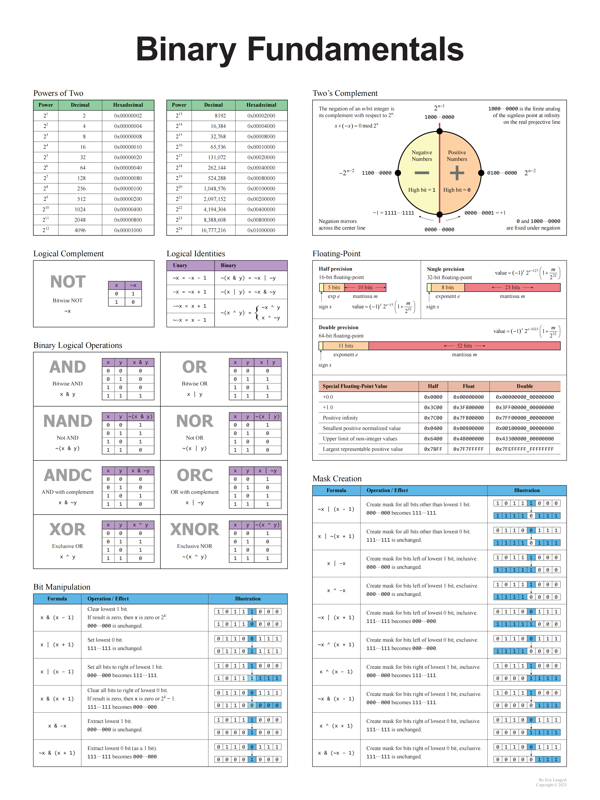

# 位运算与集合

位运算技巧:  

???+ note "位运算技巧"

    ```cpp
    // 1. x & (-x) 取出 x 最右边的 1 (树状数组中的lowbit函数)
    int rightmost_one = x & -x;  // 也可以使用 __builtin_ctz(x) 实现 (count trailing zeros)
    // 2. 判断 x 是否为 2 的幂次方
    bool is_power_of_two = x > 0 && (x & (x - 1)) == 0;
    // 3. x & (x - 1) 将 x 最右边的 1 变成 0
    int x_with_rightmost_one_removed = x & (x - 1);
    // 4. x | (x + 1) 将 x 最右边的 0 变成 1
    int x_with_rightmost_zero_added = x | (x + 1);
    // 5. x ^ (x - 1) 将 x 最右边的 1 和其后面的 0 全部变成 1
    int x_with_rightmost_one_and_trailing_zeros_added = x ^ (x - 1);
    // 6. x ^ (x + 1) 将 x 最右边的 0 和其后面的 1 全部变成 0
    int x_with_rightmost_zero_and_trailing_ones_removed = x ^ (x + 1);
    ```

位集合操作:

???+ note "位集合操作"

    ```cpp
    class BitSetManipulation {
      unsigned U;  // NOLINT
      int n;

     public:
      explicit BitSetManipulation(unsigned n_) : n(n_) {}

      unsigned Universal() const { return (1 << n) - 1; }

      // 集合运算
      void Intersection(unsigned V) { U = U & V; }

      void Union(unsigned V) { U = U | V; }

      void SymmetricDifference(unsigned V) { U = U ^ V; }

      void Difference(unsigned V) { U = U & ~V; }

      bool Contain(unsigned V) const {
        // return (U | V) == V
        return (U & V) == V;
      }

      // 当前集合的元素个数
      int Size() const { return __builtin_popcount(U); }

      // 当前集合的最小元素
      int Minimum() const { return __builtin_ctz(U); }

      // 元素运算
      unsigned ComplementarySet() const { return ~U; }

      // 元素i是否在集合中
      bool BelongTo(unsigned i) const { return ((U >> i) & 1) == 1; }

      void Add(unsigned i) { U = U | (1 << i); }

      void Delete(unsigned i) { U = U & (~(1 << i)); }

      void DeleteMinimum() { U = U & (U - 1); }

      void Traverse() const {
        for (int i = 0; i < n; i++) {
          if (((U >> i) & 1) != 0U) {  // i 在 s 中
            // 处理 i 的逻辑
          }
        }
      }

      void AllSubset() const {
        for (int s = 0; s < (1 << n); s++) {  // 全集的每个子集
          // 处理 s 的逻辑
        }
      }

      void Subset() const {
        // 从大到小枚举非空子集
        {
          for (int sub = U; sub != 0; sub = (sub - 1) & U) {
            // 处理 sub 的逻辑
          }
        }
        // 从大到小枚举子集(包括空集)
        {
          int sub = U;
          do {
            // 处理 sub 的逻辑
            sub = (sub - 1) & U;
          } while (sub != U);
        }
      }

      void SubsetK(int k) const {
        // 从[1,...n-1]枚举大小为k的子集
        int sub_set = (1 << k) - 1;
        while (sub_set < (1 << n)) {
          // 进行针对组合的处理
          int x = sub_set & -sub_set, y = sub_set + x;
          sub_set = ((sub_set & ~y) / x >> 1) | y;
        }
      }
    };
    ```

