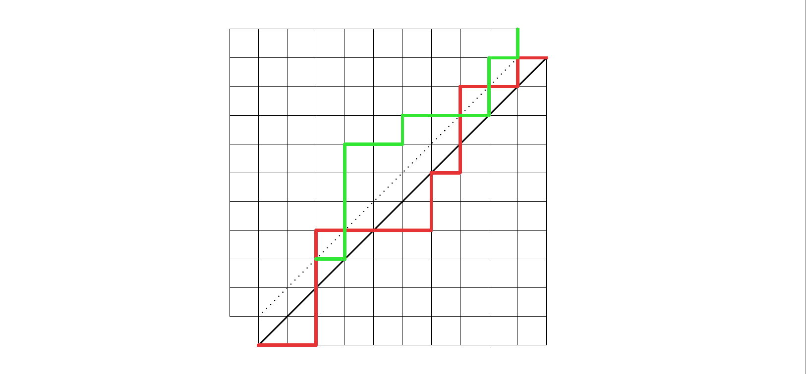

# 卡特兰数

卡特兰数（$\text{Cattelan Number}$）是一类在组合数学中出现的数列，常用于计数各种组合结构。  

## 卡特兰数计算公式

第 $n$ 个卡特兰数 $C_n$ 可以通过以下公式计算：  

1. $C_n = \binom{2n}{n} - \binom{2n}{n-1}$  
2. $C_n = \frac{1}{n+1} \binom{2n}{n}$  
3. $C_n = \frac{2(2n-1)}{n+1} C_{n-1}$，其中 $C_0 = 1$  
4. $C_n = \sum_{i=0}^{n-1} C_i \times C_{n-1-i}$，其中 $C_0 = 1$  

求解卡特兰数第 $n$ 项（答案对 $mod$ 取模）时，不同数据规模与模的性质会影响可用的方法。

!!! tip "选择合适的计算方法"

    | 数据规模 $n$ |       $mod$        |      公式      | 说明                                       |
    | :----------: | :----------------: | :------------: | :----------------------------------------- |
    |  $n \le 35$  | 任意（通常不取模） |      $4$       | 结果不溢出，直接返回真实值                 |
    | $n \le 10^3$ |        质数        |   $1,2,3,4$    | 预处理阶乘/逆元 $O(n)$，查询 $O(1)$        |
    | $n \le 10^3$ |     可能为合数     |      $4$       | 不依赖逆元，$O(n^2)$ 可行且稳妥            |
    | $n \le 10^6$ |        质数        |    $1,2,3$     | 预处理 $O(n)$，空间 $O(n)$，高效           |
    | $n \le 10^6$ |     可能为合数     | $2$+因子计数法 | 不用逆元，通过因子计数重建整数再使用快速幂 |

???+ note "卡特兰数"

    === "公式$1+2+3$（阶乘+逆元预处理）"

        ```cpp
        #include <cstdint>
        #include <vector>
        using namespace std;

        int64_t Cattelan(int64_t n, int64_t mod) {
          auto pow = [](int64_t a, int64_t b, int64_t mod) -> int64_t {
            int64_t res = 1 % mod;
            a           = a % mod;
            while (b > 0) {
              if (b & 1) { res = res * a % mod; }
              a   = a * a % mod;
              b >>= 1;
            }
            return res;
          };

          // O(n)预处理阶乘和逆元
          vector<int64_t> fact;          // 阶乘
          vector<int64_t> inverse_fact;  // 阶乘的逆元
          vector<int64_t> inverse;       // 乘法逆元
          auto build = [&](int64_t n, int64_t mod) {
            fact.resize(n + 1, 1);
            inverse_fact.resize(n + 1, 1);
            inverse.resize(n + 1, 1);
            for (int i = 2; i <= n; ++i) { fact[i] = fact[i - 1] * i % mod; }
            inverse_fact[n] = pow(fact[n], mod - 2, mod);
            for (int i = n; i > 1; --i) { inverse_fact[i - 1] = inverse_fact[i] * i % mod; }
            for (int i = 2; i <= n; ++i) { inverse[i] = inverse_fact[i] * fact[i - 1] % mod; }
          };

          // 计算C(n, m) = n!/(m!*(n-m)!)
          auto combination = [&](int64_t n, int64_t m) -> int64_t {
            if (m < 0 || m > n) { return 0; }
            return fact[n] * inverse_fact[m] % mod * inverse_fact[n - m] % mod;
          };
          // 预处理阶乘和逆元
          build(2 * n, mod);

          // 公式1: C(2n,n) - C(2n,n-1)
          { return (combination(2 * n, n) - combination(2 * n, n - 1) + mod) % mod; }
          // 公式2: C(2n,n)/(n+1) = C(2n,n) * (n+1)^(-1)
          { return combination(2 * n, n) * pow(n + 1, mod - 2, mod) % mod; }
          // 公式3: f(n) = f(n-1) * (4n-2) / (n+1)
          {
            vector<int64_t> catalan(n + 1, 1);
            for (int i = 1; i <= n; ++i) {
              catalan[i] = catalan[i - 1] * (4 * i - 2) % mod * inverse[i + 1] % mod;
            }
            return catalan[n];
          }
        }
        ```

    === "公式$4$（递推）"

        ```cpp
        #include <cstdint>
        #include <vector>
        using namespace std;

        int64_t Cattelan(int64_t n, int64_t mod) {
          vector<int64_t> catalan(n + 1, 0);
          catalan[0] = 1;
          // 公式4: C_n = sum(C_i * C_(n-1-i)), i=0..n-1
          for (int i = 1; i <= n; ++i) {
            for (int j = 0; j < i; ++j) {
              catalan[i] = (catalan[i] + catalan[j] * catalan[i - 1 - j]) % mod;
            }
          }
          return catalan[n];
        }
        ```

    === "公式$2+$因子计数法"

        ```cpp
        #include <cstdint>
        #include <vector>
        using namespace std;

        int64_t Cattelan(int64_t n, int64_t mod) {
          auto pow = [](int64_t a, int64_t b, int64_t mod) -> int64_t {
            int64_t res = 1 % mod;
            a           = a % mod;
            while (b > 0) {
              if (b & 1) { res = res * a % mod; }
              a   = a * a % mod;
              b >>= 1;
            }
            return res;
          };

          vector<int64_t> minprime;  // 最小质因子
          vector<int64_t> primes;    // 质数表
          // 线性筛法求解最小质因子
          auto build_minprime = [&](int64_t n) {
            minprime.resize(n + 1, 0);
            for (int i = 2; i <= n; ++i) {
              if (minprime[i] == 0) {
                minprime[i] = i;
                primes.push_back(i);
              }
              for (int64_t p : primes) {
                if (p * i > n) { break; }
                minprime[p * i] = p;
                if (i % p == 0) { break; }
              }
            }
          };
          build_minprime(2 * n);
          // 公式2: C(2n,n)/(n+1) (1)
          vector<int64_t> count(2 * n + 1, 0);  // 质因子计数
          for (int i = 2; i <= n; ++i) {        // 分母部分 n!, 1不计入
            count[i] = -1;
          }
          for (int i = n + 2; i <= 2 * n; ++i) {  // 分子部分 (2n) * (2n-1) * ... * (n+2)
            count[i] = 1;
          }
          for (int64_t i = 2 * n; i >= 2; --i) {
            if (count[i] == 0) { continue; }
            if (minprime[i] != i) {  // i 不是质数, 分解质因子
              int64_t p     = minprime[i];
              count[p]     += count[i];
              count[i / p] += count[i];
              count[i]      = 0;
            }
          }
          int64_t result = 1;
          for (int64_t i = 2; i <= 2 * n; ++i) {
            if (count[i] != 0) { result = result * pow(i, count[i], mod) % mod; }
          }
          return result % mod;
        }
        ```

        1. $\begin{aligned}
           C_n & = \frac{1}{n+1} \binom{2n}{n} \\
               & = \frac{(2n)!}{(n! * (n+1)!)} \\
               & = (2n) * (2n-1) * \dots * (n+2) / n! \\
               & = \frac{\prod p_i^{e_i}}{\prod p_i^{f_i}}
           \end{aligned}$


## 卡特兰数常见模型

1. 进出栈序列: $n$ 个元素进出栈，有多少种不同的出栈序列？
     - 考虑最后一个出栈的元素 $k(1 \leq k \leq n)$，那么 $k$ 进栈之前栈一定是空的，
       $k$ 之前的 $(k - 1)$ 个元素的进出栈是独立的，即 $f(k - 1)$。  
       同理 $k$ 之后的 $(n - k)$ 个元素也是独立的，即 $f(n - k)$。  
       根据前后结果，求得当 $k$ 最后一个出栈时结果为: $f(k - 1) \cdot f(n - k)$。  
       $k$ 可以是 $[1, n]$ 之间的任意数，所以 $f(n)$ 是累加 $k$ 为 $[1, n]$ 的所有结果。  
     - 本质也是进出栈的还有:

         1. 括号匹配问题: $n$ 对括号正确匹配的字符串数  
         2. 圆上 $2n$ 个点连 $n$ 条不相交的弦等问题  
         3. 不同结构的二叉树数量（节点无差别）  
         4. 不同结构的二叉搜索树数量（节点有差别）  
         5. 凸多边形三角划分问题: $n+2$ 边形的三角划分数  

2. 路径计数: 在一个 $n×n$ 的网格中，从 $(0,0)$ 走到 $(n,n)$，每次只能向右或向上走一步，有多少条路径满足路径不会经过下半区（即路径始终保持在 $y \geq x$ 的区域）。
     - 总的路径数为 $C(2n,n)$，但其中有些路径会经过下半区，这些路径是不合法的的。  
       反射法的核心是将这些不合法路径映射到一个新的路径上，使得这些路径与合法路径互不重叠。  
       不合法路径是指路径经过下半区（即某一步中 $y < x$）。  
       反射法：将不合法路径的第一个进入 $y < x$ 的点 $(k, k+1)$ 开始的部分，沿直线 $y = x + 1$ 对称反射，映射到从 $(0, 0)$ 到 $(n-1, n+1)$ 的路径。这些路径的总数为 $C(2n, n-1)$。  
       所以合法路径数为 $C(2n,n) - C(2n,n-1) = C(2n,n)/(n+1)$。  
       
     - 本质也是路径计数的还有:
          1. 不含递增三元组的排列数问题: 求长度为 $n$ 的排列（元素互异）中不含递增三元组的排列数  
          2. $\text{123-avoiding}$ 排列数问题: 求长度为 $n$ 的排列（元素互异）中不含递增子序列 $1,2,3$ 的排列数  
          3. $\pm 1$ 序列($m$ 个 $+1$，$n$ 个 $-1$，$m \geq n$)前缀和不小于 $0$ 的问题: $f(m,n) = C(m+n,m) - C(m+n,m+1) = C(m+n,m) \cdot \frac{(m+1-n)}{(m+1)}$  
