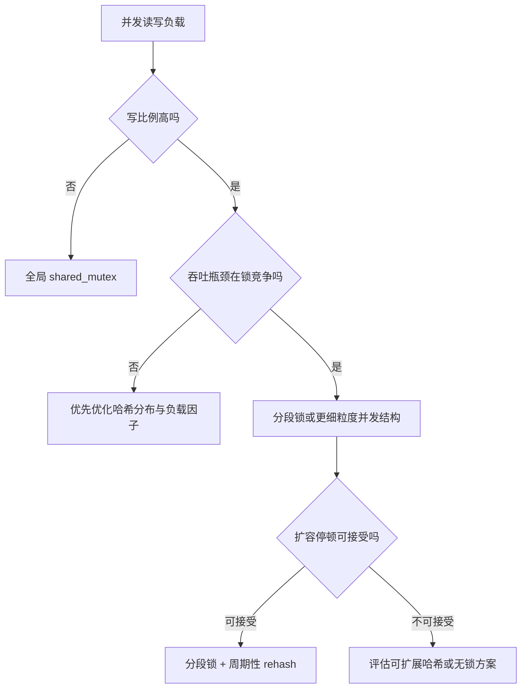

# 数据结构

## 哈希表

哈希表（Hash Table）是一种基于哈希函数实现的键值对数据结构，提供平均 `O(1)` 的插入、删除和查找性能。其核心设计原则是通过哈希函数将键映射到桶（bucket）索引，从而实现快速访问。哈希表的性能关键在于：

1. 计算哈希码
2. 计算桶索引
3. 在桶内处理冲突（查找、插入、删除）

前两步通常为常数级；性能核心在第 3 步，即桶内冲突链的长度。设元素数为 $n$，桶数为 $b$，负载因子为：

$$
\alpha = \frac{n}{b}
$$

在哈希分布近似均匀时，桶内期望长度为 $\alpha$，因此单次操作期望成本近似为：

$$
T_{avg} = O(1 + \alpha)
$$

当实现将 $\alpha$ 控制在常数量级时，得到平均 `O(1)` 的时间复杂度。

!!! warning

    平均 `O(1)` 不是严格的上界保证。

    若哈希分布严重偏斜，冲突链会拉长，最坏复杂度退化为 `O(N)`。

### 自定义键：哈希与相等的一致性

把自定义类型作为 `std::unordered_map` 的键时，需要同时提供：

1. 相等判定（`operator==` 或自定义 `KeyEqual`）。
2. 哈希函数（`std::hash<Key>` 特化或自定义 `Hasher`）。

核心约束是：若 `a == b`，则必须有 `hash(a) == hash(b)`。

??? note "Code Example"

    ```cpp title="player_id_hash.cpp"
    #include <functional>
    #include <string>
    #include <unordered_map>

    struct PlayerId {
        int server_id;
        std::string account_name;

        bool operator==(const PlayerId& other) const {
            return server_id == other.server_id &&
                   account_name == other.account_name;
        }
    };

    struct PlayerIdHash {
        std::size_t operator()(const PlayerId& key) const {
            std::size_t h1 = std::hash<int>{}(key.server_id);
            std::size_t h2 = std::hash<std::string>{}(key.account_name);
            // 组合哈希，降低字段相关性导致的碰撞概率。
            return h1 ^ (h2 + 0x9e3779b9 + (h1 << 6) + (h1 >> 2));
        }
    };

    std::unordered_map<PlayerId, int, PlayerIdHash> scores;
    ```

工程设计约束可归纳为：

1. 哈希计算应足够快，否则会抵消 O(1) 的查询收益
2. 仅使用定义键身份的只读字段参与哈希与相等判定
3. 避免把易变字段纳入键语义，防止逻辑一致性被破坏

### `std::map` vs `std::unordered_map`

`std::map` 与 `std::unordered_map` 都支持自定义比较逻辑，但底层语义不同。

- `std::map` 基于红黑树，需要提供严格弱序比较器，这决定了键的全序位置（顺序关系）。
- `std::unordered_map` 基于哈希表，需要提供哈希函数与相等谓词，这决定了是否为同一键（等价关系）。

!!! note

    `std::map` 关注顺序关系

    `std::unordered_map` 关注等价关系

## 并发哈希表

并发哈希表的设计核心在于**锁粒度**与**扩容成本**的权衡：

1. 锁冲突是否可控
2. 写入扩容时是否出现全局停顿

### 全局共享互斥锁

使用单个 `std::shared_mutex` 保护整个哈希表。读操作持有共享锁，写操作持有独占锁。

适用条件：

1. 读多写少
2. 数据规模中小
3. 需要最低的实现复杂度

主要瓶颈：

1. 写入峰值下极易遭遇串行化瓶颈
2. 触发表扩容（rehash）时往往会阻塞全部读写操作

### 分段锁

将桶与锁分离，多个桶映射到同一把锁，实现细粒度并发。常见映射逻辑：

$$
bucket\_index = hash(key) \bmod num\_buckets
$$

$$
stripe\_index = bucket\_index \bmod num\_stripes
$$

其中 `bucket_index` 决定存储位置，`stripe_index` 决定需要获取哪把锁。

??? note "Code Example"

    ```cpp title="striped_hash_table.cpp"
    #include <functional>
    #include <list>
    #include <memory>
    #include <mutex>
    #include <shared_mutex>
    #include <vector>

    template <typename K, typename V>
    class StripedHashTable {
    private:
        struct Node {
            K key;
            V value;
            Node(const K& k, const V& v) : key(k), value(v) {}
        };

        size_t num_buckets;
        size_t num_stripes;
        std::vector<std::list<Node>> buckets;
        std::vector<std::unique_ptr<std::shared_mutex>> locks;
        std::hash<K> hasher;

        size_t bucket_index(const K& key) const {
            return hasher(key) % num_buckets;
        }

        size_t stripe_index(size_t bkt) const {
            return bkt % num_stripes;
        }

    public:
        StripedHashTable(size_t b = 1024, size_t s = 16)
            : num_buckets(b), num_stripes(s), buckets(b) {
            for (size_t i = 0; i < num_stripes; ++i) {
                locks.push_back(std::make_unique<std::shared_mutex>());
            }
        }

        void insert(const K& key, const V& value) {
            size_t bkt = bucket_index(key);
            size_t stp = stripe_index(bkt);
            std::unique_lock<std::shared_mutex> guard(*locks[stp]);

            auto& bucket = buckets[bkt];
            for (auto& node : bucket) {
                if (node.key == key) {
                    node.value = value;
                    return;
                }
            }
            bucket.emplace_front(key, value);
        }

        bool find(const K& key, V& out) const {
            size_t bkt = bucket_index(key);
            size_t stp = stripe_index(bkt);
            std::shared_lock<std::shared_mutex> guard(*locks[stp]);

            const auto& bucket = buckets[bkt];
            for (const auto& node : bucket) {
                if (node.key == key) {
                    out = node.value;
                    return true;
                }
            }
            return false;
        }
    };
    ```

!!! warning

    分段锁通常只能缓解锁竞争，不能自动消除扩容带来的全局停顿。

    一旦桶数组进行重建，仍可能需要全局协调或阶段性暂停。

### 并发容器选择逻辑



## 动态哈希：可扩展哈希

可扩展哈希 (Extendible Hashing) 最初是面向外存系统（硬盘页或缓冲页）设计的动态哈希结构。

核心目标是避免传统扩容引发的全表重排，将扩容操作转化为局部桶的分裂。这通过引入两层深度状态来实现：

1. **全局深度 (Global Depth, GD)**：代表系统当前使用哈希值的 `GD` 位作为目录索引，整个目录大小为 $2^{GD}$。
2. **局部深度 (Local Depth, LD)**：绑定于具体的存储桶，代表该桶使用了哈希值的共有前缀位数。必然满足 $LD \le GD$。

其机制概括为：

1. 目录结构 (Directory) 维护了哈希前缀到实体桶的映射。如果某个桶的 $LD < GD$，则在目录中会有 $2^{GD-LD}$ 个索引共同指向该桶。
2. 桶满触发插入时，优先且仅分裂局部桶：如果目标桶的 $LD < GD$，则增加该桶的 $LD$，将其分裂为两个新桶，然后更新目录中相关的指针即可，不涉及整表搬迁。
3. 仅在绝对必要时加倍扩展目录：如果目标桶的 $LD = GD$，则必须先将 $GD$ 增加 1（目录容量翻倍），然后再执行局部分裂。

这种局部性操作使得并发处理更高效，局部分裂让细粒度锁（例如仅锁定对应的局部桶及修改涉及的目录项）更为可行。

??? example "分裂与扩容推演"

    假设每个存储桶的容量上限为 2，系统采用数据的二进制最低连续位作为目录索引。
    
    【初始状态】全局深度 GD = 1
    
    系统通过最低 1 位进行寻址，共有 2 个目录项：
    
    - 目录 [0] 指向旧桶 A (LD=1)。包含数据：000, 010 (满容)
    - 目录 [1] 指向旧桶 B (LD=1)。包含数据：001 (未满容)
    
    【场景 1：触发目录扩容与局部桶分裂】
    
    尝试插入新数据 100。算出末位为 0，经由目录 [0] 需进入旧桶 A，但 A 已满：
    
    1. 深度校验：发现旧桶 A 的 LD (1) 等于当时的 GD (1)，这说明现存的 2 项目录容积已经不足以继续独立细分它们了，必须先扩建目录。
    2. 目录翻倍：系统 GD 整体增加至 2，目录衍生为 4 项。在扩建瞬间，目录 [00] 和 [10] 都暂指旧桶 A，目录 [01] 和 [11] 都暂指旧桶 B。
    3. 局部分裂：旧桶 A 获批提升 LD 至 2，裂变为桶 A0 (专收后缀 00) 与桶 A1 (专收后缀 10)。
    4. 重分配：原本 A 里的 000, 010 以及新入的 100 被精准剥离。000 与 100 进桶 A0，010 进桶 A1。
    5. 映射更新：更新目录指针，将目录 [00] 重定向至桶 A0，目录 [10] 重定向至桶 A1。
    
    此时观察：旧桶 B 纹丝未动，它的 LD 依旧是 1，但它却借来了场景 1 造成的目录扩展红利。现在目录 [01] 和 [11] 正确地共同指向同一个旧桶 B。
    
    【场景 2：触发单纯的局部桶分裂（全程规避停顿）】
    
    紧接上步，向系统中插入 011 和 111。因为二者的最低位同为 1，都顺域名录停在旧桶 B。当存入 011 时，旧桶 B (此时含 001, 011) 宣告塞满。当插入 111 产生超发：
    
    1. 深度校验：旧桶 B 满容，再次检验发现它的 LD (1) 严格小于当前的系统 GD (2)。这就意味着能够直接使用多余名额去分治重排，彻底规避锁表式的全局扩建。
    2. 局部分裂：系统直接将旧桶 B 的 LD 原地提升至 2，裂变成新的桶 B0 (负责后缀 01) 与桶 B1 (负责后缀 11)。
    3. 重分配：将拥堵数据 001, 011, 111 按末尾两位独立平摊散去。001 入主桶 B0，011 与 111 入主桶 B1。
    4. 映射拆分：仅仅在顶层改写受波及的指针，即目录 [01] 分解抛给桶 B0，目录 [11] 取代抛给桶 B1。整个阶段仅在自身局部环境作用，做到了扩容性能平滑缩放。

??? note "Code Example"

    ```cpp title="extendible_hashing.cpp"
    #include <iostream>
    #include <vector>
    #include <memory>

    const int BUCKET_SIZE = 4;

    struct Bucket {
        int local_depth;
        std::vector<int> values;
        Bucket(int depth) : local_depth(depth) {}
        bool is_full() const { return values.size() == BUCKET_SIZE; }
    };

    class ExtendibleHashTable {
        int global_depth;
        std::vector<std::shared_ptr<Bucket>> directory;

        int hash(int key) const {
            // 简单的取低位哈希处理
            return key & ((1 << global_depth) - 1);
        }

    public:
        ExtendibleHashTable() : global_depth(1), directory(2) {
            directory[0] = std::make_shared<Bucket>(1);
            directory[1] = std::make_shared<Bucket>(1);
        }

        void insert(int key) {
            int dir_idx = hash(key);
            auto target_bucket = directory[dir_idx];

            if (!target_bucket->is_full()) {
                target_bucket->values.push_back(key);
                return;
            }

            // 触发分裂
            if (target_bucket->local_depth == global_depth) {
                // 扩展目录字典，全局深度翻倍
                int new_size = 1 << (global_depth + 1);
                std::vector<std::shared_ptr<Bucket>> new_dir(new_size);
                for (int i = 0; i < (1 << global_depth); ++i) {
                    new_dir[i] = directory[i];
                    new_dir[i + (1 << global_depth)] = directory[i];
                }
                directory = std::move(new_dir);
                global_depth++;
            }

            // 分裂局部桶
            int ld = target_bucket->local_depth;
            auto b0 = std::make_shared<Bucket>(ld + 1);
            auto b1 = std::make_shared<Bucket>(ld + 1);
            
            // 拆分原始数据 (根据当前增加的一位来分配)
            for (int v : target_bucket->values) {
                int bit = (v >> ld) & 1;
                (bit ? b1 : b0)->values.push_back(v);
            }

            // 更新目录的指针映射
            int mask = (1 << ld) - 1;
            int base_idx = dir_idx & mask;
            for (int i = 0; i < (1 << global_depth); ++i) {
                if ((i & mask) == base_idx) {
                    int bit = (i >> ld) & 1;
                    directory[i] = bit ? b1 : b0;
                }
            }

            // 数据迁移完成后重新插入当前元素
            insert(key);
        }
    };
    ```

## 无锁动态哈希：Split-Ordered Lists

Split-Ordered Lists 是一种构建无锁且支持并发动态扩容的哈希表数据结构。它通过维护一条穿插有桶哑节点 (Dummy Node) 的全局单向有序链表，将原本分散在多条冲突链上的数据串联起来。

相比于传统“每桶独立维护一个链表”的设计，该结构具有显著的无锁多线程扩容优势：扩容时不会触发任何结点的物理迁移或重散列，只需在逻辑上切分区段。

### 减少搬迁的底层逻辑

此方案背后的核心技术是位反转排序 (Bit-Reversed Ordering)：

1. 对元素的原始哈希码执行位级反转操作（例如 `001` 反转为 `100`）。
2. 将反转后的结果拼接附加标识位（例如正常节点最低位补 `1`，哑节点标志补 `0`），以此作为全局链表的比较序键 (Sort Key)。
3. 扩容分配新的桶时，只需要计算新桶编号反转后的键值，并在链表中找到对应位置插入一个哑节点即可。
4. 原本堆积在老桶（长区间）中且逻辑应当位于新桶的节点，因为其位反转后的值刚好在全局排序上处于新插入哑节点的后方区间，无需移动便自然从属于新桶。

### 并发实现关注点

在工程中，该结构常结合原子比较并交换操作来实现高效的无锁并发：

1. **延迟初始化 (Lazy Bucket Initialization)**：桶的内部数据起初为空。线程查询元素时若发现该桶尚未建立起哑节点，会安全地利用无锁操作将其接入全局链表。
2. **基于 Harris 无锁链表**：节点的插入与删除完全沿用 Harris 无锁单链表算法，以可标记原子指针 (Marked Pointer) 区分逻辑删除与物理跳过状态。
3. **严格语义保障**：基于原子变量的可线性化 (Linearizability) 保证了不论是发生读写竞争还是多线程共同扩容，执行边界语义一致。

??? example "数据排列与扩容示例"

    为了直观理解零迁移机制，假设哈希值为 3 位，全局序键（4位）构成为：`反转后的哈希值（3位） + 节点标志位（1位）`。
    
    其中，哑节点（表示桶的起点）的标志位恒为 0，真实数据节点的标志位恒为 1。例如：
    
    - Dummy 0 (桶 000)：反转 000 -> 拼接 0 -> 序键 0000 (0)
    - Dummy 1 (桶 001)：反转 100 -> 拼接 0 -> 序键 1000 (8)
    - 数据 Hash 0 (000)：反转 000 -> 拼接 1 -> 序键 0001 (1)
    - 数据 Hash 1 (001)：反转 100 -> 拼接 1 -> 序键 1001 (9)
    - 数据 Hash 2 (010)：反转 010 -> 拼接 1 -> 序键 0101 (5)
    - 数据 Hash 4 (100)：反转 001 -> 拼接 1 -> 序键 0011 (3)
    
    场景 1：初始阶段
    
    假设当前只有一个桶 Dummy 0，且插入了数据 Hash 0、Hash 4、Hash 2、Hash 1。它们按照全局序键严格升序链接在同一条物理链表上：
    
    Head -> Dummy 0(0) -> Hash 0(1) -> Hash 4(3) -> Hash 2(5) -> Hash 1(9)
    此时所有数据节点均由 Dummy 0 索引。
    
    场景 2：触发扩容
    
    负载因子上升，系统决定分裂桶，分配第二个桶 Dummy 1（负责所有末位为 1 的哈希值）。
    这只需要根据 Dummy 1 的计算规则生成序键 1000 (8)，然后通过普通的链表插入动作放入其中：
    
    Head -> Dummy 0(0) -> Hash 0(1) -> Hash 4(3) -> Hash 2(5) -> Dummy 1(8) -> Hash 1(9)
    
    由此可见神奇之处：我们唯一做的物理操作就是插入 Dummy 1。那些原本挂在 Dummy 0 后面、但末位是 1 理应划归到新桶的数据（例如 Hash 1，序键 9），由于位反转排序赋予了它们天然的、整体偏后的全局序键，在 Dummy 1 插入后便自动归属于它，彻底省去了扫描链表并迁移数据的昂贵逻辑。

??? note "Code Example"

    ```cpp title="split_ordered_list_concept.cpp"
    #include <cstdint>

    // 反转哈希值的位数，作为映射至 Split-Ordered List 的全局排序依据
    // 这里展示了 32 位整型数据的常数级运算比特反转
    inline uint32_t reverse_bits(uint32_t key) {
        uint32_t v = key;
        v = ((v >> 1) & 0x55555555) | ((v & 0x55555555) << 1);
        v = ((v >> 2) & 0x33333333) | ((v & 0x33333333) << 2);
        v = ((v >> 4) & 0x0F0F0F0F) | ((v & 0x0F0F0F0F) << 4);
        v = ((v >> 8) & 0x00FF00FF) | ((v & 0x00FF00FF) << 8);
        v = ( v >> 16             ) | ( v               << 16);
        return v;
    }

    // 将普通哈希键转化为排序所需 Regular Key
    inline uint64_t make_regular_key(uint32_t hash_val) {
        return (static_cast<uint64_t>(reverse_bits(hash_val)) | 1);
    }

    // 将桶序列转化为排序所需的 Dummy Key
    inline uint64_t make_dummy_key(uint32_t bucket_idx) {
        return static_cast<uint64_t>(reverse_bits(bucket_idx)); // 最低位自然为 0
    }

    /* 
     下方为伪代码概括结构插入思想，使用 CAS 或封装的无锁结构代替直接的指针赋值 
    */
    struct Node {
        uint64_t sort_key;
        int value;
        Node* next; // 实际实现中为 Atomic Marked Pointer
        
        Node(uint64_t k, int v) : sort_key(k), value(v), next(nullptr) {}
    };

    // 假设通过位反转建立的新结点，将按照 sort_key 直接嵌入已包含 dummy 节点的单链表中
    // Node* new_node = new Node(make_regular_key(hash), val);
    // list_insert_lockfree(head, new_node);
    ```

### 位反转排序的跨领域作用

位反转（Bit-reversed ordering）是一项通用技术，不仅用于无锁并发哈希。在众多计算密集型及系统工程场景中均有运用：

1. FFT（快速傅里叶变换）的数据重排阶段，支持原地蝶形计算。
2. 构造 Van der Corput 等低差异序列，改善采样或分布的均匀性。
3. 内存系统中的访存交织与冲突打散，显著降低局部热点冲突概率。

!!! tip

    其设计哲学的统一视角在于：

    通过位重排，将传统序列中由低位主导的“局部相邻”特性映射扩散至“全局分散位置”。

    这种变换有力地改善了结构上的并行性与分布的均匀性。

*[CAS]: Compare-And-Swap
*[FFT]: Fast Fourier Transform
