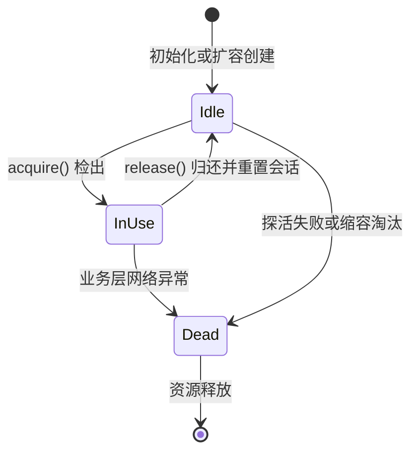

# 连接池

!!! abstract "核心机制"

    连接池（Connection Pool）是一种维持预先建立的网络连接并在不同请求之间复用的资源管理组件。

    其核心目标是通过复用存量连接，消除底层传输层建连（如 TCP 握手）、安全层协议协商（如 TLS 握手）以及应用层认证的开销，从而降低请求延迟、稳定系统吞吐量。

## 状态流转与设计原理

网络连接的创建与销毁是高耗时操作。以数据库连接为例，完整生命周期涵盖了系统调用、网络往返以及身份校验。连接池通过拦截连接的分配与释放，使其在业务逻辑和底层系统之间形成缓冲。

典型的连接在其生命周期中经历以下状态转换：

1. 预热初始：连接建立并自动加入空闲池，等待业务线程分配。
2. 借出使用：业务线程发起检出（Acquire）请求，连接状态由空闲转为使用中。出池前必须进行可用性探活。
3. 归还清理：业务线程执行完毕后归还（Release）连接。入池前必须清理事务或会话上下文，防止脏状态污染。
4. 失效销毁：当连接探活失败或业务侧抛出致命网络异常时，连接被标记为失效并销毁。

!!! note "连接状态流转图"

    只有处于空闲状态且通过健康检查的连接才能被检出。释放时必须保证上下文纯净。



## 核心工程实现

构建生产可用的连接池系统，至少需要解决三个基础工程问题：

- 容量限制：设置最大连接数（`max_size`）以防止耗尽服务端连接池或客户端文件描述符，同时设定最小空闲数避免请求毛刺。
- 探活机制（Keep-Alive）：定期检查或在检出前（Ping-on-checkout）验证连接可用性，避免业务层使用已断开的半开连接。
- 状态隔离与重置：每个请求复用连接时，必须重置会话变量，尤其是数据库事务隔离级别，并确保未提交的事务得到回滚。

以下示例基于 MySQL C API 实现了一个基础连接池。代码采用 RAII 惯用法，通过 `std::unique_ptr` 绑定自定义删除器自动管理连接的归还路径。

???+ note "MySQL C++ 连接池代码示例"

    ```cpp title="connection_pool.hpp"
    #include <mysql/mysql.h>

    #include <condition_variable>
    #include <cstddef>
    #include <memory>
    #include <mutex>
    #include <queue>
    #include <stdexcept>
    #include <string>
    #include <utility>

    namespace db {

    struct MySqlConfig {
      std::string host = "127.0.0.1";
      std::string user;
      std::string password;
      std::string database;
      unsigned int port = 3306;
      std::size_t max_size = 16;
    };

    class MySqlConnection {
     public:
      explicit MySqlConnection(const MySqlConfig& config)
          : config_(config), handle_(mysql_init(nullptr)) {
        if (handle_ == nullptr) {
          throw std::runtime_error("mysql_init failed");
        }

        if (mysql_real_connect(handle_, config_.host.c_str(), config_.user.c_str(),
                               config_.password.c_str(), config_.database.c_str(),
                               config_.port, nullptr, 0) == nullptr) {
          std::string err = mysql_error(handle_);
          Close();
          throw std::runtime_error("mysql_real_connect failed: " + err);
        }
      }

      ~MySqlConnection() { Close(); }

      MySqlConnection(const MySqlConnection&) = delete;
      MySqlConnection& operator=(const MySqlConnection&) = delete;

      MYSQL* native_handle() noexcept { return handle_; }

      bool IsValid() const noexcept { return handle_ != nullptr; }

      bool Ping() noexcept {
        return handle_ != nullptr && mysql_ping(handle_) == 0;
      }

      void ResetSession() {
        if (handle_ != nullptr) {
          mysql_rollback(handle_);
          mysql_autocommit(handle_, 1);
        }
      }

      void Close() noexcept {
        if (handle_ != nullptr) {
          mysql_close(handle_);
          handle_ = nullptr;
        }
      }

     private:
      MySqlConfig config_;
      MYSQL* handle_ = nullptr;
    };

    class MySqlConnectionPool {
     public:
      struct ReturnToPool {
        MySqlConnectionPool* pool = nullptr;

        void operator()(MySqlConnection* conn) const noexcept {
          // BorrowedConnection 析构时优先尝试把连接归还给池，而不是直接 delete。
          if (pool != nullptr && conn != nullptr) {
            pool->ReleaseRaw(conn);
          } else {
            delete conn;
          }
        }
      };

      using IdleConnection = std::unique_ptr<MySqlConnection>;
      using BorrowedConnection = std::unique_ptr<MySqlConnection, ReturnToPool>;

      explicit MySqlConnectionPool(MySqlConfig config)
          : config_(std::move(config)) {}

      BorrowedConnection Acquire() {
        std::unique_lock<std::mutex> lock(mutex_);

        while (true) {
          if (!idle_queue_.empty()) {
            auto conn = std::move(idle_queue_.front());
            idle_queue_.pop();

            if (conn->Ping()) {
              // conn.release() 只转移裸指针所有权，不关闭连接。
              // 随后由 BorrowedConnection 接管，离开作用域时自动触发 ReturnToPool。
              return BorrowedConnection(conn.release(), ReturnToPool{this});
            }

            conn->Close();
            --total_size_;
            continue;
          }

          if (total_size_ < config_.max_size) {
            auto conn = CreateConnectionUnlocked();
            // 新建连接也统一包装成 BorrowedConnection，业务侧无需显式 Release。
            return BorrowedConnection(conn.release(), ReturnToPool{this});
          }

          cv_.wait(lock, [this] { return !idle_queue_.empty(); });
        }
      }

      std::size_t GetTotalSize() const {
        std::scoped_lock lock(mutex_);
        return total_size_;
      }

      std::size_t GetIdleSize() const {
        std::scoped_lock lock(mutex_);
        return idle_queue_.size();
      }

     private:
      IdleConnection CreateConnectionUnlocked() {
        auto conn = std::make_unique<MySqlConnection>(config_);
        ++total_size_;
        return conn;
      }

      void ReleaseRaw(MySqlConnection* conn) noexcept {
        if (conn == nullptr) {
          return;
        }

        // 先用 unique_ptr 接管裸指针，确保任何异常路径都能正确释放资源。
        IdleConnection owned(conn);
        std::unique_lock<std::mutex> lock(mutex_);

        if (!owned->IsValid() || !owned->Ping()) {
          owned->Close();
          --total_size_;
          lock.unlock();
          cv_.notify_one();
          return;
        }

        owned->ResetSession();
        idle_queue_.push(std::move(owned));
        lock.unlock();
        cv_.notify_one();
      }

      MySqlConfig config_;
      mutable std::mutex mutex_;
      std::condition_variable cv_;
      std::queue<IdleConnection> idle_queue_;
      std::size_t total_size_ = 0;
    };

    }  // namespace db
    ```

    `BorrowedConnection(conn.release(), ReturnToPool{this})` 这一行代码的核心作用是将一个原本由 `IdleConnection`（即 `std::unique_ptr<MySqlConnection>`）管理的连接对象转移到 `BorrowedConnection`（即 `std::unique_ptr<MySqlConnection, ReturnToPool>`）的管理之下，同时指定一个自定义删除器 `ReturnToPool`，以确保当 `BorrowedConnection` 离开作用域时，连接能够正确地归还给连接池而不是被销毁。

## 并发控制与性能优化

基础连接池在极高并发场景下可能面临竞争瓶颈或队列阻塞。对于生产级别的中间件开发，通常需要补充以下机制：

- 预热机制（Pre-warming）：系统启动时一次性建立最小空闲数量的连接，避免冷启动过程中的建连风暴拖慢首批请求。
- 异步探活（Background Keep-Alive）：通过后台专有线程定时向空闲队列中的连接发送心跳包（如 `SELECT 1`），替代检出路径上的同步探活，降低请求的长尾延迟。
- 借用超时（Acquire Timeout）：为检出操作增加硬件或业务层面的等待超时控制。防止因后端数据库瞬时抖动造成所有业务线程无限期挂起。
- 队列锁分离：使用 Thread-Local 暂存连接、按底层哈希将单点连接池切片分散，或引入无锁队列（Lock-free Queue），以缓解单一互斥锁所致的锁碰撞开销。

!!! warning "惊群效应与资源竞争"

    当池内耗尽可用连接且大量并发线程阻塞在单一的条件变量上时，只要发生一次资源释放或扩容，就会强行唤醒所有等待线程，导致密集的竞争和无用的 CPU 上下文切换。在设计时应尽可能结合获取超时失败等降级控制策略。

*[ TCP ]: 传输控制协议，一种面向连接的、可靠的、基于字节流的传输层通信协议。
*[ TLS ]: 传输层安全性协议，用于在两个通信应用程序之间提供保密性和数据完整性。
*[ RAII ]: Resource Acquisition Is Initialization，资源获取即初始化，C++ 中管理资源生命周期的惯用法。
