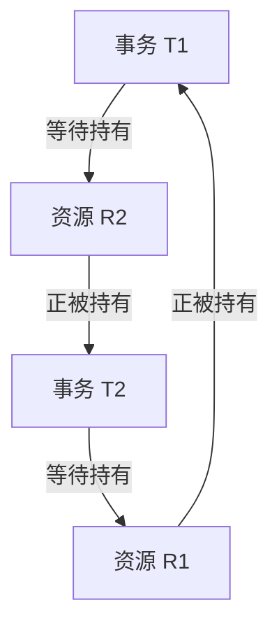
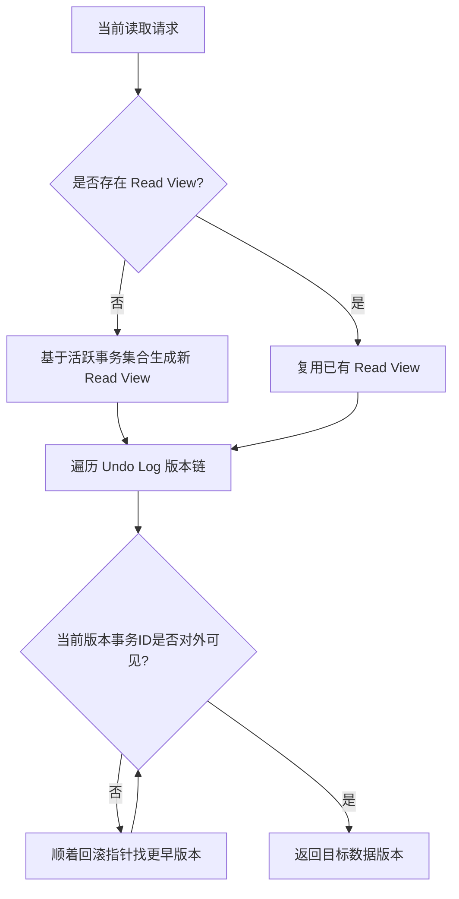

# 并发控制

!!! abstract "摘要"
    事务并发控制（Concurrency Control）机制的核心目标是在多线程并发访问数据库时，保证事务的 ACID 特性（尤其是隔离性 Isolation），并在一致性与吞吐量之间取得最佳平衡。主流的并发控制机制可分为悲观锁、乐观锁、多版本及时间戳四大流派。

## 事务与 ACID 特性

事务（Transaction）是数据库系统执行过程中的一个逻辑基本单位，由一系列有限的数据库操作构成。这些操作要么全部成功，要么全部失败。

并发控制机制的存在主要是为了在并发环境中保障事务的 ACID 四大特性：

- 原子性（Atomicity）：事务是不可分割的最小执行单位。事务内的所有操作要么全部执行，要么全不执行。
- 一致性（Consistency）：事务的执行必须使数据库从一个一致性状态转变到另一个一致性状态。约束与规范不会被破坏。
- 隔离性（Isolation）：并发访问数据库时，一个事务所做的修改在最终提交以前，对其他并发或后续事务是不可见的，彼此独立互不干扰。
- 持久性（Durability）：事务一旦提交，它对其所做的所有修改将被永久保存到非易失性存储设备上，即使数据库发生崩溃也不会丢失。

## 并发异常与隔离级别

当多个事务并发对数据进行读写时，如果不进行并发控制，将必然导致不同的交叉重叠执行顺序而引发典型的三种并发异常：

- 脏读（Dirty Read）：一个事务读取到了另一个事务修改但尚未提交的数据。如果随后第二个事务发生回滚，第一个事务读到的数据即是“脏数据”。
- 不可重复读（Non-repeatable Read）：一个事务内多次读取同一指定数据期间，由于同时活跃的其他修改事务已经提交了对此数据的更改，导致当前事务两次读取出的内容不一致。
- 幻读（Phantom Read）：一个事务内对同一范围的查询操作执行了两次期间，另一个事务在该范围内插入了新数据行并提交，以至于当前事务第二次查出了额外的新记录“幻影”。

!!! example "三种并发异常的直观业务示例"
    以下示例通过典型的业务场景进一步阐明上述异常的实际影响：

    - **脏读（读到回滚状态）**：事务 A 将账户余额从 100 扣减至 50，尚未提交。此时事务 B 读取到余额为 50。随后事务 A 发生异常并回滚，数据库层面的余额恢复为 100。事务 B 却基于这无效的脏状态 50 继续了转账校验，导致业务逻辑出现严重错误。
    
    - **不可重复读（同一行的值被篡改）**：事务 A 申请读取某个账户余额显示为 100。在此事务尚未完结的处理期间，独立事务 B 向该账户存入了 50 并成功提交。当事务 A 因为下一步逻辑再次查验同一账户余额时，发现值变为了 150。事务 A 在同一上下文对同一行进行的两次相同读取引发了结果背离。
    
    - **幻读（返回的数据范围集扩大）**：事务 A 执行范围查询，统计出当前薪资超过 10000 的员工共计 10 人。随后事务 B 新录入了一名高薪员工（薪资 12000）并提交。稍后事务 A 尝试向这些员工发放红利并更新状态时，波及到了 11 条记录。对于事务 A 而言，新记录如同凭空出现的“幻影”。

!!! tip "不可重复读与幻读的核心区别"
    两者在外部表现上都类似于“同一事务内多次读取结果不一致”，但在引发原因与处理手段上有本质区别：
    
    - **不可重复读** 的根本原因是**修改（UPDATE）**或**删除（DELETE）**。其影响的是已经存在的**单条或多条特定记录内容**。要防止不可重复读，只需对事务读取到的相关记录施加行级锁（Record Lock）即可阻止他人篡改。
    - **幻读** 的根本原因是**新增（INSERT）**。其影响的是**结果集的记录条数范围**。即便事务把当前扫描出的所有存在的数据行都加了锁，也无法阻止其他并发事务向该结果范围内凭空插入一条能够满足相同过滤条件的新记录。彻底解决幻读必须升级到范围锁（如 Gap Lock 或 Next-Key Lock）或直接使用串行化。

为在解决上述隔离异常与维持高并发吞吐量之间妥协，SQL 标准定义了四种隔离级别。

并发控制（Concurrency Control）正是底层数据库引擎实现这四阶隔离级别的基础。

### 四种隔离级别完整定义

- 读未提交（Read Uncommitted, RU）：允许事务读取其他事务尚未提交的写入结果。该级别隔离最弱，并发度最高，可能出现脏读、不可重复读和幻读。

- 读已提交（Read Committed, RC）：一个事务只能读取到其他事务已经提交的数据。RC 防止脏读，但仍可能出现不可重复读和幻读。

- 可重复读（Repeatable Read, RR）：在同一事务内，多次读取同一行记录时结果一致。RR 在多数实现中可防止脏读和不可重复读；是否彻底避免幻读取决于数据库实现（如是否使用 Next-Key Lock）。

- 串行化（Serializable）：要求并发事务的最终效果与某种串行执行顺序等价。该级别可防止脏读、不可重复读与幻读，但锁冲突最多，吞吐量通常最低。

### 隔离级别与并发异常对应关系

| 隔离级别 | 脏读 | 不可重复读 | 幻读 | 常见实现特征 |
| :--- | :---: | :---: | :---: | :--- |
| RU | 可能 | 可能 | 可能 | 读取未提交版本，几乎不做读隔离 |
| RC | 不可能 | 可能 | 可能 | 每次读都看最新已提交版本 |
| RR | 不可能 | 不可能 | 依实现而定 | 事务内复用快照；当前读常配合范围锁 |
| Serializable | 不可能 | 不可能 | 不可能 | 通过锁或依赖图将并发强制串行化 |

## 基于锁的并发控制（悲观锁）

基于锁的机制通过阻塞挂起来保障事务执行的隔离性。这套体系主要由加锁规则（两阶段锁）、死锁处理以及多粒度锁（意向锁）三部分构成。

### 两阶段锁协议（2PL）

两阶段锁协议（2PL）是一种基于锁的悲观并发控制机制，通过规定加锁和解锁的顺序来保障并发调度的冲突可串行化。

#### 核心机制

- 增长阶段：事务可以申请任何数据项上的共享锁（S 锁）或排他锁（X 锁），但严禁释放任何锁。
- 收缩阶段：一旦事务释放了第一个锁，即进入收缩阶段。此阶段事务可以释放锁，但严禁申请任何新锁。

#### 常见变体

- 严格两阶段锁（Strict 2PL）：要求事务持有的排他锁必须在事务提交或回滚后释放，用于防止级联回滚。
- 强严格两阶段锁（Strong Strict 2PL）：要求事务持有的所有锁必须在提交或回滚后统一释放，是多数商业数据库（如 InnoDB）的默认锁调度策略。

### 死锁预防与检测

2PL 无法彻底预防死锁。数据库系统通常采用死锁预防或死锁检测来处理。

死锁预防常见算法如 Wait-Die 或 Wound-Wait，利用时间戳决定事务是等待还是回滚。

**Wait-Die（非抢占式）**

设请求锁的事务为 $T_r$，持有锁的事务为 $T_h$。时间戳越小表示事务越老。

- 若 $TS(T_r) < TS(T_h)$：老事务等待年轻事务释放锁。
- 若 $TS(T_r) > TS(T_h)$：年轻事务立即回滚（die），稍后带原时间戳重试。

**Wound-Wait（抢占式）**

同样设请求者为 $T_r$，持有者为 $T_h$。

- 若 $TS(T_r) < TS(T_h)$：老事务“伤害”年轻事务，强制年轻事务回滚，老事务获得资源。
- 若 $TS(T_r) > TS(T_h)$：年轻事务等待老事务。

!!! tip "工程取舍"
    Wait-Die 实现简单，回滚触发点偏后；Wound-Wait 抢占更强，能够更快打破潜在等待链。实际系统通常结合重试退避（backoff）与最大重试次数，避免高冲突场景下活锁。

死锁检测在 InnoDB 中主要依赖等待图（Wait-for Graph）。系统后台线程会定期或在申请锁被阻塞时，检查事务等待锁的拓扑结构是否存在环路。若存在环路，系统会选择代价最小的事务进行回滚。

### 锁粒度与意向锁

并发控制不仅仅涉及何时加锁，还涉及对什么级别的数据实体加锁。

- 表级锁：锁住整张表。开销小，加锁快，不会出现死锁；锁定粒度大，发生锁冲突的概率最高，并发度最低。
- 行级锁：锁住数据行。开销大，加锁慢，会出现死锁；锁定粒度最小，发生锁冲突的概率最低，并发度也最高。

意向锁（Intent Lock）是表级锁，用于在多粒度锁并存的环境下，快速判断表上是否存在行锁。

- 意向共享锁（IS 锁）：事务打算给数据行加行共享锁前，必须先取得该表的 IS 锁。
- 意向排他锁（IX 锁）：事务打算给数据行加行排他锁前，必须先取得该表的 IX 锁。
- 共享意向排他锁（SIX 锁）：事务首先对整个表加上 S 锁，同时它本身还需要修改表里的部分记录，因此在表级再加上 IX 的意向（即 S + IX = SIX）。持有该锁的事务可以读取全表，但只能修改部分行，且排斥其他事务的任何修改或大规模加共享锁的企图。

意向锁之间兼容，不会阻塞。但它们会阻塞表级别的真正的共享锁或排他锁请求，从而避免了在对表加全局排他锁时需要全表遍历检查行锁的昂贵开销。

#### 表级多粒度锁兼容性矩阵

标准数据库多粒度锁机制（如 SQL Server 乃至经典关系数据库理论中）通常具备五种基础组合锁：

| 已持有 \ 请求 | IS | IX | S | SIX | X |
| :--- | :---: | :---: | :---: | :---: | :---: |
| **IS** | ✅ | ✅ | ✅ | ✅ | ❌ |
| **IX** | ✅ | ✅ | ❌ | ❌ | ❌ |
| **S** | ✅ | ❌ | ✅ | ❌ | ❌ |
| **SIX** | ✅ | ❌ | ❌ | ❌ | ❌ |
| **X** | ❌ | ❌ | ❌ | ❌ | ❌ |

#### 行级锁兼容性矩阵（共享锁/排他锁）

| 已持有\\请求 | S（读锁） | X（写锁） |
| :--- | :---: | :---: |
| S（读锁） | ✅ | ❌ |
| X（写锁） | ❌ | ❌ |

#### 行锁类型的物理实现

在多粒度锁与行级锁的具体实现中（如 InnoDB 的当前读路径），为了解决并发异常（特别是幻读），行锁在物理形态上被细分为以下三种范围级别：
    
- **记录锁（Record Lock）**：仅对单个确定的索引记录本身加锁，用于防止其他事务修改或删除该被命中的记录。
- **间隙锁（Gap Lock）**：锁定两个相邻索引记录之间的开区间（或第一条记录前、最后一条记录后的间隙）。其唯一目的是阻止其他事务在此区间内执行 `INSERT` 插入新数据，从源头上遏制幻读现象的发生。需要注意的是，不同事务之间的间隙锁是互相兼容的。
- **临键锁（Next-Key Lock）**：记录锁与该记录前方间隙锁的组合产物，构成一个前开后闭的锁定区间（例如 `(A, B]`）。作为 InnoDB 在可重复读（RR）隔离级别下默认的范围并发控制算法，它兼顾了锁定目标记录与防范幻读的任务。当使用唯一索引进行等值查询并精确命中一条记录时，Next-Key Lock 会触发性能优化，降级为单纯的 Record Lock。
    
在实际工程分析中，锁的兼容性判断与波及范围还会受到索引的类型（唯一/非唯一）、查询谓词范围以及访问路径的深刻影响。排查阻塞问题时必须结合具体 SQL 的执行计划与索引分布条件一起判定。

## 多版本并发控制

多版本并发控制（MVCC）是一种基于数据多版本的并发控制机制，核心优势在于实现读写互不阻塞，主要作用于数据库的存储引擎层。

### 底层核心组件（以 MySQL InnoDB 为例）

- 隐藏字段：数据行中隐式包含最后的事务版本号和回滚指针。

- Undo Log 版本链：每次修改操作不仅更新当前数据，还将旧版本写入 Undo Log，并通过回滚指针串联成历史版本链表。

- Read View（读视图）：快照读操作生成的数据结构，记录当前系统中活跃的事务 ID 集合、最小活跃事务 ID 及下一个将被分配的事务 ID。

### 隔离级别实现差异

- 读已提交（RC）：事务中每次执行快照读均生成全新的 Read View，允许读到其他事务新提交的数据。

- 可重复读（RR）：事务仅在首次快照读时生成 Read View，并在事务生命周期内持续复用，保证多次读取版本一致。

## 其他主流机制

### 乐观并发控制

乐观并发控制（OCC）假定系统并发冲突极少，执行期间完全不加锁。

- 执行阶段：分为读取阶段（写入私有工作区）、验证阶段（提交前校验数据是否被其他事务篡改）、写入阶段（持久化修改）。

- 性能特性：在读极多、写极少的场景下吞吐量极高；在写冲突频繁的场景下会导致大量事务回滚重试，浪费计算资源。

### 时间戳排序协议

时间戳排序协议（TO）利用全局单调递增的时间戳强制推导串行化顺序。

- 核心机制：系统为每个数据项维护最大读取时间戳 $Read\_TS(X)$ 和最大写入时间戳 $Write\_TS(X)$。

- 冲突校验：若事务的时间戳小于目标数据的读或写时间戳，则直接终止并重启事务。

- 性能特性：无锁化设计，从根本上杜绝死锁，但高并发下容易产生频繁的事务中止。

### 可串行化快照隔离

可串行化快照隔离（SSI）是 MVCC 的演进版本。

在保留 MVCC 读写互不阻塞优势的同时，SSI 通过构建底层的事务依赖图实时监控读写反依赖。当检测到可能引发写倾斜的危险拓扑结构时，主动回滚其中一个事务。它是 PostgreSQL 串行化隔离级别的底层实现。

## 现代数据库架构协同

现代关系型数据库通常将多种机制结合使用，以兼顾安全性与性能。

- 快照读：普通 `SELECT` 语句完全依赖 MVCC 机制，读取历史版本，不加任何锁，消除读写阻塞。

- 当前读：直接读取数据的最新提交版本，并依赖强严格两阶段锁（S2PL）对目标行加特定锁。

!!! tip "幻读的解决与 Next-Key Lock"
    在 RR 隔离级别下，快照读的幻读由 MVCC 掩盖；当前读的幻读则由 2PL 结合 Next-Key Lock（记录锁与间隙锁的组合）彻底解决。间隙锁（Gap Lock）专门用于锁定索引区间，阻止其他事务在该区间插入新数据，从而在物理层面切断产生幻读的边界条件。

## 综合对比矩阵

| 机制类型 | 冲突检测时机 | 冲突处理手段 | 核心优势 | 适用场景 |
| :--- | :--- | :--- | :--- | :--- |
| 2PL | 执行前实时拦截 | 阻塞挂起线程 | 保证写操作绝对安全，重试成本低 | 写密集型系统，冲突率高 |
| MVCC | 混合处理 | 生成多版本，读写分离 | 读写操作完全互不阻塞 | 读多写少，通用关系型数据库 |
| OCC | 提交前验证阶段 | 直接回滚并重试 | 彻底无锁化，无等待上下文开销 | 内存数据库，读极多写极少 |
| TO | 执行中实时校验 | 直接回滚 | 无锁化，杜绝死锁 | 分布式数据库或特定无锁引擎 |
| SSI | 执行中图结构监控 | 检测到写倾斜风险时回滚 | 兼顾无锁读与严格的串行化语义 | 需要强一致性与高并发的业务 |

*[ACID]: Atomicity, Consistency, Isolation, Durability
*[2PL]: Two-Phase Locking
*[MVCC]: Multi-Version Concurrency Control
*[OCC]: Optimistic Concurrency Control
*[TO]: Timestamp Ordering
*[SSI]: Serializable Snapshot Isolation
