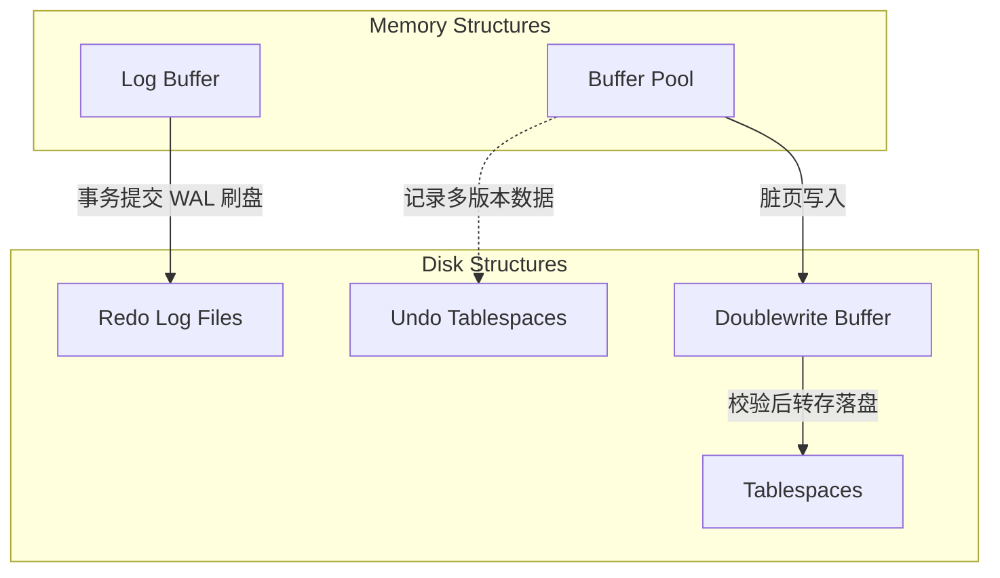

# InnoDB

!!! abstract "摘要"
    InnoDB 是 MySQL 的默认事务型存储引擎。其核心设计目标是通过 B+Tree 聚簇索引、多版本并发控制（MVCC）、行级锁机制、页大小与预读特性、预写式日志（WAL）以及双写缓冲（Doublewrite Buffer），在保障事务 ACID 特性与崩溃恢复能力的同时，提供高并发的读写性能。

## 系统架构与存储引擎特性

InnoDB 的整体架构可以划分为内存结构（基于 Buffer Pool 的缓存管理）与磁盘结构（基于表空间与日志文件的持久化管理），两者通过后台线程与预写式日志机制协助数据刷盘与状态同步。

该架构不仅保证了数据的安全性与持久性，同时通过异步刷盘与日志追加写入模式极大降低了随机 I/O 带来的性能损耗。

### 与传统引擎的对比

相比于早期的 MyISAM 引擎，InnoDB 提供了更完整的数据一致性保障与高并发处理能力。

| 维度 | InnoDB | MyISAM |
| :--- | :--- | :--- |
| 事务支持 | 完整支持 ACID 特性，提供提交、回滚与崩溃恢复 | 不支持事务 |
| 锁机制调度 | 依赖行级锁与意向锁，并发冲突粒度小 | 仅支持读写互斥的表级锁，并发度低 |
| 物理数据组织 | 采用聚簇索引，数据行依附于主键叶子节点 | 索引树与数据文件物理分离存储 |
| 外键约束 | 存储引擎层原生支持外键完整性校验 | 不支持外键约束 |

## 物理存储与索引结构

InnoDB 的磁盘数据以页（Page）为最小的逻辑与物理读取单位。

### 页面结构基础

InnoDB 默认页大小为 16KB，支持配置为 4KB、8KB、32KB 和 64KB。较大的页大小能够在单次 I/O 操作中读取更多的连续行记录与索引项。在执行大范围扫描或访问连续数据时，大缓存页能有效减少磁盘 I/O 的寻道与读取次数，从而提升数据库的整体吞吐量。

### B+Tree 数据结构

无论是主键还是辅助键，所有的数据和索引目录项均通过 B+Tree 树形结构进行组织。

- 叶子节点级：承载实际的数据记录或指针，各叶子节点物理分离但逻辑上通过双向链表连接，以此支持高效的顺序范围区间扫描。

- 非叶子节点级：仅保存边界索引键值与指向下层子节点的页号指针，用于执行从根节点向下的快速路由查找。

### 聚簇索引与二级索引

聚簇索引的本质特征是决定表内数据的物理存放顺序。每张 InnoDB 表必须包含且仅能依赖一个聚簇索引。

- 聚簇索引结构：通常由用户定义的主键充当。其叶子节点直接存储完整的用户态行记录数据。

- 二级索引结构：除主键外的其他辅助索引均为二级索引。其叶子节点仅存储当前索引包含的键值以及对应数据行的主键值。

使用二级索引进行查询过滤时，若查询投影或谓词所需的列未被该二级索引完全覆盖，则解析器必须利用获取到的主键值，回溯到聚簇索引中再次执行树检索以获取整行数据，该物理访问过程称为回表。

!!! note "主键设计原则对缓存的性能影响"
    由于所有二级索引的叶子处均包含一份主键值，主键自身占用的存储空间越小，单个二级索引页能容纳的目录项就越多。这不仅显著降低了全表的磁盘长期存取占用，还能大幅提升 Buffer Pool 中索引页的驻留时间与内存命中率，间接减少磁盘的随机定位开销。

## 内存缓冲与持久化机制

面对机械盘或固态盘存在的随机寻址延迟，InnoDB 在内存与磁盘边界构建了多层缓冲与重做归档体系。

### Buffer Pool 缓冲池

Buffer Pool 是 InnoDB 中占用物理内存最大的核心结构，主要用于缓存频繁访问的数据页和索引页。

- **读优化**：用户的查询请求首先在 Buffer Pool 中查找，如果目标页已被缓存，则直接从内存返回结果，避免了物理磁盘 I/O。

- **写优化（Write Combining）**：对于 DML 更新操作，InnoDB 首先修改 Buffer Pool 中已缓存的数据页并将其标记为“脏页”。随后由后台 Cleaner 线程依据 LRU 算法的淘汰压力及系统负载状态，异步地将脏页批量刷新到磁盘。

### 日志系统

InnoDB 依赖两类核心日志来维护事务的 ACID 特性与多版本数据。

- 重做日志（Redo Log）：记录物理页的变更内容。在事务提交前，引擎必须确保对应的 Redo Log 已持久化到磁盘。若数据库发生崩溃，重启时可通过前滚（Forward Recovery）重放 Redo Log，恢复已提交事务的修改。

- 回滚日志（Undo Log）：记录数据被修改前的历史镜像版本。当执行事务回滚或发生死锁时，系统根据 Undo Log 执行相反操作（如 `INSERT` 对应 `DELETE`）进行恢复。此外，Undo Log 是实现 MVCC 的核心载体，用于提供一致性非锁定读。

!!! warning "Write-Ahead Logging (WAL) 的核心机制"
    InnoDB 遵循 WAL 原则：事务日志（Redo Log）的落盘操作必须先于数据页的落盘。只要 Redo Log 成功写入磁盘文件，即使对应的脏页尚未同步到表空间，系统也能在崩溃恢复时保证已提交事务的修改不丢失。

## InnoDB 核心特性

InnoDB 提供了几项关键特性，用于优化磁盘 I/O 性能并保障数据安全性。

### 插入缓冲（Change Buffer）

非聚簇索引（二级索引）在进行 DML 操作时，若目标索引页不在 Buffer Pool 中，直接进行随机 I/O 载入会产生较高的性能开销。

- **核心机制**：InnoDB 将针对二级索引的修改操作暂时缓存到 Change Buffer 中。当目标索引页由于后续读取操作被加载到 Buffer Pool 时，或由后台 Master Thread 定期执行合并（Merge）操作，将缓存的修改应用到真实的索引页上。该机制将多个离散的随机 I/O 转换为合并后的顺序写 I/O。
- **适用场景**：由于需要唯一性校验，该特性无法应用于包含 `UNIQUE` 约束的索引。主要适用于非唯一二级索引的插入、更新和删除操作。

### 双写缓冲（Doublewrite Buffer）

双写缓冲机制用于解决部分写失效（Partial Page Write）问题。当操作系统崩溃或断电中断 16KB 页写入时，可能出现页面损坏，导致 Redo Log 无法基于损坏的页进行恢复。

- **核心机制**：在将 Buffer Pool 中的脏页刷入磁盘的表空间前，InnoDB 会先将这些页顺序写入磁盘上的双写缓冲区域（Doublewrite Buffer）。
- **崩溃恢复**：若数据页在写入表空间时发生部分损坏，InnoDB 在重启恢复时会从双写缓冲中提取该页的完整副本覆盖损坏的页面，随后再应用 Redo Log 进行前滚恢复。

### 自适应哈希索引（Adaptive Hash Index, AHI）

对于通过聚簇索引或二级索引执行的高频等值查询，B+Tree 仍然需要进行多层索引节点的遍历。

- **核心机制**：InnoDB 监控 Buffer Pool 中索引页的查询模式。若发现某些索引值被频繁进行等值查询，引擎会自动在内存中为这些热点数据构建哈希索引。
- **性能优化**：命中 AHI 时，查询直接通过哈希定位记录，时间复杂度降低至 $O(1)$，无需遍历 B+Tree 的非叶子节点，从而提升内存中热点数据的并发查询性能。

### 预读（Read Ahead）

预读机制旨在通过异步 I/O 提前将预期会被访问的数据页加载到 Buffer Pool 中，以将随机读取转换为顺序读取。

- **核心机制**：InnoDB 包含两种预读算法。线性预读（Linear Read-Ahead）关注顺序访问，当顺序读取同一个区（Extent）内达到一定阈值的页时，会触发异步请求读取下一个区。随机预读（Random Read-Ahead）关注同一区内的空间局部性，若区内已有一定数量的页存在于 Buffer Pool，会自动预读该区内的其他页。
- **性能优化**：预读可以在顺序扫描大表或大范围索引时，隐藏磁盘寻道带来的延迟。

## 并发控制与锁机制

InnoDB 通过多版本并发控制（MVCC）与细粒度的锁机制，在保证事务隔离性的同时提供高并发的读写能力。

### 多版本并发控制（MVCC）

MVCC 允许 InnoDB 在不加锁的情况下执行普通的读取操作（快照读），从而实现读写互不阻塞。

- 隐藏字段与 Undo Log：InnoDB 在每行记录中增加隐藏字段（包含事务 ID 与回滚指针）。回滚指针指向 Undo Log 中该记录的历史版本，进而构成版本链。

- Read View 机制：执行普通 `SELECT` 查询时，InnoDB 会动态生成或复用一个 Read View。系统通过比对记录的事务 ID 与 Read View 中的活跃事务状态，决定当前查询可见的数据版本。

关于 MVCC 在读已提交（RC）与可重复读（RR）隔离级别下的具体生命周期差异，请深入参阅 [并发控制：多版本并发控制](../ConcurrencyControl.md#多版本并发控制)。

### 行级锁与访问范围边界

当执行写操作或带有排他意向的当前读（如 `SELECT ... FOR UPDATE`）时，InnoDB 会基于读取到的最新数据版本加锁，以保障并发一致性。

**InnoDB 行锁的核心实现机制**：
不同于直接对物理行记录加锁，InnoDB 的行级锁实质上是通过**对索引项加锁**来实现的。这意味着只有通过有效的索引进行数据检索，InnoDB 才能在特定的行记录及间隙上加锁。

按照锁定范围与目的，InnoDB 的行级锁算法主要分为三种：

- **记录锁（Record Lock）**：对单条命中的索引记录本身加锁，阻止其他事务对该记录执行 `UPDATE` 或 `DELETE`，适用于精确匹配的被命中记录。在读已提交（RC）和可重复读（RR）隔离级别下均有效。

- **间隙锁（Gap Lock）**：锁定索引记录之间开区间的虚拟范围，防止其他事务在该间隙中执行 `INSERT` 插入新数据，这是为了避免幻读（Phantom Read）的发生。主要在可重复读（RR）隔离级别及以上支持。

- **临键锁（Next-Key Lock）**：Record Lock 与 Gap Lock 的结合体，不仅锁定命中记录本身，同时锁定这行数据前方的间隙，形成前开后闭区间。这是 InnoDB 在 RR 隔离级别下的默认锁定算法。如果在执行查询时，通过**唯一索引或主键**进行等值匹配且成功命中记录，InnoDB 会进行性能优化，将 Next-Key Lock **降级为 Record Lock**，不再锁定间隙。

探究多粒度表锁、意向锁的概念及相应的锁相容矩阵，详见 [并发控制：锁粒度与意向锁](../ConcurrencyControl.md#锁粒度与意向锁)。

!!! warning "索引失效导致锁升级的风险"
    由于 InnoDB 的行锁是通过锁定索引记录来实现的，如果在执行 `UPDATE`、`DELETE` 或 `SELECT ... FOR UPDATE` 时未命中有效索引，导致查询计划退化为全表扫描，InnoDB 将对表中的所有记录以及记录之间的间隙加锁。这种大范围的锁定会阻塞其他事务对该表的写入操作，可能导致严重的并发问题甚至死锁。

*[ ACID ]: Atomicity, Consistency, Isolation, Durability
*[ DML ]: Data Manipulation Language
*[ LRU ]: Least Recently Used
*[ MVCC ]: Multi-Version Concurrency Control
*[ OLTP ]: Online Transaction Processing
*[ WAL ]: Write-Ahead Logging
*[ 脏页 ]: Buffer Pool 中已被修改但尚未同步写入磁盘的数据页
