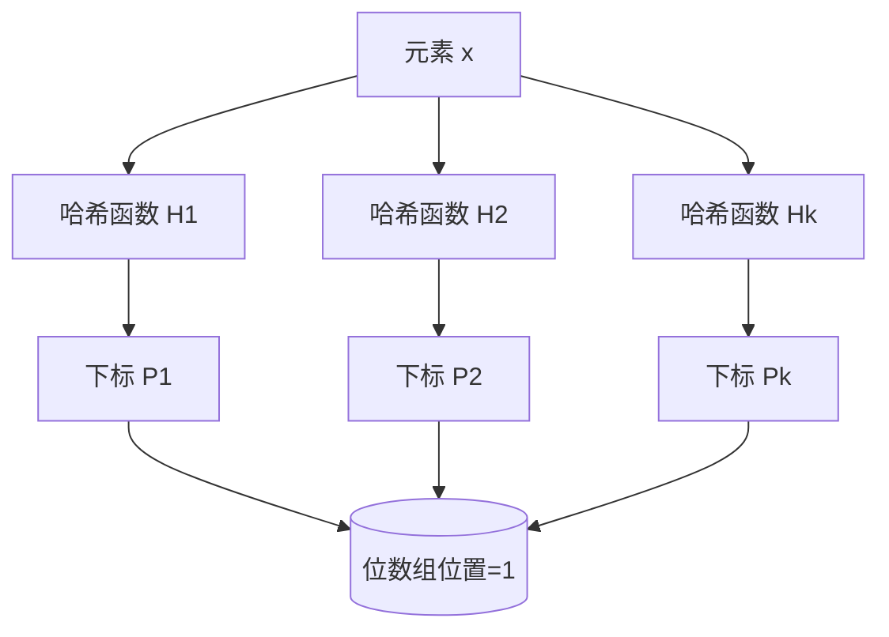

# 布隆过滤器

布隆过滤器（Bloom Filter）由 Burton Howard Bloom 于 1970 年提出，是一种空间效率高的概率型数据结构（Probabilistic Data Structure）。它通过一个二进制位数组和一系列随机映射函数，用于判断一个元素是否存在于特定的集合中。

!!! abstract "工作特性"

    布隆过滤器的查询结果受限于其概率特性，具备以下两类可能：

    - 一定不存在：如果布隆过滤器判断元素不存在，则该元素必定不在集合中。
    - 可能存在：如果布隆过滤器判断元素存在，则该元素可能在集合中。系统中存在一定的假阳性（False Positive）发生率。

## 核心机制

### 1.1 数据结构

布隆过滤器的底层数据结构主要由以下两部分构成：

1. 位数组（Bitmap）：一个长度为 $m$ 的二进制向量，初始状态下所有位的值均被置为 `0`。
2. 哈希函数集合：$k$ 个相互独立且均匀分布的无偏哈希函数 $H_1, H_2, \dots, H_k$。

### 1.2 操作流程

#### 添加元素 (ADD)

当向布隆过滤器中添加元素 $x$ 时，按以下步骤执行：

1. 使用 $k$ 个独立的哈希函数对 $x$ 进行哈希计算，生成 $k$ 个哈希值。
2. 将这 $k$ 个哈希值分别对位数组长度 $m$ 取模，得到 $k$ 个数组下标位置：$P_i = H_i(x) \pmod m$。
3. 将位数组中这 $k$ 个下标对应的比特位置均更改为 `1`。

#### 查询元素 (CONTAINS)

当查询元素 $y$ 是否存在时，按以下步骤执行：

1. 使用相同的 $k$ 个哈希函数对 $y$ 进行哈希计算，生成 $k$ 个下标位置。
2. 检查位数组中相应的比特位状态：
    - 若任意一个位置的值为 `0`，表示元素 $y$ 必定不存在。
    - 若所有位置的值均为 `1`，表示元素 $y$ 可能存在。由于哈希碰撞，不同元素的散列值可能映射至相同下标，进而导致未加入集合的元素被判定为存在。

#### 删除元素 (DELETE)

标准布隆过滤器不支持对已添加数据的删除操作。

若直接将判定命中的相应比特位清零，受哈希冲突影响，操作可能波及同一集合内映射在该比特位的其他元素。这将导致对实际存在的元素产生漏报查询结果（假阴性，False Negative）。在读写场景要求必须包含删除机制时，可以采用引入计数状态的变体结构（例如 Counting Bloom Filter）予以实现。

## 参数期望与设计

布隆过滤器的系统性能与准确性受到初始设计参数的直接影响。在系统应用中，通常基于预计的插入总元素数 $n$ 和可接受的假阳性概率 $p$ 进行配置。

!!! tip "系统参数推导公式"

    根据目标参量 $n$ 和 $p$，可推导最优的位数组长度 $m$ 以及匹配的哈希函数数量 $k$：

    1. 位数组长度 $m$：$m = -\frac{n \ln p}{(\ln 2)^2}$

       *说明：可容忍错误率 $p$ 的设定越低，所分配的位数组 $m$ 则越长；期望元素规模 $n$ 越大，占据的空间线性增加。*

    2. 哈希函数个数 $k$：$k = \frac{m}{n} \ln 2$

       *说明：最优的随机哈希函数数量由平均单元素的比特空间分配比率决定。*

用于计算系统配置参数的在线工具：

- [Hur.st Bloom Filter Calculator](https://hur.st/bloomfilter/)
- [Krisives Bloom Calculator](https://krisives.github.io/bloom-calculator/)

## 技术特征评估

### 优势 (Pros)

- 空间配置效率：区别于在内存结构中持有完整实体数据，布隆过滤器仅维护散列状态标识，显著降低了系统的存储开销。
- 时间计算开销：对集合中元素的插入与查询操作表现为 $\mathcal{O}(k)$ 常数级别的时间复杂度（$k$ 为选用的哈希函数数量），其查询耗时与集合自身规模完全独立。
- 哈希散列保密性：数据实体借助哈希转化处理，布隆过滤器结构不保存任何明文或原生特征，适应脱敏场景并有助于系统防御直接数据枚举。

### 局限 (Cons)

- 存在假阳性的固有概率：架构本身具有不可消除的存在误判特性，会概率性地反馈错误的肯定验证。
- 不可逆的数据提取能力：系统的散列算法过程在映射后发生数据损耗，无法反向还原已知数据集特征。
- 缺失的删除操作支持：基础位数组构造限制了对单个独立元素的删除能力。

## 典型应用场景

在分布式及系统级集成实践中，布隆过滤器用于计算流的前置校验以及冗余数据的避免过滤。

### 4.1 缓存穿透防御

业务问题：如果系统中接收到大量针对既不在缓冲层中亦不存在于底层存储中的目标键的大并发请求，这些请求会绕过缓存层，进而直接转移至底部数据库节点，导致数据库负载过高，形成缓存穿透。

架构方案：

通过布隆过滤器来装载全部合法的业务主键标识。当接收到请求输入后，过滤层作为第一线查询判断：

1. 过滤器反馈拦截：请求键命中“一定不存在”状态 ➡️ 终止请求处理并返回拒绝应答。
2. 过滤器反馈通过：请求键命中“可能存在”状态 ➡️ 放行该请求进入核心数据层查询。
   *(少量产生误判的数据项会被传输进入后续层，均可通过数据库现有查询承载能力正常消化。)*

### 4.2 反复状态判重计算

- Web 爬虫连接筛查：在网络爬虫执行中筛查已被处理的目标地址 URL 链接，阻止系统的循环获取逻辑带来的额外带宽开销。
- 黑名单阻断校验：设置于内部请求网关中或是出站拦截校验中，对系统请求实体进行基于防恶意规则集的快速筛除机制。
- 推荐引擎计算降载：流媒体系统的推荐推流处理基于高访问流量计算冷记录。在此操作范围中能普遍容忍一定的漏推失误率。依靠过滤器能够快速适应已消费分发曝光项内容的庞大内存需求。

### 4.3 底层存储 I/O 开销优化

在基于 LSM-Tree 特性的架构持久化 NoSQL 数据库（如 HBase, RocksDB, LevelDB 等）文件结构操作中，数据检索需层层搜寻对应的持久化磁盘模块（SSTable）。数据库通常默认合并携带特定的 Bloom Filter 索引记录当前存盘块是否存在查询目标项。此时通过跳过对判断为尚未涉及存在项的文件检索，规避直接调用高成本的无关磁盘 I/O 获取。

## 常见结构变种变迁

| 变种数据结构 | 系统设计改良点 |
| :--- | :--- |
| Counting Bloom Filter | 将位数组中的基本映射数据位替换作为包含具有确定范围容量的小数值计数器槽表现域。随着插入操作增加该对应散列命中的计数强度，释放出直接操作减记录的安全删除数据能力。 |
| Cuckoo Filter (布谷鸟过滤器) | 依托布谷鸟散列建立的空间变体架构结构，通常表现为相较于传统过滤器更加严苛优化了空间表现占用规模并且保障严格对基础元素并发读取操作下数据删除支持的需求。可以看做严苛工业场景下的替代部署配置。 |
| Scalable Bloom Filter | 当预期配置结构受制遭遇数据空间使用饱和瓶颈进而拉升整体漏检阈值问题下表现出的自动动态拓展横向增加底层位数组的延展性结构体限制的变体表现层增强框架。 |

## 参考文献与扩展阅读

- Wikipedia: [Bloom filter](https://en.wikipedia.org/wiki/Bloom_filter)
- Redis 官方模块指南: [RedisBloom (现并入 Redis Stack)](https://redis.io/docs/data-types/probabilistic/bloom-filter/)
- CSDN 技术博客: [布隆过滤器全面讲解](https://blog.csdn.net/qq_41125219/article/details/119982158)

*[ LSM-Tree ]: Log-Structured Merge-Tree
*[ SSTable ]: Sorted String Table
*[ I/O ]: Input/Output
*[ URL ]: Uniform Resource Locator
*[ NoSQL ]: Not Only SQL
