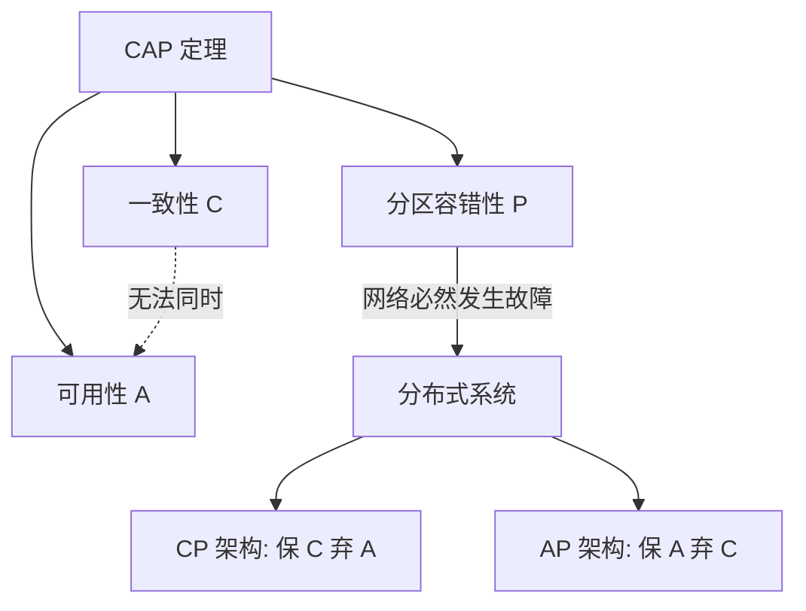

# 分布式理论基石：CAP 定理与 BASE 理论

CAP 定理（CAP Theorem）与 BASE 理论是分布式系统设计的基石。前者界定了分布式系统在面临网络分区时的理论上限与权衡模型；后者则是在该模型下，针对大规模高可用系统的工程实践指导原则。除此之外，PACELC 定理与 FLP 不可能性定理也从不同维度补充了分布式环境下的时延权衡及共识算法边界。

!!! abstract "核心结论"

    - **CAP 定理**：在分布式数据存储系统中，无法同时满足强一致性（Consistency）、可用性（Availability）和分区容错性（Partition Tolerance）。在网络分区（P）不可避免的前提下，系统必须在一致性（C）与可用性（A）之间进行取舍。
    
    - **BASE 理论**：作为对 CAP 中 AP 分支的工程化延伸，通过接受牺牲强一致性，采用基本可用（Basically Available）和软状态（Soft State）设计，最终通过异步机制达到最终一致性（Eventual Consistency）。

## CAP 定理核心定义

CAP 定理涉及的三个属性在分布式存储架构中具有严格的技术定义。

### 1.1 一致性 (Consistency)

此处的一致性特指强一致性（严格等价于线性一致性，Linearizability）。

定义：在分布式系统中的所有节点，必须在同一时间看到相同的数据。这意味着，任何一次写操作成功后，系统内随后发起的所有读操作都必须返回该最新写入的值。

机制与代价：为了维持强一致性，系统在写入数据时通常需要依赖同步复制或分布式共识算法（如 Paxos, Raft 等协议）。这会导致写入延迟增加，且在节点间通信受阻时引发系统整体阻塞。

### 1.2 可用性 (Availability)

定义：系统中的任何非故障节点，都必须对接收到的每个请求（读或写）在一个合理的时间范围内返回非错误响应。

机制与代价：高可用性要求节点能够快速响应客户端，即使该节点由于网络问题无法获取全局最新数据。由此引发的后果是，系统对外界放宽了屏障约束，客户端可能会读取到旧版本（Stale）的滞后数据。

### 1.3 分区容错性 (Partition Tolerance)

定义：分布式系统在遭遇网络丢包、延迟激增或节点间通信完全断开（即网络分区，Network Partition）的情况下，仍能继续作为一个整体运转。

现实意义：由于现代分布式系统跨机器、跨机架乃至跨地域部署，网络故障具有不可避免的物理必然性。因此，分区容错性（P）是分布式系统必须具备的基础属性，而非可选优化项。

## CAP 架构的权衡逻辑

理解 CAP 的关键在于明确其约束条件：既然网络分区（P）一定会发生，架构师必须在节点无法通信的期间，决定系统如何响应请求。

### 2.1 CP 架构 (保一致性牺牲可用性)

!!! warning "核心风险：牺牲可用性导致阻塞"
    当网络分区发生时，为保证所有副本数据绝对一致，系统会拒绝对可能产生状态分歧的节点进行读写处理，或者暂停整体写服务，直到分区恢复且数据同步完成。此时客户端请求可能经历耗时断崖式攀升、超时或收到明确的失败报错。

典型场景与组件：

- 分布式协调服务与元数据管理：如 ZooKeeper（基于 ZAB 协议）、etcd（基于 Raft 协议）。此类需求对数据准确性极高，脑裂（Split-Brain）将导致严重集群混乱。

- 分布式关系型数据库：如 TiDB 及多数传统金融核心链路系统。并发引发的脏读或库存超卖造成的业务破坏远超系统短暂不可用带来的影响。

### 2.2 AP 架构 (保可用性牺牲一致性)

!!! note "工程取舍：容忍数据滞后以保障响应"
    当网络分区发生时，为保证系统持续响应，各节点会退而求其次，基于自身持有的本地数据副本进行读写服务，放弃与其他节点间状态的强制等待同步。此时所有请求都能快速返回反馈，但不同客户端访问不同节点时，可能会读取到相互冲突或处于旧状态版本的数据。

典型场景与组件：

- 高并发的基础服务与缓存中台：如 Eureka（服务发现组件）、Nacos 的 AP 模式、Cassandra、DynamoDB。

- 互联网大并发流行业务：如购物车浏览、社交信息流、点赞系统。此类场景对响应时长极其敏感，且往往能极大地容忍数据秒级的短暂不一致。

## BASE 理论：工程实践的应用

BASE 理论是对大规模互联网分布式系统实践经验的归纳。其核心思想是在面对实际的性能规模挑战且难以完美达成全局强一致性的前提下，利用业务特性进行分级，通过弱化部分状态的一致性要求来换取系统整体的高可用。

### 3.1 基本可用 (Basically Available)

机制：允许分布式系统在出现计算饱和与不可预知故障剧增的突发期，牺牲部分系统功能或降低响应质量，以充分保障核心主干链路的正常运转。

常见工程手段：

- 流量限流与排队：在秒杀等请求突增峰值场景，利用各类令牌桶或漏桶算法对超出系统承载上限的流量予以拦截或阻断等待。

- 服务降级：在大促高负载运行期间，暂时性剥离关闭非主干业务（如评价体系、复杂商品推荐计算等各类下游外部接口），从而返回预设的默认静态缺省数据兜底。

### 3.2 软状态 (Soft State)

机制：允许系统内部的数据流转存在过渡隔离阶段（即中间状态），且认为该中间状态的滞持存在不会对整个外部业务的表象可用性产生根本破坏。

技术表现：主节点写入成功后立即向业务上游返回流转完成信号，而下设至读备库节点的数据落盘同步在后台采用异步处理执行。在整个传输闭环时间窗内，主备库内数据存在一定程度的读取差异滞后（Replication Lag）。

### 3.3 最终一致性 (Eventual Consistency)

机制：系统通过算法声明承诺，在没有新的全局写入操作叠加后，其系统底层的所有的副本数据会经过一段合理容忍的有限时间窗口，最终自行收敛平齐至一模一样的状态表现。

常见工程手段：

- 异步消息队列机制：通过高容错的消息传递与死信消费驱动业务的流水分段状态对齐流转（如订单建立执行创建与库房实际商品库存扣减状态之间的迟延一致协调）。

- 后台补偿与对账（Anti-entropy / Reconciliation）：部署离线定时调度扫描对比各个边缘及核心节点数据间的版本或事务差异，用覆盖更新消除异常错位状态。

- 读修复（Read Repair）：部分无主架构采用在客户端获取合并读取到多数据副本版本冲突报错后，从读操作流程面上由系统自动向下层逆向发起校正最新副本修复操作流程。

!!! note "工程实践指导"
    BASE 理论是对 CAP 定理中 AP 架构分支的延伸与妥协，在大部分互联网应用（如电商、社交网络）中得到广泛应用。通过消息队列异步解耦、容灾降级、定时补偿等手段，系统可以在保证核心流程高可用性的同时，异步实现数据的最终一致性。

## PACELC 定理

PACELC 定理是对 CAP 定理的完整补充，它不仅考虑了网络分区情况下的权衡，还指出了系统在正常运行状态下的性能折中。

- **PAC**：如果发生网络分区（**P**artition），系统必须在可用性（**A**vailability）和一致性（**C**onsistency）之间进行权衡。这部分与 CAP 定理的结论一致。

- **ELC**：否则（**E**lse），即系统正常运行且未发生网络分区时，系统必须在延迟（**L**atency）和一致性（**C**onsistency）之间进行权衡。

系统要保证强一致性，就意味着数据在写入时需要进行多节点同步，这必然会带来网络和磁盘的写入延迟。如果希望降低延迟以提高吞吐量，系统就必须放松对一致性的要求。

!!! warning "延迟与一致性的冲突"
    PACELC 解释了为什么不能简单地将系统归类为 CP 或 AP 架构。例如，在正常网络下，由于追求低延迟，Dynamo、Cassandra 等系统本质上是 PA/EL 系统，而 ZooKeeper、HBase 等系统由于追求强一致性，通常被划分为 PC/EC 系统。

## FLP 不可能性定理

FLP 不可能性定理（Fischer, Lynch, Paterson Impossibility）是分布式共识理论的基石，证明了在完全异步的网络模型下，如果存在哪怕一个可能崩溃的节点，就不可能存在一个确定性的分布式共识算法。

- **异步网络环境**：假设网络环境是完全异步的，消息的传递延迟没有上限，但消息最终会被送达。

- **确定性算法**：指的是算法在相同的输入和初始状态下，运行结果是完全可预测和确定的。

- **崩溃故障模型**：仅考虑节点崩溃并停止工作（Crash-stop），不考虑拜占庭故障（Byzantine failure）。

在分布式系统中，由于无法准确区分“节点发生崩溃”与“网络延迟导致消息迟到”，系统为了达成共识，必须在一致性与终止性之间妥协。

!!! abstract "突破 FLP 定理的工程方案"
    由于纯粹的异步网络下无法实现确定性共识，实际工程实现通常通过引入超时机制（Timeout）、半同步网络模型假设以及随机化算法（如 Raft、Paxos 变种）来规避死锁，从而在实际应用中达成共识。

## 扩展视角：CAC 模型

在更为学术性质的结构探讨中，部分控制理论（如 CAC）提出了针对网络通讯特性的分离评定方法观点：

- Consistency（一致性）

- Availability（可用性）

- Convergence（收敛性）

技术背景：传统 CAP 将数据落盘分布机制与网络连接通断性做了高度的因果绑定。CAC 则意图将网络分区脱离前提，它去强调：即便处于网络通讯质量长期处在极高阻断乃至间歇断联的极端恶劣环境之中，系统的底层协议应该能够如何稳健地达成并恢复至收敛统一。该模型在无去中心化（Decentralized）计算网络架构、边缘物联网以及核心 P2P 协议通信推导领域有极强的原理指导作用。在通用基于中心化的分布式微服务等多数开发领域中，以遵循 CAP 约束以及执行 BASE 实践作为基础结构指导已能够完全胜任架构的基石设计要求。 

## 参考文献与扩展阅读

- InfoQ 技术洞察: [CAP 理论十二年回顾："规则"变了](https://www.infoq.cn/article/cap-twelve-years-later-how-the-rules-have-changed)

- 知乎架构师专栏: [分布式系统的 CAP 定理详解](https://zhuanlan.zhihu.com/p/335617791)

- Jdon 结构视点: [一致性、可用性和收敛性（CAC）](https://www.jdon.com/artichect/consistency-availability-and-convergence.html)

*[ CAP ]: Consistency, Availability, Partition Tolerance
*[ BASE ]: Basically Available, Soft State, Eventual Consistency
*[ AP ]: Availability and Partition Tolerance
*[ CP ]: Consistency and Partition Tolerance
*[ CAC ]: Consistency, Availability, Convergence
