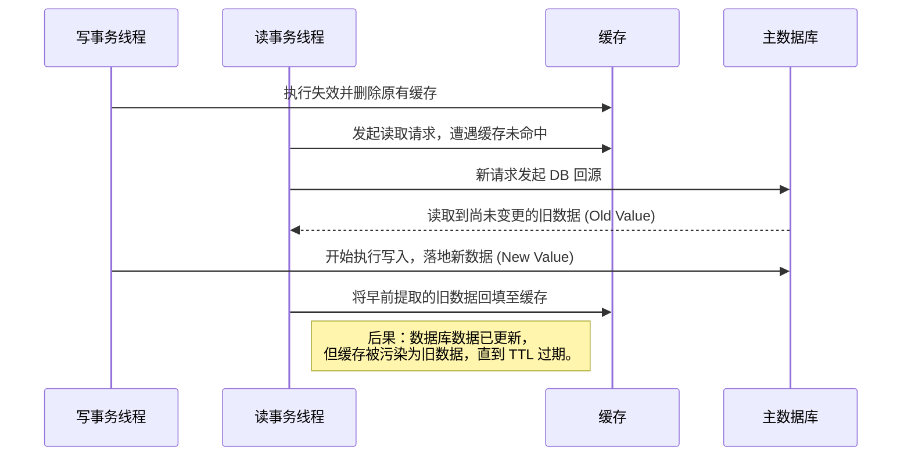
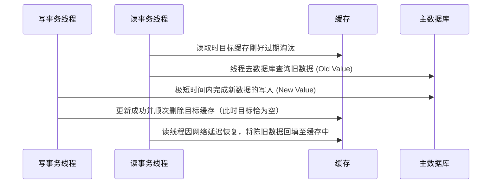
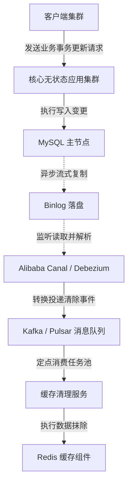

# 缓存与系统一致性

!!! abstract "核心概念"

    在分布式系统中，引入内存级缓存层（如 Redis）能够显著降低底层持久化存储（如 MySQL）的读取压力，并提升系统的整体吞吐量。然而，由于计算节点与存储底座物理分离，两者之间难以建立轻量级的本地事务保障。因此，在发生数据状态变更时，如何协调读写的并发时序，以避免因网络延迟或系统异常导致的脏数据（Dirty Data）问题，是缓存一致性（Cache Consistency）架构设计的核心难点。

## 缓存架构读写拓扑模型

依据业务场景对数据一致性和系统性能要求的不同，缓存系统演化出了多种更新策略。

### Cache-Aside 模式

Cache-Aside（旁路缓存）是应用最为广泛的缓存模式。业务应用代码全权负责数据在主存储与缓存层之间的调度逻辑。

- 读数据阶段：应用端首先探查缓存。若缓存未命中（Cache Miss），应用端向底层数据库请求原始数据，随后在内存中建立映射并回填至缓存介质，最后向最终用户响应数据。

- 写数据阶段：应用端优先向关系数据库提交写指令。确认在磁盘上写入成功后，主动向缓存层发送一条清除（Evict / Delete）对应键名的指令。

!!! note "为什么选用删除操作而不采用更新（Update）操作？"

    在分布式并发环境下，针对缓存节点的写操作存在并发乱序的风险。若多个线程并发执行更新操作，由于网络传输耗时的不确定性，晚执行的数据库写操作可能先完成缓存更新，早执行的操作反而覆写了较新的值。
    
    将写入动作转换为静态的主动失效（Invalidation），强制后续的读请求自动回源获取最新数据进行回填，能有效避免并发覆盖导致的旧值写入问题。

### Read-Through / Write-Through 模式

在该模式下，缓存中间件充当透明的缓冲代理（Proxy）。应用程序直接与缓存中间件交互，不再直接操作底层持久化数据。

- Read-Through 模式：读请求由缓存代理统一处理。若发生缓存未命中，由代理主动向数据库回源并更新缓存。

- Write-Through 模式：应用程序提交写操作时，同步等待代理组件在缓存节点内写入成功。代理在此期间会将数据同时向下写入目标数据库。由于数据双写必须在同一个请求链路中同步完成，这在一定程度上会增加系统的写入延迟。

### Write-Behind 模式

Write-Behind（异步回写）模式以提升并发写入吞吐量为主要设计目标。应用程序的写请求在写入缓存后即可直接返回成功响应，无需等待磁盘写入完成。

后台异步的批处理工作线程（Batching Worker）会接管这些脏页（Dirty Pages），按照固定的时间间隔或容量阈值，将变更数据批量合并并刷新至持久化数据库引擎中。

!!! warning "数据丢失（Data Loss）风险"

    Write-Behind 极大地提升了系统整体效能上限。但是，如果内存缓存节点遭遇断电或进程崩溃，所有尚未异步刷写（Flush）至持久性存储器中的更新数据将会丢失。这种数据折损风险使其仅适用于点赞量、点击计数器等允许一定程度数据不一致或丢失的边缘业务场景。

## 双写并发隔离挑战

对于绝大多数使用 Cache-Aside 模型的应用，面临的高频难点是选择“先写数据库后删缓存”还是“先删缓存后写数据库”。不同的操作时序在并发场景下会带来不同的逻辑风险。

### 先删缓存再更新数据库的缺陷

如果选择提前失效缓存，再启动数据库写过程，在短时间内会对高并发读请求造成数据不一致漏洞：

这种时序极易引发长期的数据污染。针对此漏洞，工程实践中衍生出了延迟双删（Delayed Double Delete）方案：强制在第一次删除缓存并完成主库更新之后，线程主动休眠（Thread Sleep）数百毫秒，随后再次发送缓存删除指令。该休眠时间的设计目标是涵盖读线程完成回源并写回缓存的整个周期。

### 先更新数据库再删除缓存

相较而言，“先更新数据库后使其缓存项失效”被视为并发风险较低的执行时序。其触发倒挂漏洞的条件极其苛刻，但在极小概率下依然存在理论风险：

尽管存在发生“缓存自然失效后网络停顿导致旧值回填”的理论空间，但在实际运行中，数据库写入操作的锁抢占和磁盘 I/O 开销必然大幅度长于简单的读指令流程。因此，这种极小概率事件在真实系统中极难复现，先更新数据库的策略成为了业界的标准实践。

## 重塑最终一致性保障架构

上述分析解决了因乱序并发和读写时延差异引发的不一致风险。然而系统还面临部分失败（Partial Failure）问题：如果业务服务器在 MySQL 数据修改成功后，因为内存溢出（OOM）或网络中断未能发出删除缓存的指令，缓存将无限期保留旧数据。

为保证系统的高可用性与最终一致性，补偿机制需要由异步管道进行保障。

### 基于消息中间件的确认投递重试

对于一致性要求较高的业务场景，在本地数据库事务完成的同时，会向消息中间件（如 Kafka、RocketMQ）发送一条缓存清理消息。

专门的独立消费队列服务负责持续监听该事件。当接收到清除数据缓存的指令时，消费端执行缓存失效逻辑；若由于 Redis 宕机或网络异常导致失败，消息队列依赖消费者确认（ACK）机制与指数退避重试（Exponential Backoff Retries）策略持续执行重试操作，直至缓存清除任务最终成功，从而保障系统的最终一致性（Eventual Consistency）。

### 基于 CDC 与 Binlog 的旁路抓取系统

消息中间件方案导致业务代码与缓存清理逻辑耦合较深。工业界目前的主流方案是引入变更数据捕获（CDC, Change Data Capture）技术。

基于 Canal 或 Debezium 的旁路截流体系接管了处理一致性补偿的职责：

1. 应用层实现解耦：业务服务仅需关注 MySQL 的更新操作，无需编写发送 MQ 消息及清理缓存的代码。
2. 数据一致性保障：Canal 伪装为 MySQL 的从节点（Slave），通过原生主从复制协议获取精准的基于行（Row-based）的 Binlog 日志，从而获得确凿的数据变更快照。
3. 异步平滑投递：这些准确的变更记录被转化为标准事件，通过事件总线（Event Bus）下发至缓存清除服务器。

该架构不仅有效隔离了前端服务器异常宕机导致的消息丢失风险，还将并发处理顺序与数据一致性维护置于底层数据流机制上，是目前保障最终一致性的主流架构设计。

*[ CDC ]: Change Data Capture
*[ TTL ]: Time To Live
*[ ACK ]: Acknowledgement
*[ OOM ]: Out Of Memory

