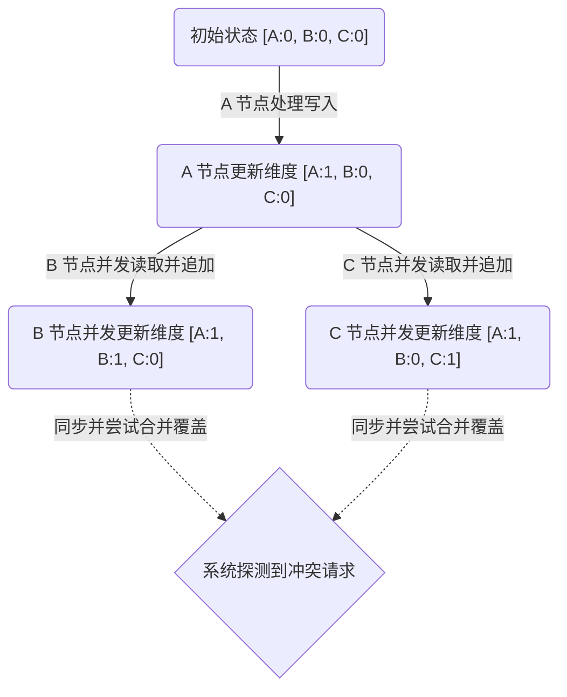

# 时钟与因果关系

!!! abstract "核心概念"

    在分布式系统中，由于网络通信的不确定性以及独立物理硬件的状态隔离，系统无法建立绝对一致的全局时间。时钟（Clocks）系统的核心工程目标，逐渐从记录业务发生的绝对时间（Wall-clock Time），转变为确立系统内部不同事件间的因果关系（Causality）与全局序列（Ordering）。

## 因果关系与“发生在此之前”

在分布式计算模型中，时间不再是一个自发流逝的标量，而是被事件之间的依赖度量所替代。如果系统的输出依赖于过去的某个输入或状态，则表明这两者之间存在因果关系（Causality）。

**发生在此之前**（Happened-Before）关系是构建逻辑因果关系的基础定义，通常使用数学符号 $\rightarrow$ 进行表示。它满足以下三类推导法则：

1. **节点内控制流**：如果事件 $A$ 和事件 $B$ 发生在同一个独立节点进程内，并且在程序的控制流中事件 $A$ 的执行先于事件 $B$，则严格满足 $A \rightarrow B$。

2. **跨节点消息流**：如果事件 $A$ 代表某节点向外发送网络交互消息 $m$，而事件 $B$ 代表另一个独立节点接收到该网络消息 $m$，由于网络传输必定耗费时间，因此严格满足 $A \rightarrow B$。

3. **因果传递性**：如果已知 $A \rightarrow B$，且存在 $B \rightarrow C$，依据数学传递性（Transitivity），必可推导出 $A \rightarrow C$。

在实际运行轨道上，当事件 $A$ 和事件 $B$ 既不满足 $A \rightarrow B$，也无法得出 $B \rightarrow A$ 的推论时，此时称事件 $A$ 与事件 $B$ 之间不存在因果依赖联系。系统将判定这两者正处于**并发**（Concurrent）冲突状态，通常记作 $A \parallel B$。正确识别并处理并发事件是所有分布式并发读写算法的核心要求。

## 物理时钟及其局限性

物理时钟（Physical Clocks）依赖设备内部电子元器件（如石英晶体振荡器）来度量时间流逝。由于温度或供电电压的物理变化，不同设备的晶振频率会产生微小偏移，进而引发可观测的**时钟漂移**（Clock Drift）。

工业界通常依靠外部时间服务器协议，如 NTP（Network Time Protocol）或者 PTP（Precision Time Protocol），周期性对齐系统节点的本地时间。但在解决强因果关系的并发场景中，纯物理时钟同步机制面临系统级的局限性：

- **同步精度受限**：常规 NTP 同步在互联网基础网络中的误差范围通常介于数毫秒至数十毫秒量级。面对每秒万级并发吞吐的数据存储层，这一级别的误差足以使得实际发生较晚的写入操作被错误地分配到更早的时间戳，导致存储层的写入时间线上出现倒置异常现象。

- **潜在的时间回拨**：当进行强制时钟同步校准策略时，节点的时间标度可能会出现瞬时回拨（Clock Jumping Backwards）。对于依赖单调递增时间戳特性的分布式因果序模型而言，时间倒流将直接破坏数据的一致性状态。

!!! warning "物理时钟与 LWW 数据丢失陷阱"

    在具备“最后写入者获胜”（Last Write Wins, LWW）合并策略的最终一致性系统中，冲突决策完全依赖当前节点的物理时间戳。如果节点 A 由于时钟漂移，其物理系统时钟比节点 B 的时钟快 10 毫秒，那么即使节点 B 发起的覆盖写操作在真实的绝对时空中发生在 A 之后，A 携带着看似“更晚”伪造时间戳的数据依然会将 B 真实的更新操作予以强制丢弃。

## 逻辑时钟机制

逻辑时钟（Logical Clocks）设计抛弃了依赖客观物理世界流逝获取时间戳的思路。它利用各节点本地维持的相对单调标量或向量，通过消息机制在全网中扩散以传递发生在此之前偏序逻辑，从而对所有核心事件进行确权标号。

### Lamport 逻辑时钟

Lamport 逻辑时钟（Lamport Timestamps）方案通过为每个事件分配单调递增的正整数，提供了一种在无中心节点系统里生成全序（Total Order）递增序列的标准框架。

其具体算法计算与传递流程如下：

1. 系统初始化阶段，每个节点 $N_i$ 在其内存中独立维护一个起始值为 0 的相对逻辑计数器 $C_i$。

2. **内部执行递增**：在节点处理任何本地逻辑事件（如写入内存）之前，自身必须前置执行自增指令：$C_i = C_i + 1$

3. **发送消息附带状态**：当节点 $N_i$ 需要向远端节点发送信件 $m$ 时，它首先推进系统滴答 $C_i = C_i + 1$，随后在信件 $m$ 的网络载文首部附着当前的瞬时计数值 $C_i$ 作为该消息的逻辑时间戳 $T_m$ 予以发出。

4. **接收消息状态融合**：当远端节点 $N_j$ 接收到附带时间戳 $T_m$ 的消息载荷时，它必须对比提取到的信件发生时间和其自身的本地计时计数，并将自身推演至二者的最远进度之后再次递增一格：$C_j = \max(C_j, T_m) + 1$
   
   随后才允许将信息流转交付给上层调用。

Lamport 时钟的设计成功保证了正向逻辑推导的严格性：若事件在因果关系上存在 $A \rightarrow B$，则生成的编号必定呈现 $T(A) < T(B)$。

!!! warning "单向判定反推缺陷" 

    如果系统全局排序表中出现了某条记录满足 $T(A) < T(B)$，仅凭此条件绝对无法反向推导出 $A \rightarrow B$。
    
    由于没有建立全局完整拓扑，系统无法区分 $T(A) < T(B)$ 是由于 $A$ 与 $B$ 真正存在关联消息交互导致的依次递增，还是仅仅因为两个完全独立的节点各自处理业务导致凑巧出现的自然大小关系。因此，单独使用 Lamport 时钟不足以识别出系统中两个脱节事件是否正处于无交集的并发（Concurrent）更新状态。

### 向量时钟

向量时钟（Vector Clocks）是专门用于解决 Lamport 时钟无法反推出并发冲突与否这一缺陷的数据结构演进版本。向量时钟方案并非采用单一的标量整数，而是由各个节点维护一个恒定长度为 $N$（对应节点总数）的状态数组，以便完整刻画系统因果状态的前进快照。

**并发冲突判断规则**：假设存储层提取到针对同一个键值的两个分离向量时钟记录版本 $V_1$ 与 $V_2$。

- 若对于状态数组内所有遍历维度 $i$，普遍存在 $V_1[i] \le V_2[i]$，且确凿存在至少一个维度呈现出严格的 $V_1[i] < V_2[i]$，系统则依据状态落后关系敲定向量 $V_1$ 代表的事件作为旧历史客观发生在 $V_2$ 之前。存储底座此时能够安全无侧漏地利用 $V_2$ 最新实体对 $V_1$ 做强覆盖操作。

- 若两份向量彼此呈现出锯齿状差异分布（即存在部分节点记录的某一维度 $V_1[i] > V_2[i]$，且与此同时又暴露出其他维度存在 $V_1[j] < V_2[j]$），则在数学上确证了两组独立更新序列在未曾查阅对方数据的隔绝背景下提交了写入指令，这两份修改事实处于完全的并发冲突（Concurrent）态势。

!!! note "工程实践：Dynamo 架构中的兄弟版本机制"

    在 DynamoDB 或 Riak 等专注高可用特征的分布式键值库中，向量时钟只充当冲突探测器。当存储判定发生并发写入时，架构核心往往不会代替应用层丢弃任意一个分支的值，而是采用记录兄弟版本（Siblings）的形式将有冲突的多份数据并存写入磁盘持久化存储。后续请求读取该属性时，系统会将检测到的所有兄弟数据打包反馈，留待客户端逻辑业务层依据特性机制（如电商系统中的最终并集合并计算）去接管执行确定性的冲突消解（Conflict Resolution）。

## 混合与硬件级解决方案：TrueTime

向量时钟结构能准确判断偏序与并发，但却不可避免地让数据结构随着集群扩张表现出严重膨胀，为网络吞吐制造了沉重负担。在需求 Strict Serializable 强一致或者需要确切知道全网操作顺序的大型分布式关系型数据库（如 Google Spanner）集群中，纯粹基于逻辑向量排序机制性能开销庞大。此类系统需要建立的是一条有上限保障的全局一致性物理时间标尺。

Google 针对这一矛盾提出了 TrueTime 基础架构。该设施彻底脱离了逻辑推断的路线，改为在硬件底层集成全球基准原子钟（Atomic Clocks）加上高精度的 GPS 时间接收组件，并辅以专属数据网络。

TrueTime 体系不再向代码提供单点浮点数戳，而是通过返回一段可度量的包含正负物理漂移因子的误差区间容差：

$$
TT.now() \rightarrow [ \text{earliest}, \text{latest} ]
$$

上述边界范围客观量化涵盖了请求函数调用的瞬间当前确凿不可能逃跑出轨的物理事件绝对边界（在 Spanner 中该上下界误差多数情况下保障在 $1 \sim 7$ 毫秒的窄带范围之中）。

**提交休眠等待（Commit Wait）机制**：

依靠客观有界漂移理论，TrueTime 将读写操作序列先后关系转化为等待真实时间跨越重叠交集的过程。为了防范时间的不稳定，保证在全球规模进行部署的数据中心级外部一致性：

1. 主事务执行节点发起提交数据协议命令，获取当前的基准界差区间 $TT.now()$，锁定调用刻度的后置时间界限边界值 $\text{latest}$。该数值被系统强制分配作为该批更新请求向全系统公允宣称的绝对时间落款（记作 $T_{commit}$）。

2. 关键防御生效：该节点在获取时间后绝不立即响应执行提交工作，而是进入睡眠或系统挂起挂靠状态。休眠控制程序不断验证并等待绝对时间推延流逝，直至底层轮询到最新读取返回边界记录之左侧下限（$\text{earliest}$ 参数值）宣告严格大于之前冻结等待的那个 $T_{commit}$（即先前的 $\text{latest}$）时方可放行。

3. 通过等待真实物理时空走过区间误差的不可测疑云网点，任何后产生的因果事件都不再有机会与之产生时间戳重叠错位。醒来后的节点携带确定的事务标号落盘存库，完成了分布场景下的事件保序执行。

## 一致性和存储场景中的应用

分布式事务及无中心节点的数据存储组件通常会引入上述的时钟与确序机制，以解决数据一致性与并发操作的乱序问题。

- **最后写入者胜（LWW）的时间戳覆盖**：许多分布式键值存储（如 Cassandra）采用 LWW（Last Write Wins）策略解决冲突，以降低状态跟踪的系统开销。但在该策略下，冲突解决完全依赖客户端或入口节点附带的物理时间戳。如果个别节点由于时钟漂移而生成了超前的时间戳，即使其更新操作在真实世界中发生较早，依然会在后续阶段错误地覆盖掉发生更晚的最新数据。

- **兄弟版本与读修复**：当采用向量时钟等并发探测机制时，系统在遇到并发冲突时不会直接丢弃或覆盖数据。常见的处理方式是将冲突的分支数据同时保留，形成**兄弟版本**（Siblings）。在客户端发起后续读取请求时，存储层会将所有并发版本一并返回，由包含业务上下文的应用程序或借助 CRDT（无冲突复制数据类型）进行数据合并。合并后的正确状态最终会被再次写回底层，以修复各节点间不一致的数据副本，这一过程被称为**读修复**（Read Repair）。

- **全局排序与事务时间戳**：在实现快照隔离（Snapshot Isolation）或严格可串行化（Strict Serializability）等强一致性要求时，事务调度层需要获取不受本地节点时钟误差影响的全局提交时间戳（Commit Timestamp），以确立分布式事务间的先后顺序与可见性边界。此类系统通常会引入独立且高可用的 TSO（Timestamp Oracle）组件作为全局时间戳分配器，确保所有的并发事务获得单调递增且全局一致的排序序列。

*[ LWW ]: Last Write Wins
*[ NTP ]: Network Time Protocol
*[ PTP ]: Precision Time Protocol
*[ CRDT ]: Conflict-free Replicated Data Type
*[ TSO ]: Timestamp Oracle
