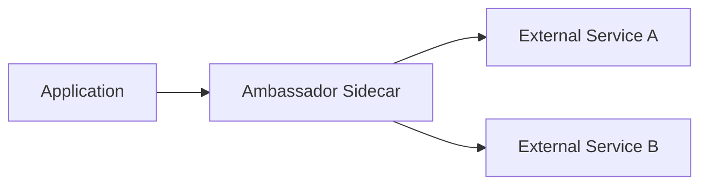
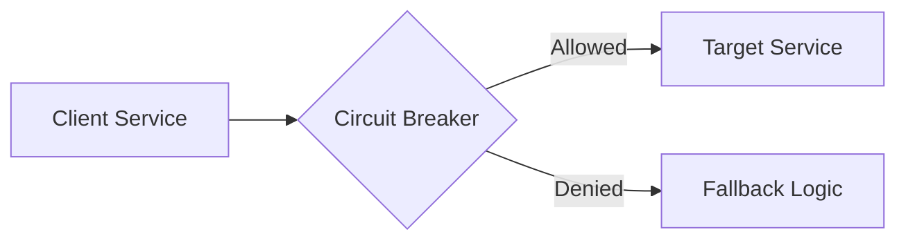
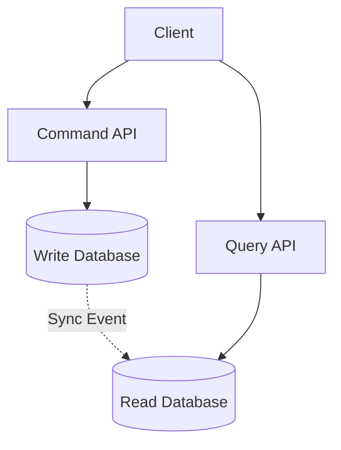
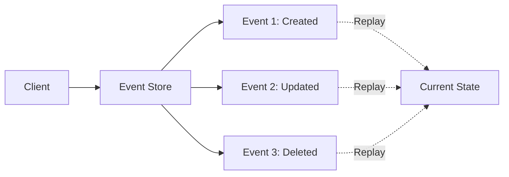
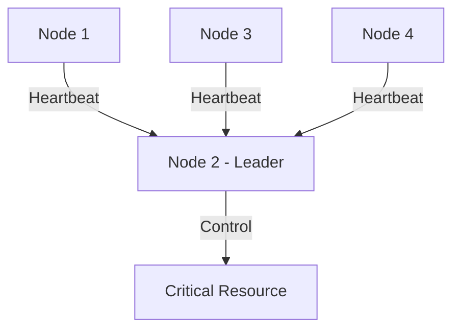
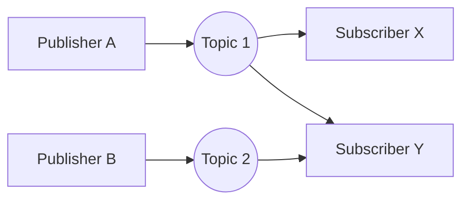
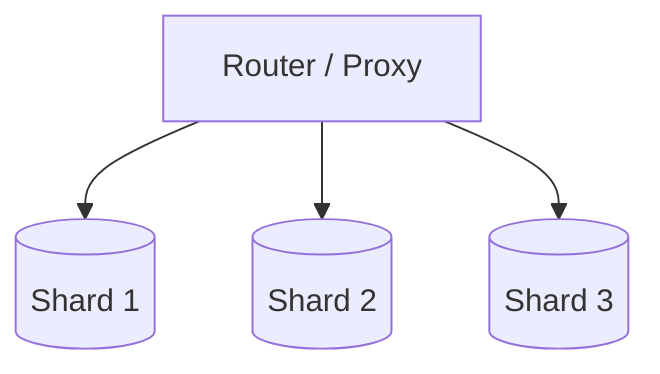
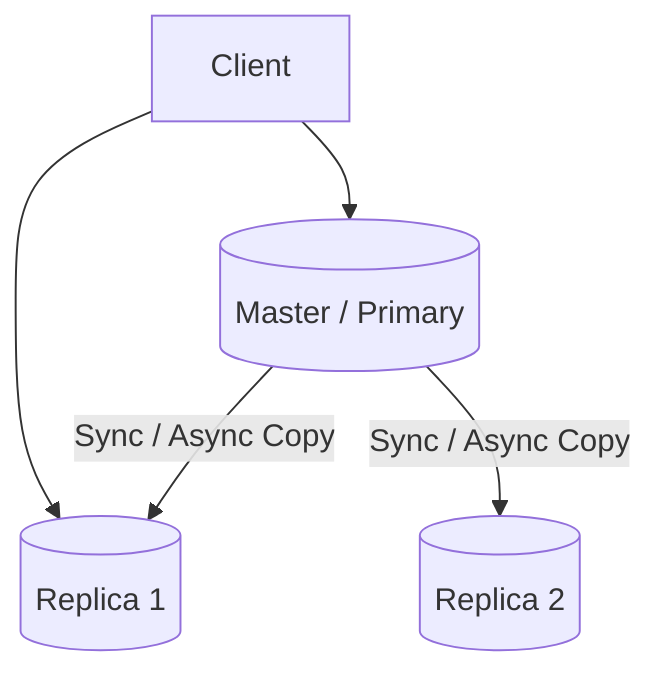
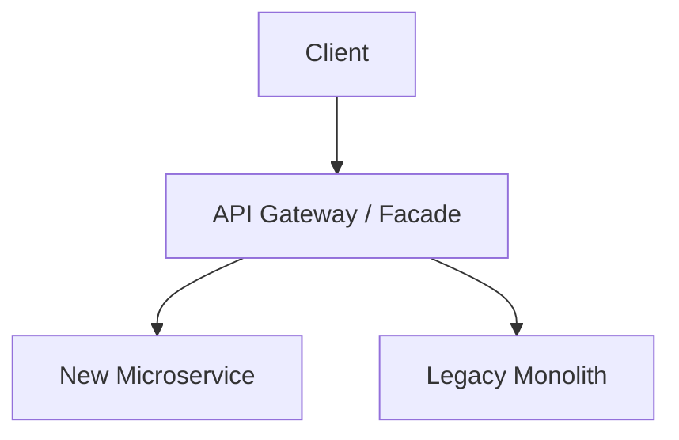

# 分布式系统模式

本页面整理了在分布式系统和微服务架构中经常出现的核心设计模式。这些模式为解决分布式环境下的通信、数据一致性、可扩展性以及系统演进等复杂问题提供了标准化的解决方案。

## Ambassador（大使模式）

Ambassador（大使）模式主要用于处理应用程序与外部服务之间的网络通信。

在此模式下，系统在应用程序实例的旁边部署一个代理服务（即 Ambassador），负责建立连接、路由请求以及执行通信策略。

核心职责包括：

- 管理请求路由与负载均衡
- 实现重试机制与超时控制
- 提供集中的日志记录与监控指标收集
- 执行统一的安全通信策略（如 TLS 加解密）

!!! example "工程实践"

    例如在 Kubernetes 中，通常使用 Envoy 作为 Sidecar 代理，从而将底层网络通信逻辑从业务代码中解耦。

这种模式的显著优点在于降低了核心应用程序的网络管控复杂度，增强了系统调用的安全性，并简化了整体架构的演进成本。

## Circuit Breaker（熔断器模式）

Circuit Breaker（熔断器）模式是一种用于防止级联故障的保护机制。

在分布式系统中，服务之间普遍存在依赖关系。当某一游服务出现延迟激增或不可用时，熔断器可以迅速切断对该服务的请求，避免调用方的资源被耗尽。

熔断器通常维护三种状态：闭合（Closed）、断开（Open）与半开（Half-Open），并根据请求的失败率动态转换状态。

!!! example "工程实践"

    常见的实现包括 Netflix 的 Hystrix，以及更为现代的 Resilience4j 等组件。

其核心优势是极大提高了分布式系统的容错能力和整体可用性，有效防止局部故障向全局蔓延。

## CQRS（命令查询职责分离）

CQRS（Command Query Responsibility Segregation，命令查询职责分离）模式通过分离系统的读操作与写操作，以获得更细粒度的性能优化和扩展能力。

系统的写入模型（Command）主要负责执行业务逻辑与数据校验，而查询模型（Query）则针对数据读取进行专门设计，可能涉及完全不同的数据结构或存储介质。

典型应用场景：

- 读写比例严重失衡的数据库系统
- 查询模型和写入模型在业务逻辑与索引需求上差异极大的场景
- 需要构建复杂聚合查询与缓存机制的架构

!!! tip "实现方式"

    常见的实现方式包括：主库负责处理写请求、从库负责处理读请求；或者在写库更新后，通过发送变更事件异步刷新独立的缓存系统（如 Redis）。

## Event Sourcing（事件溯源）

Event Sourcing（事件溯源）模式摒弃了传统数据库只保存当前业务状态的做法，转而将所有导致状态变更的单一操作作为不可变事件记录在案。

系统的当前状态可以通过按顺序重放这些历史事件来动态计算和重建。

典型应用案例：

- Git 等版本控制系统的更改历史
- 数据库事务日志（如 MySQL Binlog 等）
- 业务事件持久化到 Kafka 后供各类下游系统独立读取和消费

主要优势：

- 天然保留完整的状态演变历史，无法被篡改
- 极大方便了系统的安全审计与故障回放
- 能够与异步消息机制无缝结合，实现最终一致性

## Leader Election（领导者选举）

Leader Election（领导者选举）模式用于在分布式集群中确定唯一的主节点，以确保关键操作或资源调度不发生冲突。

在多节点集群中，所有节点通过某种一致性算法选举出一个 Leader，只有该节点拥有执行特定任务的权限。当现任 Leader 宕机或失联时，剩余的存活节点会重新发起选举投票。

!!! example "工程实践"

    例如 Etcd 与 ZooKeeper 均利用 Leader Election 机制来协调分布式环境下的配置管理和分布式锁。

该模式通过牺牲一定的写入可用性，换取了严格的强一致性，避免了分布式系统中的“脑裂”问题。

## Publisher / Subscriber（发布/订阅模式）

Publisher / Subscriber（发布 / 订阅，简称 Pub/Sub）模式是一种广泛使用的异步通信架构。

在此模式下，事件发布者（Publisher）不直接将消息发送给特定的接收者，而是将消息分类并发送到特定的主题通道中；事件订阅者（Subscriber）则按需监听自己感兴趣的主题，双方互不感知。

典型中间件如 Kafka、RabbitMQ 和 Redis 等。

采用该模式能够深度解耦数据的生产方与消费方，为系统提供了极高的可扩展性和峰值削峰能力。

## Sharding（分片模式）

Sharding（分片）模式是解决海量数据存储与高并发读写的核心扩展手段。

它将庞大的总数据集按照特定的路由算法（如哈希取模或一致性哈希）拆分成多个更小、更易管理的数据块（即 Shard），并分布在不同的物理节点上。

实际应用：

- 关系型数据库的分库分表设计
- 分布式 NoSQL 数据库的数据分布
- Kafka Topic 内部的多个分区机制
- Elasticsearch 对索引的底层分片存储

该模式主要目标在于实现系统容量和吞吐量的水平扩展（Scale-out），但同时也引入了跨分片路由、热点数据倾斜以及分布式事务等工程难题。

## Replica（副本模式）

Replica（副本）模式是在分布式系统中维护数据冗余的基础方案。

通过将同一份数据复制并存储到多个物理节点上，系统可以在某些节点发生硬件故障时，迅速切换到其他健康副本，从而提供高可用服务。

副本数量的反向推演表明：冗余副本越多，系统的容灾能力越强，读取吞吐量上限越高；但随之而来的是保证各副本间数据协同的一致性协议（如 Paxos 或 Raft）的实现复杂度大幅提升。

## Strangler（绞杀者模式）

Strangler（绞杀者）模式是一种平滑迁移和重构大型遗留系统的架构演进策略。

相比于风险极高的“推翻重写”，此模式主张以渐进式的方式，在旧系统前端建立一个统一的应用网关，并逐步将旧系统的各项功能剥离，用独立部署的新微服务进行替代。

主要优点：

- 极大降低了业务中断与系统重构的风险
- 允许研发团队控制迁移节奏，逐步扩大重构范围
- 为客户端提供稳定的统一接口，隐藏了后端的重构细节

!!! note "概念归纳与总结"

    根据其主要解决的领域问题，上述模式可以大致分类：
    
    - **通信治埋**：Ambassador，Circuit Breaker，Publisher/Subscriber
    - **数据组织**：CQRS，Event Sourcing，Sharding，Replica
    - **系统演进**：Leader Election，Strangler

## 参考文献与扩展阅读

- Microsoft Azure 架构中心: [云设计模式 (Cloud Design Patterns)](https://learn.microsoft.com/zh-cn/azure/architecture/patterns/)
- Martin Fowler 系列文章: [微服务架构模式](https://martinfowler.com/articles/microservices.html)

*[ API ]: Application Programming Interface
*[ CQRS ]: Command Query Responsibility Segregation
*[ K8s ]: Kubernetes
*[ TLS ]: Transport Layer Security

