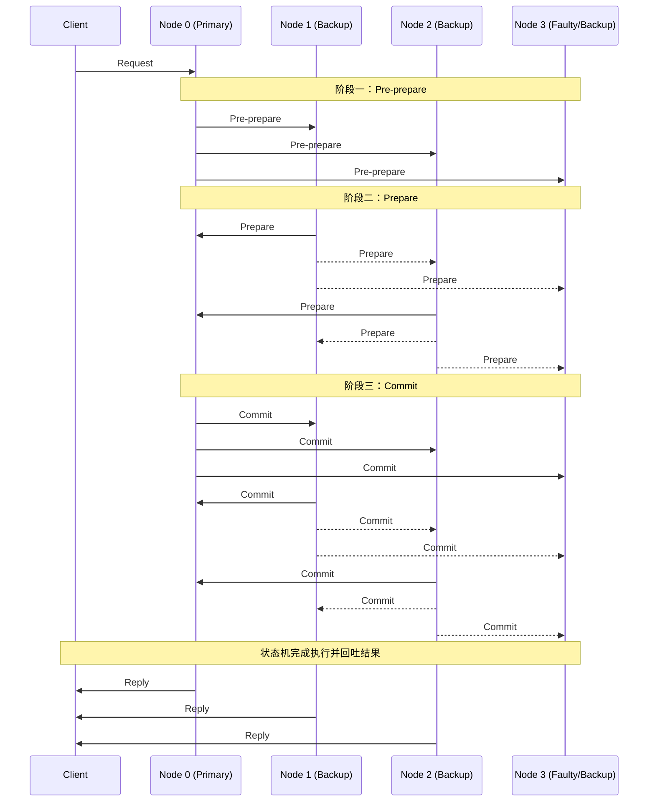

# PBFT 算法

## 基本概念

实用拜占庭容错算法（Practical Byzantine Fault Tolerance, PBFT）由 Miguel Castro 和 Barbara Liskov 于 1999 年提出。它是首个在异步网络环境下，能够在保证安全性和活性（Liveness）的前提下，有效处理拜占庭节点（恶意篡改数据或行为不可预测的节点）的实用共识算法。

与以往具有指数级复杂度的拜占庭容错算法不同，PBFT 将通信复杂度降低至多项式级别（$O(n^2)$），使其在实际工程环境中具备了可行性。在总节点数为 $N$ 的集群中，PBFT 能够容忍最多 $f$ 个拜占庭故障节点，其核心条件为 $N \ge 3f + 1$。

## 角色与视图

PBFT 系统中包含客户端和若干副本节点（Replica）。副本节点在逻辑上被划分为两种角色，其角色由当前系统所处的**视图**（View）决定：

- **Primary**：主节点。在每个视图中唯一存在，负责接收客户端请求、分配全局唯一的序列号，并统筹提议的广播分发。
- **Backup**：从节点。除主节点外的所有副本节点，负责校验主节点的提议，参与共识投票，并在确认共识后将结果反馈给客户端。
- **Client**：客户端。发起请求的发起者。由于网络中存在恶意节点，客户端必须收集来自 $f + 1$ 个不同副本节点的计算结果作为最终的验证依据。

视图（View）是一个连续递增的整数，用于标识当前由哪个节点担任主节点。当主节点被判定发生故障时，系统会触发视图切换（View Change）过程，按照特定算法（通常是当前视图编号对节点总数取模）顺延选出新的主节点。

## 核心机制

PBFT 的正常运行流程被划分为三个核心阶段，即预准备（Pre-prepare）、准备（Prepare）和提交（Commit）。当客户端向系统提交一个操作请求时，整个集群的工作流如下：

### 1. 客户端请求（Request）

客户端向主节点发送包含操作指令的请求。若客户端因超时未收到足够的响应，则会将该请求直接向所有从节点广播。

### 2. 预准备阶段（Pre-prepare）

主节点接收到合法的客户端请求后，分配一个单调递增的系统序列号 $n$，并构造一条 `<PRE-PREPARE, v, n, d>` 消息广播给所有从节点，其中 $v$ 为当前视图编号，$d$ 为请求消息的摘要（哈希值）。此阶段确立了请求在当前视图内的绝对执行顺序。

### 3. 准备阶段（Prepare）

从节点接收到且验证 `<PRE-PREPARE>` 消息后，其状态转入准备阶段，并向集群内所有其他节点多播一条 `<PREPARE, v, n, d, i>` 消息（$i$ 为该从节点自身的标识）。

其他节点收到 `<PREPARE>` 消息后同样验证其签名及参数的一致性。当一个节点除了自身的最初状态外，还能收齐来自其他 $2f$ 个不同节点的具有完全相同视图 $v$、序列号 $n$ 和摘要 $d$ 的 `<PREPARE>` 消息时，该节点便达到了 **Prepared** 状态。该状态确保了集群内对于该序号的请求在单一视图内达到半数以上的一致序列，防止恶意主节点对同一序列号分配多个不同请求。

### 4. 提交阶段（Commit）

达成 Prepared 状态的节点进一步向全网多播 `<COMMIT, v, n, d, i>` 消息。

当某个节点累计收集到包括自身在内，共计 $2f + 1$ 条验证非伪造且内容匹配的 `<COMMIT>` 消息时，该节点流转为 **Committed** 状态。这一重确认机制主要用于跨越视图切换的边界，它在数学上断定：即使现有的主节点宕机导致视图更迭，新视图的多数派阵营中必然包含至少一个记录了该安全确立序号的正常节点。

### 5. 响应客户端（Reply）

节点处于 Committed 状态，并且本节点已经按序执行了该序列号之前所有的请求指令后，即将该指令状态实施进物理状态机，并将计算得出的结果通过响应（Reply）发送回客户端。当客户端最终核对收取到 $f + 1$ 个来自不同节点的匹配签名结果后，该操作被最终视作安全结束。

## 容错边界定理推导

PBFT 之所以要求系统节点数 $N$ 满足 $N \ge 3f + 1$，是因为在拜占庭环境下，必须保证正常节点的多数派交集严格有效。

在任意给定时刻，可能会有 $f$ 个节点属于恶意的拜占庭行为，另有 $f$ 个诚实节点因为临时网络分区而不在线。对于系统的任意决策，必须能够从剩下的 $N - f$ 个响应节点中做出安全判定。

为了防止恶意节点伪造共识，收集到的响应集合内部的诚实节点数量，必须严格大于恶意节点的数量：

$$(N - f) - f > f$$

化简该不等式可得：$N > 3f$。
因此，能够容忍 $f$ 个拜占庭错误的最少节点总规模即为 $N = 3f + 1$。

### 视图切换与垃圾回收

- **视图切换（View Change）**。
    当某个 Backup 节点在规定超时时间内未能推进状态并收获回应，则会主动判定当前 Primary 产生故障，随后向所有节点释放视图切换通知。当系统内收集到超过 $2f$ 个指向相同新视图的申请时，将强制执行换届协议，以防止系统因固定主节点长期隔离而进入死锁瘫痪。
- **垃圾回收（Garbage Collection）**。
    日志序列长期保存会引发存储耗尽。PBFT 系统通过设定固定的步长（如每产生 100 个提交号），触发生成共识系统的数据快照（Checkpoint）。当各节点验证并完成最新一次安全 Checkpoint 落盘后，便可统一且安全地清理更早期历史阶段产生的日志报文。

!!! note "工程应用与局限性"

    相较于 Raft 解决的崩溃容错（CFT，Crash Fault Tolerance），PBFT 首度使非加密货币架构具备了防范恶意节点的拜占庭容错能力（BFT）。该算法深度影响了联盟链领域，是早期 Hyperledger Fabric 的经典共识协议范本。
    然而，PBFT 需要执行全网 $O(n^2)$ 级消息两两多播校验，此高额的通信成本与签名校验开销导致该算法极难具备横向扩展性（通常工业落地节点上限停留在极几十的数量级内），且无法广泛铺设至公链这类海量节点环境。

*[ PBFT ]: Practical Byzantine Fault Tolerance
*[ BFT ]: Byzantine Fault Tolerance
*[ CFT ]: Crash Fault Tolerance
