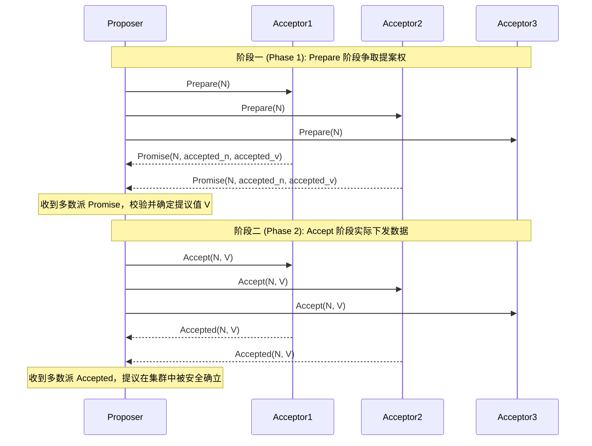

# Paxos 算法

## 基本概念

Paxos 算法由 Leslie Lamport 提出，是第一个被严格数学证明在异步网络模型中能够安全达成共识的算法。它允许节点宕机、网络延迟、消息丢失或乱序，前提是不存在恶意篡改数据的拜占庭故障。

其核心思想是通过两阶段提交和多数派机制，在一个可能存在多个提议者的对等网络中，保证最终只有一个值被安全地选定。算法将共识过程分解为准备与承诺（Prepare and Promise）、提议与接受（Accept and Accepted）两个阶段，通过单调递增的提案编号来解决由于网络不确定性带来的冲突。

## 角色划分

在 Basic Paxos 中，逻辑上定义了三种基本角色。在实际工程系统中，一个物理节点通常同时扮演这三种角色：

- **Proposer**：提议者，负责接收客户端请求并主动发起提议。每次提议包含一个全局唯一且单调递增的提案编号（$N$）和一个提议值（$V$）。
- **Acceptor**：接受者，组成共识集群的被动决策层，负责处理 Proposer 的请求并进行投票表决。只有当超过半数的 Acceptor 接受了某个提议，该提议才被视为最终确立。Acceptor 内部需要持久化记录自身见过的最大提案编号以及已接受的最终提议。
- **Learner**：学习者，不参与投票协商，仅负责从 Acceptor 处获取已经被多数派接受的确立值，并应用到业务状态机中。

## 核心机制与推演

Basic Paxos 的执行流程分为两个主阶段。Acceptor 必须将以下三个核心状态变量持久化到非易失性存储（如本地磁盘）中，以应对节点宕机重启：

- `min_n`：承诺不接受更小编号的提议（初始为 0，即当前节点的最小提案编号阈值）。
- `accepted_n`：历史上已经接受的提议的最大编号（初始为 0）。
- `accepted_v`：历史上已经接受的具体提议值（初始为空）。

### 阶段一：Prepare（准备与获取历史状态）

这个阶段的核心目的是向 Acceptor 申请独占的提案权，并探明集群中是否已经存在可能形成共识的历史值。

1. 发起准备请求。
    Proposer 选择一个全局唯一且单调递增的提案编号 $N$（通常通过时间戳或自增计数器与节点 ID 拼接保证唯一性），向集群中超过半数（多数派）的 Acceptor 并行发送 `Prepare(N)` 请求。此请求中不携带具体的提议值 $V$。

2. 做出承诺与响应。
    Acceptor 收到 `Prepare(N)` 请求后，将 $N$ 与其本地持久化的 `min_n` 对比：
    - 如果 $N > \text{min\_n}$，Acceptor 接受该请求，将本地的 $\text{min\_n}$ 更新为 $N$ 并持久化。这代表 Acceptor 承诺不再接受任何编号小于 $N$ 的 `Prepare` 或 `Accept` 请求。随后，Acceptor 将其已经接受过的最高编号历史提议 `(accepted_n, accepted_v)` 返回给 Proposer（若无历史提议，则返回空）。
    - 如果 $N \le \text{min\_n}$，说明有其他的 Proposer 曾以更大的编号更新了阈值。Acceptor 会拒绝该请求，避免旧状态对系统的干扰。

### 阶段二：Accept（提议决议与确立）

3. 确定最终提议值 $V$。
    当 Proposer 收到多数派 Acceptor 对其 `Prepare(N)` 的成功响应后，进入选定提议值 $V$ 的阶段。分为两种情况：
    - 如果所有多数派的响应中都没有返回任何历史 `accepted_v`，说明之前尚未达成过共识。Proposer 可以指定客户端传入的新数据作为 $V$。
    - 如果 Acceptor 回复的集合中包含历史的 `accepted_v`，Proposer 必须放弃客户端的值，在所有返回的 `accepted_v` 中挑选出其附加的 `accepted_n` 最大的那一个，作为本次提议的 $V$。

4. 发送接受请求。
    Proposer 将确定的 `(N, V)` 数据通过 `Accept(N, V)` 请求广播给多数派 Acceptor。

5. 执行接受与通知。
    Acceptor 收到 `Accept(N, V)` 请求后，进行最后一次界限校验：
    - 如果 $N \ge \text{min\_n}$，Acceptor 持久化该数据，更新 $\text{min\_n} = N$、$\text{accepted\_n} = N$ 且 $\text{accepted\_v} = V$。完成后将被接受的数据通知系统中的 Learner。
    - 如果在此期间有更大编号的提议推高了 `min_n`，导致 $N < \text{min\_n}$，该 `Accept` 请求被丢弃并返回失败。

## 安全性与活锁验证

Paxos 的完备性建立在多数派交集定理（Quorum Intersection）之上。当集群节点数设定为 $2F + 1$ 时，任意两个规模为 $F + 1$ 的半数派集合必定至少包含一个公共交集节点。

### 安全性推演

Paxos 试图解决如果一个值已经被确立成了共识，如何保证它不被后续的 Proposer 覆盖。

假设集群有 A、B、C、D、E 共 5 个节点。

1. Proposer 1 发起编号 $N=10$ 的提案，准备写入数据 X，获得了 A、B、C 的 `Accept`。此时集群中该实例的值确立为 X。
2. 由于网络延迟或隔离，Proposer 2 发起了一个具有更高编号 $N=20$ 的提案，试图写入新数据 Y。
3. Proposer 2 首先发起 `Prepare(N=20)`，必须从至少 3 个节点中获取承诺。
4. 根据多数派交集定理，Proposer 2 的多数派集合必然包含 A、B、C 中的至少一个节点（例如 C）。
5. 节点 C 收到 `Prepare(N=20)`，因为 $20 > 10$，它承诺更新 `min_n` 为 20，并返回历史数据 `(accepted_n=10, accepted_v=X)`。
6. Proposer 2 收到大多数节点的回包后，发现节点 C 返回了历史数据 X（编号 10）。
7. 根据强制继承规则，Proposer 2 必须将其提案数据改为 X。
8. Proposer 2 在第二阶段广播 `Accept(N=20, V=X)`，集群再次持久化数据 X。

即便在对等网络中，一旦共识值（X）被多数派写入，后续的 Proposer 必定会验证并再次广播 X。试图覆盖的行为会在准备阶段受到 `min_n` 的约束，被迫继承已确立的值。

### 活锁（Livelock）僵局

多数派机制确保了安全性，但也引入了活锁风险。由于 Basic Paxos 允许多个 Proposer 同时存在并竞争，如果争夺频繁，系统可能无法推进状态：

1. Proposer 甲以编号 $N=100$ 发起 `Prepare`，获得多数派承诺，`min_n` 更新为 100。
2. 在甲发送 `Accept` 前，Proposer 乙以编号 $N=101$ 发起 `Prepare`。多数派接受该请求，将 `min_n` 更新为 101。
3. Proposer 甲的 `Accept(N=100, V=...)` 请求到达，由于 $100 < 101$，被 Acceptor 拒绝。
4. 甲发现被拒绝后，使用更大的编号 $N=102$ 发起 `Prepare`，导致多数派 `min_n` 更新为 102。
5. 随后 Proposer 乙的 `Accept(N=101, V=...)` 同样因 $101 < 102$ 被拒绝。

双方交替提高提案编号，不断刷新 Acceptor 的 `min_n`，导致各自的 `Accept` 请求均被拒绝。系统陷入循环争夺，无法写入实质数据。

!!! note "从理论到工程：走向 Multi-Paxos 与 Raft"

    Basic Paxos 理论严密，是众多分布式共识算法的理论先驱。但其只能就单个值达成共识。为了实现工程上连续的日志复制，通常需要将其扩展为 Multi-Paxos，即通过选出一个长期的 Leader 来避免频繁的两阶段协商和活锁问题。由于短时间内未能给出具体的实施规范细节，这间接促成了注重“可理解性”的 Raft 算法的诞生与流行。

*[ RPC ]: Remote Procedure Call
