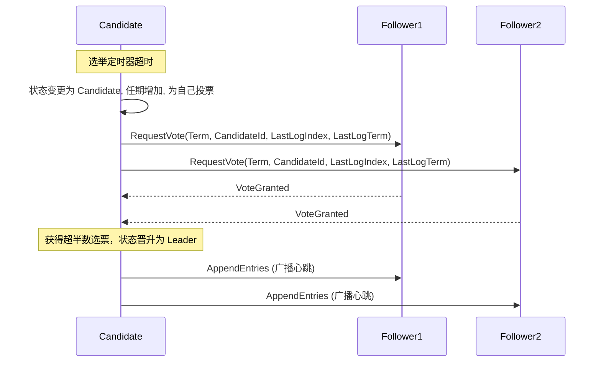

# Raft 算法

## 基本概念

Raft 算法由 Diego Ongaro 和 John Ousterhout 在 2013 年提出，其核心设计目标是提升算法的可理解性。Raft 在功能上等价于 Multi-Paxos，但通过引入强领导者（Strong Leader）模型并限制日志复制的并发度，降低了工程实现的复杂度。

Raft 将共识问题分解为三个相对独立的子问题：

- Leader 选举
- 日志复制
- 安全性

通过严格的状态约束和逻辑时钟的划界，Raft 能够在网络分区、节点宕机等异常情况发生时，保障系统数据的强一致性。

## 节点状态与任期

在 Raft 集群中，任意一个物理节点通常只处于以下三种状态之一：

- **Leader**：领导者。负责处理所有的客户端请求。若是其他节点收到请求，也会将其转发给 Leader。Leader 同样负责管理整个日志复制过程，并向其他节点周期性发送心跳。
- **Follower**：跟随者。作为从节点，不会主动发起请求，仅响应来自 Leader 或 Candidate 的 RPC 调用。如果在超时时间内未收到心跳包，其状态将转变为 Candidate 并发起选举。
- **Candidate**：候选者。用于选举产生新 Leader 的中间过渡状态。

算法引入了**任期**（Term）作为系统中的逻辑时钟。任期是一个单调递增的整数。如果某个节点发现自身的任期号小于集群内其他节点，则会立即更新自身的任期号。相应地，如果当前 Leader 发现自身的任期号已经小于网络中的其他任期，则会自动退化为 Follower 状态。

## 核心机制

### Leader 选举

Raft 依靠心跳机制和随机超时时间来管理选举状态的转换。

1. 选举触发机制。
    正常运行期间，Leader 会周期性地向集群所有 Follower 发送不包含实际日志内容的 `AppendEntries` RPC 作为心跳。Follower 在接收到心跳时，会重置本地的选举超时定时器（超时配置通常为 150 毫秒至 300 毫秒之间的随机值）。
    当 Follower 在该随机超时区间内未收到有效心跳时，将判定集群当前不存在领导者，进而发起新一轮选举。

2. 发起投票。
    发起选举的 Follower 会转换为 Candidate 状态，递增本地维护的任期号（$\text{Term} + 1$），首先为自身投出一票，随后向集群内其他所有节点并行发送 `RequestVote` RPC。

3. 投票规则与校验。
    目标节点在收到 `RequestVote` 请求后，按照以下三项原则决定是否投票：
    - 若请求附带的任期号小于当前节点记录的任期号，直接拒绝。
    - 在同一个任期内，每个节点最多只能投出一票，遵循先发请求先获得的原则。
    - 日志完备性检查（Up-to-date Check）：Candidate 发送的 `RequestVote` RPC 会携带其本地最后一条日志的索引号与任期号。如果投票节点发现自身最后一条日志的任期号大于 Candidate 的任期号，或任期号相等但自身日志索引值更大，则判定由于对应日志陈旧而拒绝投票。最终能够当选的 Leader 必然具备集群内已经被多数派确认过复制的最新日志。

4. 选举结果流转。
    由于网络竞争，该状态将持续直至遇到以下三种情况之一：
    - Candidate 获得集群中超过半数节点（多数派）的选票，晋升为新 Leader。此时立刻向全网广播心跳，制止其他选举请求。
    - Candidate 在等待确认期间，收到属于其他当前当选节点的 `AppendEntries` 请求，并且其任期号大于或等于该 Candidate 的任期号。该 Candidate 将承认新 Leader 的地位并退回为 Follower 状态。
    - 若多个 Follower 几乎同时触发超时并转化为 Candidate，可能导致各自获得相近选票而未能组成多数派（选票瓜分问题）。此时，这些节点的定时器会由于超时重置而再次递增任期号发起选举。由于节点超时时间包含随机性缓冲，通常系统在短时间内即可解决该冲突。

### 日志复制

Leader 确立身份后，系统即开始处理业务写入请求。任何更改最终系统状态的操作请求，都会被封装为日志条目（Log Entry），由 Leader 单向同步至集群的 Follower 节点。

1. 客户端请求与结构封装。
    Leader 收到业务写入操作后，在本地将其封装并追加为新的日志条目。每一行新日志条目包含：实际的业务指令、Leader 此时所处的任期号（Term），以及单调递增的序列索引号（Index）。

2. 日志广播与一致性参数。
    Leader 并行下发包含上述日志条目的 `AppendEntries` RPC 至全网节点。为避免因网络延迟与丢包导致写入不一致，RPC 呼叫中除传递日志数据外，会额外附带上一条历史日志记录的索引号（`PrevLogIndex`）以及相关任期号（`PrevLogTerm`）。

3. Follower 日志校验。
    Follower 获取指令前必须严格进行日志匹配一致性核对：
    - 检索本地记录对应的 `PrevLogIndex` 坐标数据，若节点未能匹配到该坐标，或此位置的任期号对应不上请求传入的 `PrevLogTerm`，此次日志追加行为将立刻向主节点返回失败。
    - 当核对检验安全通过，Follower 的存储引擎才会将新条目顺序入库，并向 Leader 回调确认成功的响应。针对存在多重丢包或历史分区的 Follower 遗留了较多旧值数据的情况，如果在首次核对时便返回失败，Leader 将主动递减递交的 `PrevLogIndex` 位置不断重试探测一致点，当确认最后的一致位置后，强制截断 Follower 冲突的分支数据并实施全量覆写。

4. 回执与多数派提交。
    在获得过半数集群节点下发的成功日志确认信号后，该日志条目在此被正式标志为已提交（Committed）状态。这表明该条目不会丢失，Leader 进而将相关指令交付业务状态机去完成本地执行计算，而后向客户端反馈落盘确认信息。

5. 状态机追赶与最终确认。
    Leader 在后续发出的普通更新或定期心跳 `AppendEntries` 的 RPC 请求体内，均会囊括 `LeaderCommit` 这一最新提交索引水位元数据。系统内的各位从节点在检测到该新指针标尺时，再将对应的被提交命令同样交至各自端的物理状态机计算应用。

### 安全性原则与保证

Raft 算法凭借如下机制逻辑法则规范运行的严谨底线，阻止破坏系统一致性的异常扩散。

- 选举周期互斥约束。
    凭借单届任期只能派发一票配合多数派确认要求，数学层面能够绝对保证在一个指定任期号内最多只存在一个有效领导者。
- 日志单向追加原则（Leader Append-Only）。
    Leader 端任何时刻都不被允许覆写或主动删除自身维护的历史既有日志。对系统的数据更改全数限制为只执行新建追加操作，数据流向明确由 Leader 单向流向 Follower。
- 日志历史关联匹配（Log Matching）。
    若两个集群成员副本存放的一组具有特定索引位置的日志拥有均等的任期号时，这两方副本在该索引号之前包含的历史日志部分必定彼此相同且保持一致。
- Leader 历史完备性要求。
    结合选举流程中所具有的最新验证条件，如果一条记录已被集群确认处于已提交状态，这一历史事件必定存在于此后任何任期当选为合法 Leader 的数据中。
- 物理状态机的执行序列安全。
    综合上述验证流程的互斥限定，如果特定的节点已经在指定的索引位置将指令状态应用执行于状态机，那么其他所有正常运转的节点绝对不会在同一个索引位置执行相异的指令状态。

---

## 容错分析与工程视角

以处理异步非拜占庭环境数据崩溃故障为目的，Paxos 与 Raft 一致性推导核心目标相同，在底层设计规范及其衍生表现方面差异明显。

| 核心组件 | Paxos (Basic Paxos) | Raft |
| --- | --- | --- |
| 整体架构模型 | 去中心化的对等模型，共识机制围绕每次特定的单一写入请求执行多轮并发承诺。 | 控制结构相对集中向单点模型，状态传递单一清晰，极大地收敛了数据的无序性处理及开销成本。 |
| 系统活锁风险 | 当并发触发较多提议节点时，协议不断累加更新编号导致接受端相互覆盖，易遭遇共振活锁问题。 | 使用了具备随机特性的定时处理机制，通过细微的时间窗落差限制直接瓦解选票瓜分的冲突。 |
| 工程实现难度 | 系统细节推导成本较高，各类基于 Multi-Paxos 的优化缺乏统一规范，工业实现偏差极度显著。 | 因为整体框架致力于提升可理解性以及流程的规整性，在系统快照导出及子模块扩展支持方面具有严苛定义，业界标准统一。 |

!!! note "工程应用总结"

    当下分布式应用系统内，Raft 已广泛被应用为底层状态同步共识的基础协议。诸如 Etcd、Consul 等微服务注册中心组件及 CockroachDB、TiKV 等分布式数据库项目，均依托 Raft 原理构建起高可用与可靠容灾的基础副本网络。

*[ RPC ]: Remote Procedure Call
