# 一致性哈希

一致性哈希（Consistent Hashing）主要解决的是在节点数量变化时，如何尽量减少数据迁移的问题。它广泛应用于分布式缓存、对象存储、分布式 KV 系统及各种分片路由系统中。

## 简单哈希取模的局限性

最基础的数据路由算法通常采用简单的哈希取模操作，其计算公式为：

$$
m = \text{hash}(o) \pmod n
$$

其中：

- $o$ 为对象标识符
- $n$ 为集群内的物理节点总数
- $m$ 为目标机器的映射编号

假设现有 3 个节点，10 个数据对象的哈希值分别为 $1, 2, 3, \dots, 10$。经过取模计算后，数据的初始分布如下：

- 节点 0：$3, 6, 9$
- 节点 1：$1, 4, 7, 10$
- 节点 2：$2, 5, 8$

当集群因扩容增加 1 个节点，节点总数 $n$ 变为 4 后，映射结果将发生剧烈变化：

- 节点 0：$4, 8$
- 节点 1：$1, 5, 9$
- 节点 2：$2, 6, 10$
- 节点 3：$3, 7$

!!! warning "全量数据迁移风险"

    上述结果表明，当节点总数 $n$ 发生改变时，原有哈希映射关系会大面积失效，导致几乎所有数据都需要重新结算归属并产生物理迁移。在海量数据的工程场景下，此种规模的数据重分布将显著增加网络带宽消耗并对后端存储介质造成极大的 I/O 压力。

## 一致性哈希机制

一致性哈希的提出旨在缩小集群扩缩容时影响的数据范围。其核心设计在于将散列值空间组织成一个封闭的环状结构，数据与节点实体均映射至该环上的固定位置，依靠位置的相对关系来裁定数据的归属。

### 2.1 构造哈希环空间

通常将哈希空间设定为范围在 $0 \sim 2^{32} - 1$ 的整数域。在逻辑结构上，将最高值紧邻最低值，首尾相连形成一个闭合的环。

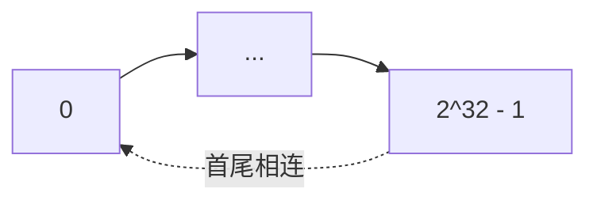

### 2.2 数据对象与节点映射

利用特定的散列算法对对象的主键或唯一标识进行计算，得出对应哈希环上的具体位置。对于物理节点，同样选取其 IP 地址或全局唯一标识进行哈希计算，投影至同一环上。

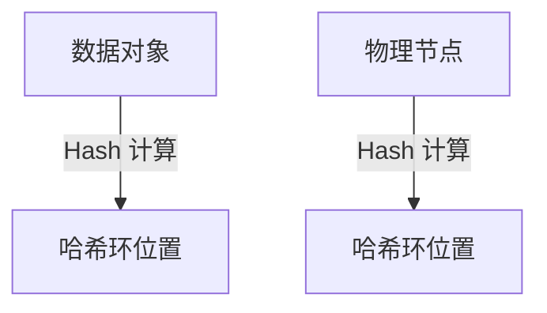

### 2.3 数据路由规则

在确认对象与节点在哈希环上的坐标后，从对象所在的刻度出发，沿顺时针方向寻找，将寻得的第一个可用节点作为该数据的最终归属节点。

例如：

- 数据 `object1` 被分配至 `NODE1`
- 数据 `object3` 被分配至 `NODE2`
- 数据 `object2`、`object4` 被分配至 `NODE3`

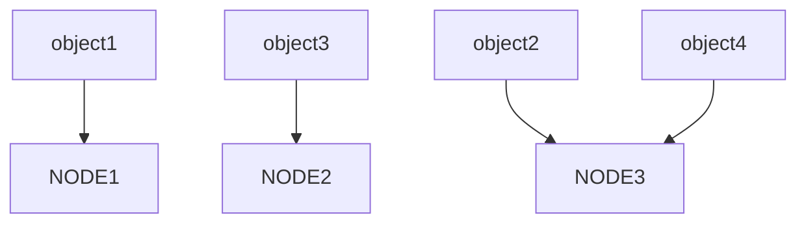

### 2.4 集群拓扑变更

#### 节点扩容

若此时集群中新增节点 `c4`，且其哈希值落在 `c2` 与 `c3` 之间，依照顺时针寻址规则，仅有处于 `c2` 到 `c4` 区间内的数据需从原属的 `c3` 节点迁移至 `c4`，其余节点与数据映射关系保持不变。

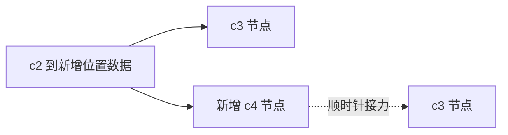

#### 节点缩容

若因节点故障或主动缩容移除节点 `c1`，则原由 `c1` 负责管理的数据集合将被整体顺延迁移至其顺时针方向的直接后继节点。环内其他节点各自维护的数据集完全不受干扰。

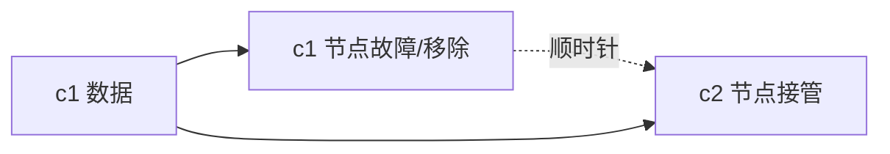

!!! abstract "核心收益"

    一致性哈希能够有效将节点拓扑变更带来的数据重新分布代价控制为局部现象，避免了全量重算导致的系统波动。

### 2.5 数据倾斜与虚拟节点

当哈希环上的物理节点数目稀少时，节点在整数域上的投影极易呈现非均匀分布，引发哈希环偏斜。

如下图所示，节点 `A` 控制了极大的哈希区间，节点 `B` 覆盖范围极小，而节点 `C` 几乎无法分担负载：

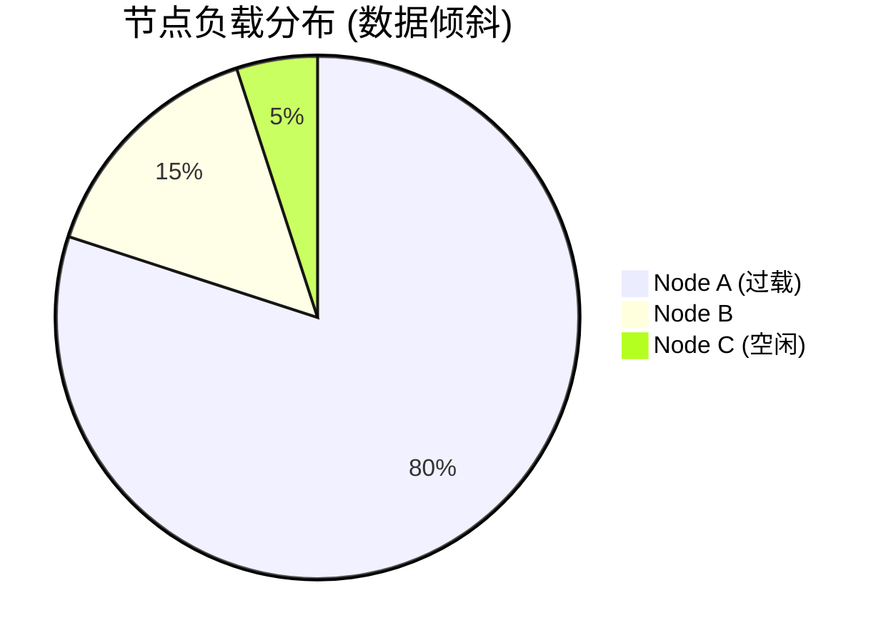

数据长期向个别节点集中会导致以下问题：

- 从宏观尺度看，集群负载极度不均衡，节点处理能力出现短板。
- 热点节点一旦崩溃，海量请求会瞬间转移至顺时针后继节点，可能引发链式故障（Cascading Failure）。

为了纠正环形偏斜，工程实践中普遍采用虚拟节点（Virtual Nodes）技术。该方法并不强行增加物理服务器，而是对单台伺服机器进行多重映射。

加入虚拟节点后的数据分布呈现出更高的均匀度，进一步摊薄了单点瓶颈风险：

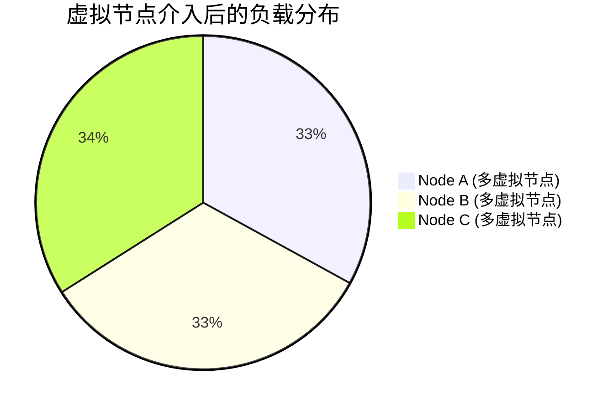

以下 Mermaid 图表展示了包含虚拟节点的映射拓扑：

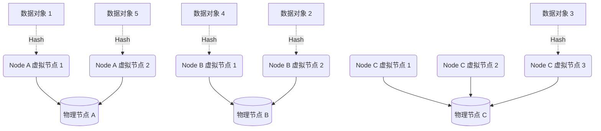

## 分布式散列表：Chord 协议

在 P2P 分布式网络或者 DHT 架构下，资源定位算法的效率尤为重要。传统的中心化架构（如 Napster）具有极大单点故障隐患；而基于消息洪泛的机制（如 Gnutella）又面临着较高的全网广播开销，网络信令与节点总数紧密耦合。

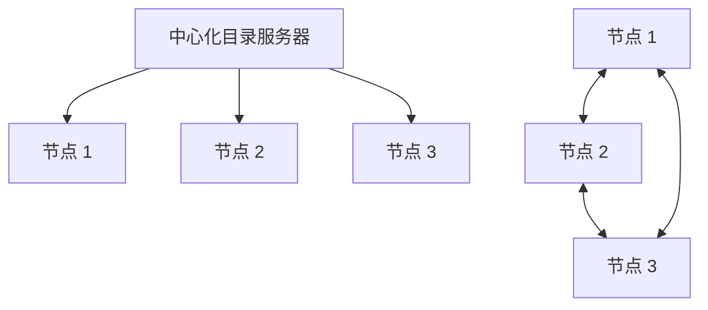

Chord 协议作为一致性哈希在去中心化网络中的一项工程实现，系统性地规划了资源寻找、路由表管理以及网络拓扑自愈问题。

### 3.1 空间模型构造

Chord 常见以 `SHA-1` 用作底层散列算法，其理论环空间可达 $2^{160}$ 规模。在简化表述时，为便于说明内部逻辑常将其缩等至 6 位（$2^6 = 64$）空间，节点在 $[0, 63]$ 的环中闭合相接。

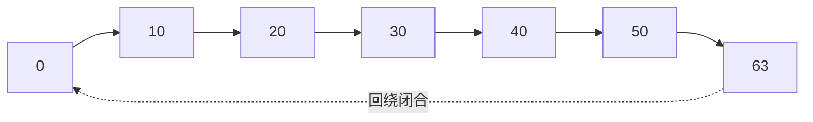

### 3.2 资源定位算法

数据查找在 Chord 体系结构中是最高频的操作。单纯沿后继节点链路穷举查询的算法时间复杂度为 $\mathcal{O}(N)$。这种线性时间成本在海量节点网络框架中代价极高。

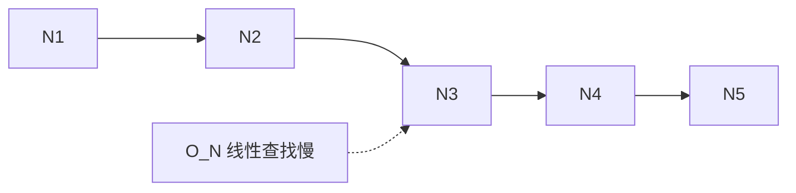

#### 路由表 (Finger Table) 的引入

为将查找过程提速至 $\mathcal{O}(\log N)$ 级别复杂度，Chord 为网络中每一个单一节点配置了基于当前哈希刻度由近及远分布的路由表项（Finger Table）。

其中，拥有 $m$ 项的路由表内，第 $i$ 条路由条目指向标识为 $(\text{hash}(node) + 2^{i-1}) \pmod{2^m}$ 的哈希节点后继位置。这允许查询请求以指数跨度形式跳跃前进。

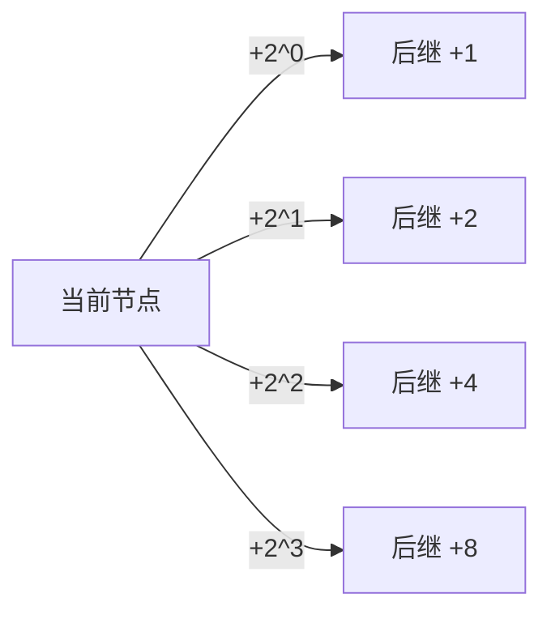

#### 查询路径追踪

在节点 `N8` 尝试寻址资源 `K54` 时：

1. `N8` 判断自身后继不覆盖 `54`，随后扫描本地 Finger Table。
2. 查找不超过 `54` 且最接近目标的远端节点引用。在此例中，符合条件的条目是 `N42`。
3. 查询请求投递至 `N42`。`N42` 复用同样的匹配策略继续寻址。

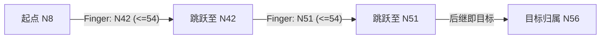

由于每一次跳动都会将候选哈希距离缩减至少一半左右，该协议最终保证资源在经历最多 $\mathcal{O}(\log N)$ 步跳跃后成功解析至 `N56`。

### 3.3 路由表自维护与拓扑修复

在动态网络中，节点状态随时间频繁波动。Chord 采取了后台探测任务以补偿后继断层及修正路由表滞后的缺陷。

当例如 `N26` 这类新节点主动挂载：

1. 新节点与现网通过基础查询确定其应当在 `N21` 与 `N32` 之间的间隙内挂载。
2. `N26` 指向 `N32`。
3. `N26` 向原后继宣告自身并篡改 `N32` 之直接前驱依赖关系。
4. 原定由 `N32` 保管的部分归属权重在校验完毕后向 `N26` 发生实质性块迁移。

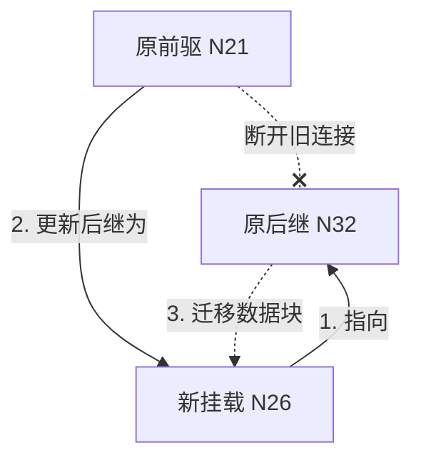

在随后的时间窗口里，由于 Chord 定期的全网一致性探测巡检机制，邻座节点的缓存路由表项也会依据探测到的当前状态自动收敛对齐。

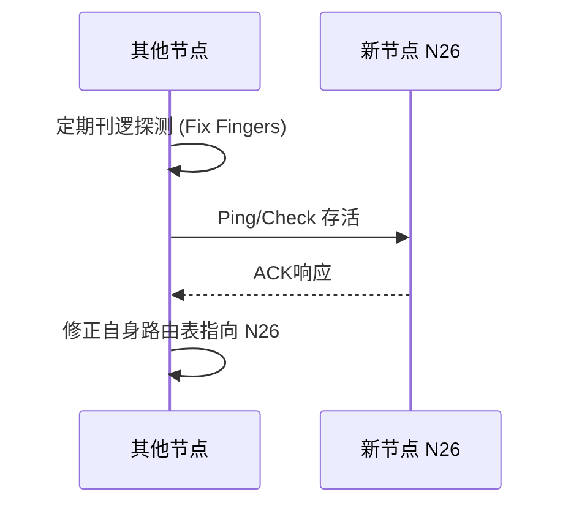

!!! note "拓扑稳定前的数据可获得性"

    若路由全集尚未最终收敛，在查找命中阶段依然可能正确解析，但跳变的路径效率将自 $\mathcal{O}(\log N)$ 退化直至 $\mathcal{O}(N)$ 的直连扫描。一旦底层后继指环断裂，查询便具有失败可能，这需要依托端侧发起的逻辑重传策略做二次兜底保障。

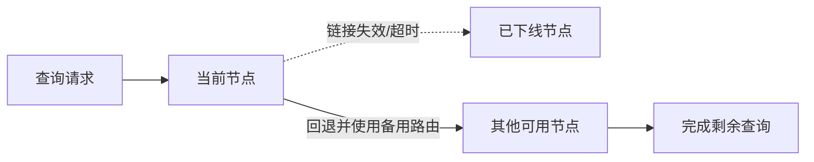

## 参考资料

- [一致性哈希算法（consistent hashing） - 知乎](https://zhuanlan.zhihu.com/p/129049724)

*[ KV ]: Key-Value
*[ P2P ]: Peer-to-Peer
*[ DHT ]: Distributed Hash Table
*[ TTL ]: Time To Live
