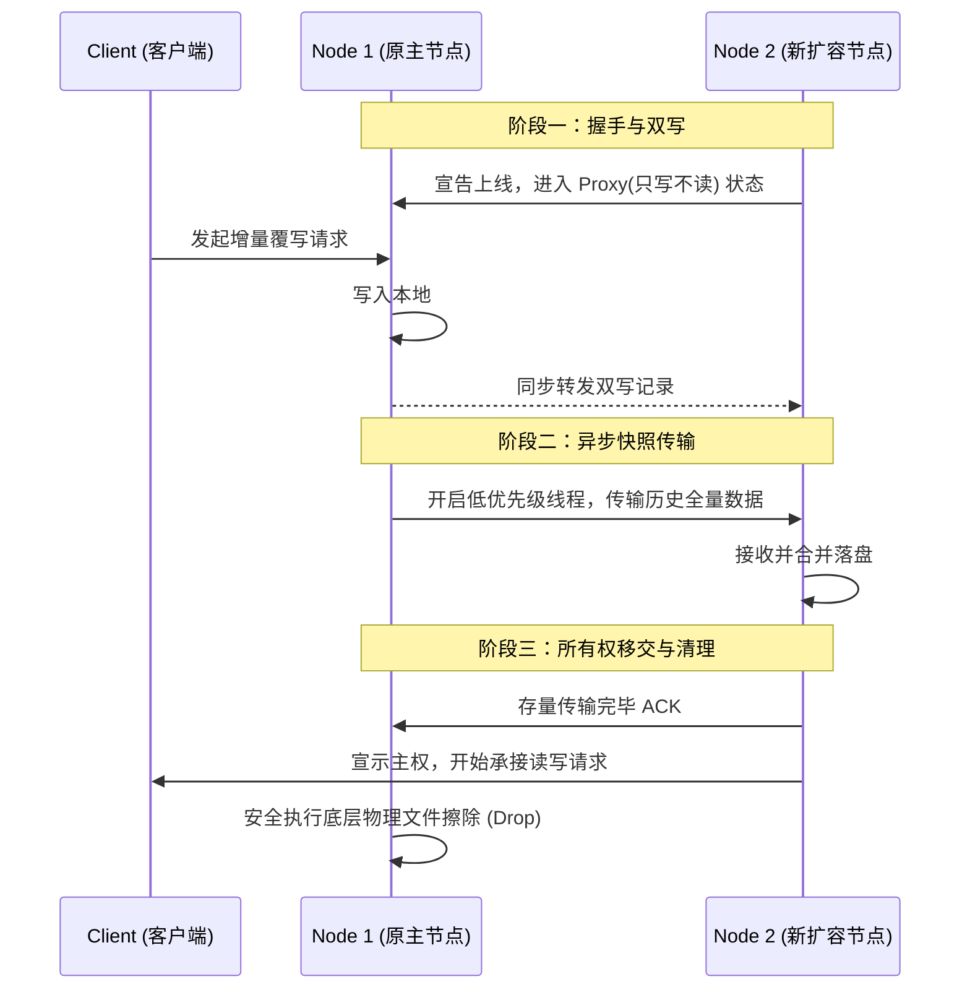

# 集群扩缩容与数据重平衡

!!! abstract "核心概念"

    在分布式数据系统运行过程中，随着业务规模的增长或硬件的老化，系统不可避免地需要动态添加新节点（扩容）或下线故障节点（缩容）。在此拓扑变更期间，将数据从原有节点平稳过渡至新归属节点的过程，称为**数据重平衡**（Rebalancing）或数据迁移。其核心工程挑战在于，如何在不中断前端读写服务（无感或微感）的前提下，保证底层数据移动的一致性与完整性。

## 数据重平衡的分类与策略

依据系统提供的是纯粹的高速缓存服务还是高度可靠的持久化存储服务，工业界在应对扩缩容的数据迁移时演化出了两种截然不同的架构流派。

### 1. 缓存场景下的惰性迁移策略

对于诸如 Memcached 或是使用 Twemproxy 代理的 Redis 等系统，其核心定位是加速主数据库的读取并容忍一定的数据丢失。在这类弱持久化保证的场景中，系统往往采用**惰性处理**（Lazy Handling）策略，不执行主动的数据搬迁。

扩容新节点时的执行流程如下：

1. **路由重定向**：运维平台将新节点加入一致性哈希环（Consistent Hashing Ring）。代理层感知拓扑变更后，原本应由部分老节点承担的新范围请求会由于哈希圈的切分瞬间发生易主（重路由至新节点）。

2. **触发缓存回源**：当客户端首次向新节点发起请求尝试读取某条存量数据时，因新节点内存尚空，必然触发冷启动未命中（Cache Miss）。

3. **被动回填**：客户端或代理层转而向下游底层真实持久化数据库（如 MySQL）拉取最新数据，并以最新状态回填重建至新节点内存。

4. **旧数据自然淘汰**：老节点上遗留那些事实上已经不应当由自己负责托管的数据实体。系统不再主动发起磁盘擦除动作，而是依赖 LRU（Least Recently Used）内存淘汰算法以及 TTL（Time To Live）自动过期机制将它们从物理内存中逐步自然挤出释放。

!!! note "工程收益"

    惰性迁移方案极大地规避了由于瞬时大规模内存镜像拷贝引发的网络拥塞和 CPU 尖峰。它利用时间的流逝将原本需要 O(N) 级别爆发的 I/O 代价平滑摊分到了后续海量的增量查询请求之中。

### 2. 持久化存储的主动平滑搬迁

相对地，对于 Cassandra、HBase 等充当唯一系统记录真相（System of Record）的分布式数据库系统，旧节点的任何强制丢失即意味着业务数据的彻底损毁。因此，当系统执行扩缩容时，必须启动强一致性的**主动平滑搬迁**（Proactive Smooth Migration）流程。

整个数据无损交接期通常历经以下数个阶段：

## 迁移期间的并发冲突与异常处理

在数小时乃至更长的全量快照搬迁期内，前端客户端依然在源源不断地持续向数据库发起对那些“正在被迁移的键”的删改操作。为防止传输途中发生时序倒置甚至脏数据覆写新数据现象，分布式存储基座构筑了严密的防线。

### 快照与增量日志（Snapshot + WAL）架构

为避免数据传输因并发修改产生撕裂（Torn Data），业界广泛采用两阶段传输架构：

1. 老节点首先在磁盘级使用 Copy-on-Write 技术锁死某个瞬间时刻的不可变底层数据切片（Snapshot），并将其作为基准数据推送至新节点。

2. 在漫长的快照跨网搬迁期间内，针对该区间新发生的所有客户端写操作指令均被顺序记录在一份独立的增量变更日志文件（Write-Ahead Log, WAL）中。

3. 在快照块校验完毕落地后，新基座立刻启动日志追延回放（Log Replay），依照时间线将积压的 WAL 流水事件逐一复现至内存树中。这种基于时间流的顺序定帧合并极大地压缩甚至抹平了存量传输与现实数据写入之间的宏观冲突窗口。

### 最后写入者获胜（LWW）的时序仲裁

当通过增量流传输时，网络包可能会乱序抵达。此时为了抉择某一个 Key 最终保存什么状态，系统强制回退至时间维度，采用**最后写入者获胜**（Last Write Wins, LWW）策略。

所有的数据项元数据在写入时都被硬性烙印了客户端发起时或接入时的全球唯一的时间戳（Timestamp）或版本自增序号。当新节点接收旧服务器下发来的快照载文记录时，它必须对比提取本地同一对应记录的时间戳。如果发现下发报文中的那条数据的时间戳事实上远早于（更旧于）目前自己引擎管理里已存在的该数据时，新节点就会断然丢弃这段旧版本记录（即静默舍弃无效历史追溯）。

### 幽灵复活与墓碑（Tombstone）机制

普通的 LWW 策略面临一个极为危险的边界角点问题，这就是分布式系统中臭名昭著的**幽灵复活**（Zombie Resurrection）。

!!! warning "幽灵复活的灾点场景"

    假设由于网络不稳定导致重平衡周期停滞。客户端在时间点 $T_3$ 上给旧节点发送了一条 `DELETE(Key=X)` 请求。如果旧节点直接在磁盘内粗暴地抹除了关于 `Key=X` 的一切物理结构痕迹；那么当网络恢复后，存粹的重发机制或尚未删除的旧副本可能又在时间点 $T_5$ 将曾经持有的旧状态 `SET(Key=X, Val=1, T_1)` 的快照重新搬运灌输回新节点。
    由于新节点在 $T_5$ 时点去本地搜索时，对于曾经发生的 $T_3$ 的删除动作一无所知（因为老节点是真擦除，没有留下任何线索移交），它自然会接纳并落盘这条早已过期的 $T_1$ 状态数据。由此引发了一个早已被明确请求删除的主键业务像幽灵一般再度“复活”，重新对外展示于查询表单中。

为了消除幽灵复活，多数列式数据库和 LSM-Tree （Log-Structured Merge-Tree）存储底座坚决禁止物理原地擦除，而是引入了**墓碑**（Tombstones）软删除机理。

墓碑机制的核心理念是不删除，而是“写一条更高级的空记录”：

1. 当客户端下发 `DELETE` 命令时，引擎并非定位释放底层占用内存槽，而是实打实地追加写入一条标示字段特异化的新型记录（例如 `Tombstone(Key=X, Timestamp=T_3)`）。

2. 当旧版本的数据 `Key=X, T_1` 试图在后段迁徙入新节点时。由于墓碑数据具备实体结构，它亦会被如实传递至对偶节点，且因为其时间戳 $T_3$ 大于 $T_1$，所以在合并与压实（Compaction）计算层级上，系统能正确拦截比较并依靠墓碑的遮蔽属性对较弱的残留数据进行静默抛弃阻断。

3. 唯有在系统判断全域各副本当中所有遗留的陈旧关联镜像都被彻底合规扫描覆盖、清理完成后的指定修剪真空（GC Grace Seconds，如 Cassandra 默认配置十天滞缓期）过后，那些散落在环上起守护防范作用的真实墓碑块本身，才允许被后台垃圾回收线程安全无隐患地实施物理剿杀。

*[ LWW ]: Last Write Wins
*[ WAL ]: Write-Ahead Log
*[ LRU ]: Least Recently Used
*[ TTL ]: Time To Live
*[ ACK ]: Acknowledgement
