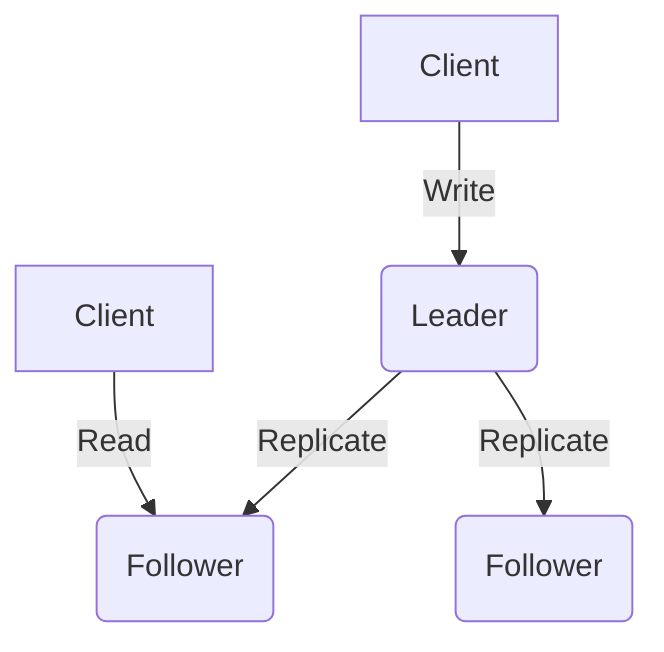
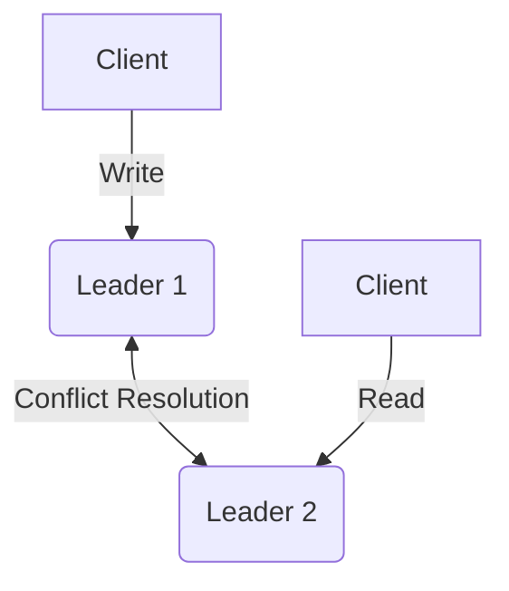
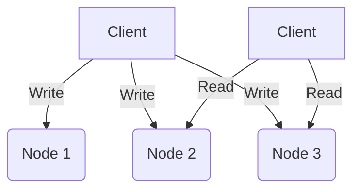

# 数据复制

数据复制（Replication）是指在多台通过网络连接的物理或虚拟机器上保存相同数据副本的机制。其核心目标是通过物理冗余提高系统的高可用性（High Availability），缩短由于地理位置过远导致的访问延迟，并在水平扩展（Horizontal Scaling）场景下增加读取吞吐量。

分布式存储系统中，网络分区、节点崩溃与请求超时是常态。数据复制在抵御硬件故障及局部网络隔离方面具有决定性作用，但同时深刻改变了系统的数据一致性（Consistency）及其性能特征。

!!! note "工程权衡"

    数据复制不可避免地涉及 CAP 理论（Consistency, Availability, Partition tolerance）与 PACELC 定理的工程权衡。系统架构必须在复制延迟（Replication Lag）、通信开销与一致性级别（如线性一致性、最终一致性）之间做出妥协。

## 复制架构与实现模型

在解决分布式状态一致性问题时，业界通常采取以下三种基础的逻辑复制模型：

### 单主复制（Single-Leader Replication）

在此架构下，所有写入流量有且仅有一个 Leader 节点负责接收和持久化，随后将变更日志流式转发给 Follower。该机制保证了严格的变更顺序，但写入吞吐量受限于单机的物理极限。

### 多主复制（Multi-Leader Replication）

多个数据中心（Datacenter）通常各自维持一个 Leader 节点以降低异地写入延迟。该机制显著提升了可用性与写入性能，但在并发修改时面临极高的冲突解决（Conflict Resolution）复杂性。

### 无主复制（Leaderless Replication）

客户端或者协调节点向多个副本并行发送写入请求，利用分布式法定人数系统进行容错。由于不存在单一的主节点瓶颈，系统可用性更高，但也需要客户端或后台机制（如 Read Repair、Anti-entropy）来处理数据陈旧的问题。

## 与其他分布式基础模块的关联

数据复制并非孤立存在，系统级别的持久化保障必须通过横跨多个组件的协同合作来实现：

- 共识算法（Consensus）：单一 Leader 的稳态运营极其脆弱。当节点宕机或发生大规模网络超时时，系统必须依靠 Paxos 或 Raft 等共识协议来完成 Leader Election，避免脑裂（Split Brain）导致的数据损坏。
    
- 逻辑时间与时钟（Clocks）：物理时钟的漂移与不同步使依赖时间戳的数据合并（如 Last-Write-Wins，*LWW*）具备不确定性。因果关系必须依靠版本向量（Version Vectors）或逻辑时钟（Logical Clocks）来追踪并解决并发写入。
    
- 数据分片（Partition/Sharding）：单节点通常无法存储海量业务数据，需要将全集划分为多个 Partition。在现代分布式数据库（如 Cassandra、TiKV）的设计中，数据复制机制均作用于单独的分片之上，以此实现计算与存储水平拓展的最大化。

## 核心机制详解

后续小节将分别深入探讨上述理论基础与实现细节，剖析分布式复制算法中的核心组件：

- [故障转移与容错控制机制](Failover.md)：详细分析单主复制场景下的心跳探测阈值、领导者任期以及切换流程。
    
- [法定人数与数据一致性](Quorum.md)：论证法定读取（Read Quorum）与法定写入（Write Quorum）的相交半数原则。
    
- [状态流言协议](Gossip.md)：解析去中心化无主集群如何利用扩散模型进行反熵更新，并高效维护集群成员拓扑连接图。

*[CAP]: Consistency, Availability, Partition tolerance
*[LWW]: Last Write Wins
