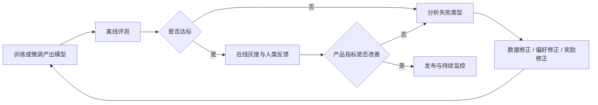

# 数据与评测

!!! abstract

    本章整理大模型后训练阶段的数据设计、治理与评测方法，说明数据如何影响能力对齐、偏好优化、推理风格、工具使用与安全边界，以及评测信号如何反过来约束训练与发布。这里关注的是数据分布如何决定目标函数可学性、梯度方向稳定性与最终模型行为，以及评测闭环如何决定系统是否真正改善。

## 这一章关注什么

这一章讨论后训练闭环中的两类基础设施：

- 数据：训练材料如何构造、清洗、配比、版本化
- 评测：模型行为如何被验证、比较、诊断与回流

两者共同决定后训练系统能否稳定迭代。数据定义了模型会朝什么方向更新，评测定义了系统如何判断这些更新是否有效。

## 章内结构

这一章改为单页收口，原先分散在评测子页中的核心内容，现统一并入本页。阅读时可以按以下顺序理解：

- 先看数据类型、数据来源与样本结构，理解监督信号从何而来。
- 再看清洗、去重、污染检查与配比，理解数据如何进入训练。
- 最后看评测方法，理解模型改动如何被验证并回流到下一轮训练。

## 数据

后训练通常发生在预训练之后，用于把通用语言建模能力转化为更接近产品目标的行为分布。预训练主要学习条件概率分布与世界知识的统计结构，后训练则进一步约束模型在特定输入下应当如何响应、拒答、调用工具、展示推理步骤，或在多候选答案中偏向哪一种输出。

从优化角度看，后训练数据至少承担四类作用：

- 指定任务接口。模型需要从原始续写模式转向 instruction-following、对话、多轮工具调用或偏好比较等更明确的输入输出结构。
- 指定行为分布。相同知识能力可以对应不同风格、不同安全边界和不同推理长度，数据决定模型最终靠近哪一种行为子空间。
- 指定错误代价。通过正负样本、偏好对或过程标签，训练目标会对事实错误、格式错误、越权调用、危险回答等问题赋予不同惩罚强度。
- 指定泛化边界。后训练数据覆盖哪些任务、语言、领域与失败模式，决定模型在真实流量中哪些区域稳定，哪些区域仍然脆弱。

后训练不是简单增加“更多高质量文本”。关键在于样本是否与目标行为严格对齐，以及不同子任务之间的梯度是否兼容。若数据目标混杂，例如一部分样本鼓励详细 chain-of-thought，另一部分又强制极短回答，且缺少场景条件，模型会学到不稳定的折中策略，表现为风格漂移、拒答不一致或推理长度抖动。

若希望理解后训练与基础训练的关系，可先参考 [训练](../CS336/Training.md) 与 [解码](../Inference/Decoding.md) {target=_blank}，前者说明参数更新如何积累能力，后者说明相同参数如何在不同采样策略下呈现不同输出。

## 数据类型

后训练数据并不存在单一标准格式，不同目标对应不同监督信号。常见类型如下。

| 类型 | 典型结构 | 主要目标 | 主要风险 |
| --- | --- | --- | --- |
| instruction | prompt + response | 建立任务接口与基本遵循能力 | 模板化、覆盖面窄、风格过拟合 |
| preference | prompt + chosen + rejected | 学习偏好排序与回答取舍 | 偏好噪声、标注不一致 |
| reasoning trace | prompt + rationale + answer | 强化复杂推理路径与中间结构 | 冗长、错误推理被模仿 |
| process label | step + correctness / critique | 监督中间步骤质量 | 标注成本高、定义难统一 |
| synthetic | 模型生成后筛选或蒸馏 | 扩大规模、补齐长尾 | 自蒸馏闭环、错误复制 |
| tool | messages + tool schema + calls | 学习调用时机、参数与恢复流程 | API 漂移、状态不一致 |
| safety | prompt + safe response / refusal | 约束危险行为与合规边界 | 过拒答、覆盖不全 |

### Instruction

instruction 数据通常用于 supervised fine-tuning。它把输入显式组织为任务说明、上下文与期望回答，解决的问题是让模型从“继续写下去”转向“按请求完成任务”。这类数据对格式、语气和任务边界很敏感，因此同一知识点在不同模板下也可能产生不同梯度效果。

高质量 instruction 数据通常具备三个特征：任务描述清晰、回答标准稳定、覆盖多样但不过度冲突。若样本里存在大量模糊指令、答案风格随标注者随机变化，模型容易学到表面礼貌或冗余解释，而不是可靠的任务执行能力。

### Preference

preference 数据常用于 RLHF、DPO、IPO 或其他偏好优化方法。它不直接告诉模型唯一正确答案，而是告诉模型在两个或多个候选中哪一个更优。监督信号因此从 token-level target 转为 response-level 或 pairwise comparison。

这类数据更适合表达“更好”而非“唯一正确”。例如有些问答在事实层面都成立，但其中一个版本更完整、更安全或更符合产品风格。偏好数据能够把这些软约束编码进目标函数，但前提是标注准则足够稳定，否则模型学到的是标注噪声。

### Reasoning Trace

reasoning trace 数据显式提供推理轨迹、中间分解或草稿式证明，用于提升复杂任务上的可学习性。它常见于数学、代码、逻辑和规划问题。

它的收益来自把长依赖问题拆成更短的局部决策，使梯度能够作用于中间结构，而不只作用于最终答案。它的风险也很直接：若轨迹本身错误但答案恰好正确，模型可能模仿错误模式；若轨迹普遍过长，模型会在不需要时也产生冗余推理。

因此，reasoning trace 更适合作为受控能力信号，而不是默认覆盖所有任务。对是否展示长推理，还应结合产品策略与安全策略单独控制。

### Process Label

process label 关注步骤级监督，而不是整条回答的最终优劣。它可以是每一步是否正确、哪一步发生跳跃、哪个工具调用无效，也可以是 critique、revision、step ranking 等更细粒度信号。

这类数据的价值在于降低“结果偶然正确”带来的误导。对于复杂搜索或多步计算，仅看 final answer 容易让模型通过不可解释的捷径取得低训练损失；加入过程标签后，优化器能更直接地区分局部有效步骤与局部错误步骤。

代价是标注成本高，而且步骤边界不总是天然明确。若任务本身存在多种等价解法，过强的过程约束也可能压缩模型的策略空间。

### Synthetic

synthetic 数据包括自蒸馏、教师模型生成、程序合成、规则扩展、回译、对抗生成与自动批改。它的核心用途是以较低人工成本扩大覆盖范围、构造长尾样本、平衡语言分布或注入特定格式。

synthetic 数据的关键问题不是“是否由模型生成”，而是其误差如何传播。若教师模型在某一类题目上系统性偏差明显，直接放大采样只会把偏差变成稳定梯度。因此，synthetic 数据通常需要配合规则校验、交叉模型评审、执行验证或人工抽检。

### Tool

tool 数据用于训练模型在消息序列中何时调用工具、如何构造参数、如何处理工具报错、何时结束调用链。它通常包含 system / user / assistant / tool 多角色结构，以及函数签名、JSON 参数、工具返回值和后续自然语言整合。

该类数据与普通 instruction 数据的区别，在于目标不是单步文本生成，而是状态机式交互。模型需要学习：

- 何时应先询问补充信息，而不是猜测参数。
- 何时应调用工具，而不是直接臆造结果。
- 工具返回为空或报错时应如何恢复。
- 多工具链路中哪些字段是持久上下文，哪些字段只对当前步骤有效。

若需要进一步理解工具调用对服务系统的影响，可参考 [服务](../Inference/Serving.md) {target=_blank}。

### Safety

safety 数据用于定义拒答边界、危险内容处理方式、越权请求响应格式以及灰区问题的降风险策略。它既可以是显式拒答样本，也可以是安全重写、最小充分回答、转介说明、澄清追问或多轮升级路径。

安全数据的主要难点在于边界不是二元的。很多请求并非纯安全或纯危险，而是取决于意图、上下文、权限和细节程度。若训练数据只包含极端案例，模型在真实流量中的灰区判断往往不稳定，容易出现过拒答和漏拒答并存。

## 数据来源

后训练数据来源决定其覆盖面、偏差结构与治理成本。常见来源包括人工标注、真实产品日志、公开数据集、专家编写样本、模型合成数据、程序生成样本和执行反馈。

### 人工标注

人工标注的优势是可控性强，能够围绕明确规范构造高密度监督信号，特别适合 instruction、preference、critique 和 safety 数据。缺点是成本高、吞吐有限，并且标注者之间的一致性通常需要额外流程保障。

高价值场景包括：

- 产品风格要求严格。
- 安全和合规边界需要人工判定。
- 长尾任务需要专家给出标准过程。
- 偏好信号难以从自动指标中恢复。

### 产品日志

真实流量是后训练最有价值的来源之一，因为它反映了分布外请求、真实失败模式与用户实际关注的问题。但日志只能在完成脱敏、权限隔离与合法使用之后进入训练管线。

日志数据的优势在于真实性，缺点在于噪声高。用户输入常常不完整、目标不明确、上下文缺失，且历史模型回复本身可能质量不稳定。因此，日志不能直接等价于训练样本，而应经过筛选、重写、配对或回标。

### 公开数据集

公开数据集适合快速补齐基础能力覆盖，尤其在学术任务、通用问答、数学推理与安全评测方面具有较高复用价值。问题在于公开集往往已被广泛使用，存在污染风险、风格同质化和任务边界与产品目标不一致等问题。

### 专家样本

专家编写样本适合高难领域，例如法律、医学、金融、复杂代码审查、系统设计与多轮运维。它的优势不是规模，而是高密度知识和高可靠标准。对于高风险领域，少量高质量专家样本常常比大量普通样本更能稳定模型行为。

### 模型合成与执行反馈

模型合成适合补规模，执行反馈适合补真实性。两者结合常见于代码、数学、工具使用与代理任务：先生成候选，再用单元测试、检索验证、规则检查或环境交互结果过滤。这样得到的监督信号虽然仍有偏差，但比纯文本自蒸馏更接近可执行正确性。

## 样本结构

后训练数据的质量不仅由文本内容决定，也由样本结构决定。结构设计会直接影响目标函数是否明确、损失是否可分解，以及不同阶段是否能复用同一份数据。

### 基本字段

常见字段包括：

- `id`：样本唯一标识，用于追踪、去重与回滚。
- `source`：来源类型、采集时间、标注批次与授权状态。
- `task`：任务类别、语言、领域、难度或风险等级。
- `messages`：多轮对话序列或 prompt-completion 结构。
- `label`：标准答案、偏好选择、步骤标签或安全类别。
- `metadata`：模板版本、工具版本、评估结果、污染标记等。

这些字段并非为了管理便利而存在，它们直接支持后续的数据切片、配比、回溯与实验复现。没有稳定元数据，训练失败后通常无法定位是哪一类样本改变了行为。

### 对话结构

在对话模型中，推荐显式保留角色边界，例如 system、user、assistant、tool。角色边界决定模型如何解释上下文，也决定模板迁移时是否会发生语义错位。若把系统约束、用户问题与工具返回混成单段文本，模型可以学到局部模式，但很难形成稳定的交互策略。

### 偏好结构

偏好数据通常至少需要 prompt、chosen、rejected 三部分。若还包含标注理由、严重性等级、标签来源与审查者信息，则更适合后续做噪声分析与分桶训练。

### 过程结构

过程监督数据应显式表示步骤边界。常见方式包括逐步列表、状态转移、局部 critique 或 step verdict。边界越清晰，训练目标越容易与推理过程对齐；边界越模糊，模型越容易把整段文字当成普通长回答进行模仿。

## 清洗

清洗的目标不是单纯删除“脏文本”，而是控制噪声对梯度方向的破坏。后训练阶段的数据量往往远小于预训练，单条样本的权重相对更高，因此结构错误、标签错误和模板错误会更直接地改变模型行为。

### 结构校验

第一步通常是结构合法性检查，例如 JSON 是否可解析、角色顺序是否合理、tool call 是否满足 schema、chosen 与 rejected 是否同时存在、答案是否为空。结构错误样本应优先清除，因为它们带来的损失通常没有可解释语义。

### 内容过滤

内容过滤包括语言识别、乱码检测、占位符残留、HTML 或日志碎片清除、极短无信息样本删除、过长截断与模板泄漏检查。其目标是保证每条样本都承载可学习信号，而不是让模型吸收无意义模式。

### 标签一致性

对于 preference、safety 和 process label，标签一致性尤为重要。同一类输入若在相近条件下被赋予相反标签，模型会被迫学习平均策略。实际落地中通常需要抽检、交叉复核、一致性统计和难例回标。

## 去重

后训练去重比预训练去重更敏感，因为重复样本会显著放大某一行为模板的训练权重。重复问题不只包括完全相同文本，还包括模板改写、字段顺序不同、轻微同义改写和跨源复制。

常见去重层次包括：

- 精确去重：完全相同的 prompt、response 或消息序列。
- 近似去重：基于 MinHash、SimHash、embedding 或 n-gram overlap 识别高相似样本。
- 语义去重：识别内容等价但表述不同的 instruction 或偏好对。
- 跨阶段去重：避免同一高价值样本同时在 SFT、preference 与评测集中重复出现。

去重阈值不宜过高或过低。阈值过高会保留大量模板重复，造成风格过拟合；阈值过低会误删必要的任务变体，削弱鲁棒性。实践中通常按任务类别分桶设阈值，而不是对全量数据使用单一标准。

## 污染检查

污染检查的目标是隔离训练集与评测集之间的泄漏，避免把记忆误判为泛化。对于后训练，污染不只意味着整个题目重复，还包括标准答案、隐藏测试、模板前缀和高相似改写进入训练集。

| 检查对象 | 典型方法 | 主要问题 |
| --- | --- | --- |
| 基准题目全文 | 精确匹配、n-gram overlap | 直接泄漏评测样本 |
| 改写题目 | 近似检索、embedding 相似度 | 评测分数虚高 |
| 标准答案片段 | 答案库检索、关键短语匹配 | 模型记住答案模板 |
| 代码测试集 | 函数签名、注释、测试用例匹配 | pass@k 被污染放大 |
| 工具任务日志 | request schema、ID、返回模式匹配 | 学到环境细节而非通用策略 |

污染检查通常至少分三层执行：

- 训练前过滤：在进入主数据仓前剔除已知评测内容。
- 训练后审计：对高分样本回溯检索，确认是否存在近邻泄漏。
- 发布前复核：对关键 benchmark、私有评测和产品红线任务做专项检查。

若仓库中已有与推理和服务相关的页面，可结合 [KV Cache](../Inference/KVCache.md) 与 [服务](../Inference/Serving.md) {target=_blank} 一并理解，因为一部分工具日志和多轮代理轨迹会带有强环境状态依赖，不适合未经处理直接进入通用训练集。

## 数据配比

后训练的核心工程问题之一是配比。不同类型样本不仅目标不同，梯度尺度、难度分布、输出长度和损失密度也不同。若简单按条数混合，往往不能得到期望行为。

### 配比维度

常见配比维度包括：

- 数据类型配比：instruction、preference、tool、safety、reasoning 等各占多少。
- 领域配比：通用、代码、数学、专业领域、多语言等各占多少。
- 难度配比：短答、长答、复杂推理、对抗样本、边界样本等各占多少。
- 质量配比：人工高质量、自动筛选、纯合成数据各占多少。
- 长度配比：短上下文与长上下文样本如何分布。

### 配比原则

配比不应追求静态“最优比例”，而应服务于当前阶段的主目标。常见原则包括：

- 先稳接口，再补长尾。早期应优先保证 instruction-following、基本拒答与格式稳定，再逐步增加复杂推理、工具链路和对抗安全样本。
- 高质量样本决定上限，低成本样本决定覆盖。人工样本适合做锚点，合成样本适合补密度，但不应让低可信来源主导关键能力。
- 难例需要控制注入速度。若过早注入大量复杂偏好或高噪声 reasoning trace，模型基础接口尚未稳定时容易训练震荡。
- 安全样本需要覆盖灰区。只堆叠极端拒答案例会提升命中率，但也容易提升误拒率。

实践中常用 curriculum 或 staged mixing。先用相对干净的 instruction 数据建立稳定行为，再引入 preference、tool 和 safety 数据做局部修正；或对不同桶使用不同采样权重、不同 epoch 上限和不同 replay 频率。

## 常见问题

### 模板过拟合

当大量样本来自少数提示模板时，模型会学习固定句式、固定回答结构和固定免责声明，而不是任务本身。表现上通常是看似稳定，但一旦用户输入脱离模板，质量迅速下降。

### 偏好噪声

偏好数据若标准不清或标注者口径不一，模型会学到不稳定排序函数。常见表现是同一问题在不同采样下风格漂移明显，或对事实正确但表达不同的答案判断摇摆。

### 过拒答

安全数据如果把大量灰区请求都映射为统一拒答，模型会为了降低训练损失而扩大拒答边界。其后果不是单一能力下降，而是整体帮助性下降，尤其影响专业问答、调试建议和双用途内容处理。

### 推理冗长

reasoning trace 若缺少任务条件控制，模型可能在简单问题上也输出长篇推导。这不仅增加 token 成本，也会拖累在线服务延迟，并在某些场景中暴露不稳定中间推理。

### 工具幻觉

tool 数据若只包含成功调用路径，模型会高估工具可用性，在无权限、无参数或工具失败时继续编造调用结果。恢复路径、空结果路径和异常路径因此必须显式覆盖。

### 合成闭环

如果主要数据来源是上一版模型自生成，而缺少外部校验，模型会不断强化已有偏差。这类问题在专业领域、代码修复和安全边界上尤其明显。

## 版本管理

后训练数据需要像代码一样进行版本管理，因为模型行为往往由“数据差分”而不是“代码差分”决定。

### 版本粒度

推荐至少维护以下粒度：

- 数据集版本：例如 `sft_v3`, `pref_v5`, `safety_v2`。
- 样本版本：支持单条样本的修订、下线与追踪。
- 模板版本：记录 prompt template、tool schema、标注规范的变更。
- 切分版本：记录 train / dev / eval 的具体分配。

### 元数据要求

每个版本应记录来源、过滤规则、去重阈值、污染检查结果、语言分布、任务分布、平均长度、采样权重与适用训练阶段。没有这些元数据，即使训练结果发生明显变化，也很难定位原因。

### 回滚与复现

高质量版本管理必须支持两件事：

- 回滚：某次数据更新导致过拒答或工具行为恶化时，可以快速恢复到上一稳定版本。
- 复现：给定模型 checkpoint，能够重建其对应的数据快照、采样配置与模板版本。

对团队协作而言，数据变更审查不应弱于代码审查。任何新增来源、规则调整或阈值变更，都可能比一段训练代码更显著地改变模型输出。

## 实践建议

### 先定义目标行为

在收集数据之前，先把目标写成可执行规范：模型是否需要详细解释、何时优先调用工具、哪些情况必须拒答、推理是否允许显式外露、专业领域回答需要多强的不确定性声明。目标不清时，后续配比和清洗都无法稳定。

### 先做小规模闭环

优先构建小规模高质量闭环，而不是一开始追求海量样本。典型流程是：

- 选取核心任务桶。
- 设计样本结构与标注规范。
- 训练小模型或做小步增量实验。
- 用人工审查与自动评测确认主要退化点。
- 再扩大数据规模与覆盖范围。

小闭环的价值在于先确认监督信号方向正确，再放大规模。若方向错误，大规模扩展只会更快放大错误行为。

### 区分锚点数据与扩展数据

建议把人工高质量样本视为锚点数据，把合成与日志扩展视为覆盖数据。锚点数据负责稳定目标行为，扩展数据负责提升长尾覆盖与长度多样性。训练时可以对锚点数据设置更高采样权重，或在每个 epoch 保持固定 replay。

### 建立专项桶

对以下问题单独建桶通常比混入通用集更有效：

- 高风险安全灰区。
- 工具失败恢复路径。
- 多轮上下文引用错误。
- 冗长回答与过度免责声明。
- 特定专业领域的事实性错误。

专项桶便于后续做 targeted eval 与 targeted replay，也便于在回归时快速追踪是哪类数据失效。

### 把评测前移到数据阶段

不要等到训练完成才发现数据方向错误。许多问题可以在数据阶段提前暴露，例如拒答边界过宽、偏好标准不一致、工具参数字段缺失、reasoning trace 冗长。把抽检、规则校验、近似污染搜索和小模型试训前移，通常比事后做大规模回归更省成本。

### 同步关注系统成本

数据设计不仅影响离线指标，也影响线上成本。长答案、长推理、多轮工具链会直接推高 token 使用、延迟与服务负载。若要平衡能力与成本，需要把数据长度分布与服务指标一起考虑，而不是在训练阶段单独优化帮助性。相关背景可结合 [量化与低精度](../Quantization.md) 和 [服务](../Inference/Serving.md) {target=_blank} 阅读。

## 评测

评测的作用，是把“模型在什么条件下表现如何”转化为可比较、可追踪、可用于决策的信号。对于 LLM 而言，单一总分通常不足以描述真实能力，因为同一个模型可能在知识问答、推理、工具调用、长上下文保持、对齐行为和安全拒答上表现差异很大。

因此，评测通常至少承担三类任务：

- 判断模型是否达到目标能力边界
- 识别训练、对齐和部署中的薄弱环节
- 为后续训练、数据筛选和产品策略提供反馈

### 评测对象

LLM 评测一般围绕四类对象展开：

- **能力**：知识、理解、推理、写作、代码、数学、检索整合等
- **对齐与安全**：有害请求拒答、政策遵循、偏见控制、越狱鲁棒性
- **工具使用**：函数调用、检索、代码执行、外部 API 协作、规划与纠错
- **系统行为**：延迟、稳定性、成本、上下文保持、输出格式可控性

### 能力评测

能力评测关注模型是否掌握目标任务所需的语义理解、知识召回、组合推理和表达能力。

| 任务类型 | 常见指标 | 主要限制 |
| --- | --- | --- |
| 选择题 / 闭集问答 | Accuracy、Exact Match | 容易受模板和选项分布影响 |
| 抽取任务 | F1、EM | 对边界和标注规范敏感 |
| 生成任务 | 人评、pairwise preference、ROUGE/BLEU | 自动指标与真实质量相关性有限 |
| 数学 / 代码 | pass@k、unit test pass rate | 依赖题目集合与测试覆盖 |

### 对齐与安全评测

对齐与安全评测关注模型是否在政策约束下保持可控行为。它不仅看“会不会回答”，还看“在什么情况下应该拒答、如何拒答、是否保持一致”。

### 工具使用评测

工具使用评测衡量模型是否能正确选择、调用并整合外部工具结果。关注点通常有四个：

- **工具选择**：是否在需要时调用正确工具
- **参数构造**：输入格式、字段语义、边界条件是否正确
- **结果整合**：是否能把工具返回值纳入最终回答
- **失败恢复**：工具报错、超时、返回空值时是否能重试或改写策略

### 推理评测

推理评测关注模型是否能在多步约束下保持中间状态一致性，并完成链式推导、归纳、演绎和规划任务。

### 离线评测与在线评测

| 维度 | 离线评测 | 在线评测 |
| --- | --- | --- |
| 目标 | 可重复比较 | 真实业务效果 |
| 成本 | 低到中 | 中到高 |
| 噪声 | 较低 | 较高 |
| 代表性 | 有限 | 较高 |
| 风险 | 低 | 高 |
| 适用场景 | 回归、筛选、研发 | 发布、策略验证、业务决策 |

离线评测适合回归测试和横向比较。在线评测更接近真实产品目标，但噪声更大、周期更长。

### 人类评测与 LLM-as-a-judge

人类评测通常用于自动指标难以覆盖的维度，例如回答有用性、结构质量、表达自然度、对话体验与拒答是否得体。LLM-as-a-judge 常用于大规模快速筛选、对比评测和辅助标注。

LLM-as-a-judge 的常见偏置包括：

- **位置偏置**：先出现的答案更容易被选中
- **长度偏置**：更长的回答更容易被误判为更完整
- **风格偏置**：流畅表达可能掩盖事实错误
- **自洽偏置**：judge 更偏好语气一致、结构规整的输出

### 污染与泄漏

污染与泄漏指评测数据或其近似版本已经进入预训练、指令微调或偏好优化过程，使评测结果不再反映真正的泛化能力。

### benchmark 增益与产品增益

benchmark gain 指模型在固定基准上的分数提升；product gain 指模型在真实产品指标上的改善，例如更高完成率、更低人工接管率、更少错误回复和更低成本。

### 训练—评测—反馈闭环

### 设计评测体系时的要点

评测体系通常需要同时满足三件事：

- **可重复**：同一模型、同一数据、同一设置下结果稳定
- **可解释**：能定位是能力、对齐、工具还是系统问题
- **可迁移**：离线信号能尽量映射到在线结果

## 总结

数据决定模型会朝什么方向更新，评测决定系统如何判断这些更新是否有效。高质量后训练闭环依赖明确的数据目标、可控的样本治理、稳定的评测设计，以及能够把失败信号回流到下一轮训练的工程机制。
