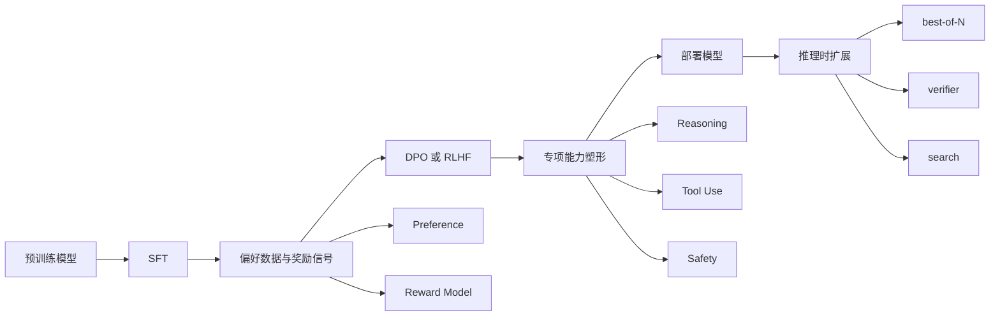

# 后训练

!!! abstract

    本节整理 large language model 后训练的主要目标、数据类型与方法谱系，重点说明 supervised fine-tuning、偏好学习、奖励建模、RLHF、DPO、推理强化、工具使用、安全塑形与推理时扩展分别改变什么、依赖什么监督信号，以及它们在真实系统中的组合方式。这里关注的是机制、边界、代价与工程分工。

## 位置

预训练负责学习广泛的语言统计结构、世界知识与基础表征，后训练负责把这些能力组织成更接近目标产品与目标任务的行为分布。常见后训练目标包括：

- 提高指令遵循与输出格式稳定性
- 调整回答风格、偏好排序与拒答边界
- 强化多步推理、工具调用与长轨迹决策
- 在推理阶段用额外计算提高关键任务成功率

后训练关心的核心问题可以概括为三类：

- **接口**：模型以什么格式接收输入、生成输出、调用工具
- **目标**：模型在多个可行回答之间偏向哪一种行为
- **边界**：模型在风险、成本、延迟与能力之间如何取舍

## 章节结构

本章按照后训练链路中的功能分工组织。读者可以先建立章节边界，再进入各家族内部的方法细节与工程取舍。

从章节关系看，可以概括为五个家族。

### 监督方法

这一组对应后训练的起点，核心任务是把基础模型拉到可交互分布上，建立 instruction-following、对话格式、结构化输出与基础行为接口。本组目前由 [监督方法](sft.md) 展开，作为后续偏好优化和专项塑形的共同入口。

### 偏好与策略优化

这一组讨论如何把“哪个回答更好”转成可训练信号，并进一步把排序偏好变成策略更新。本组由 [偏好与策略优化](preference.md) 单页收口，统一覆盖奖励建模、DPO、RLHF 与强化学习优化。阅读这一组时，重点关注偏好数据如何构成监督、奖励模型如何充当中间接口，以及离线目标与在线策略更新各自适用的条件。

### 专项能力塑形

这一组围绕具体能力做进一步塑形，重点是让模型在特定任务形态下形成更稳定的行为模式。本组由 [专项能力塑形](reasoning.md) 单页收口，统一覆盖 reasoning、工具使用与安全塑形。它们通常需要过程监督、执行反馈、对抗样本或更细粒度的行为约束。

### 数据与评测

这一组讨论后训练闭环中的输入与验证机制，由 [数据与评测](data.md) 单页收口。这里关心的问题是：训练材料如何构造、评测信号如何反映目标能力，以及数据生产、训练迭代与上线反馈如何形成闭环。

### 推理时扩展

这一组对应参数更新之外的增益手段，由 [推理时扩展](inference_time_scaling.md) 展开。重点是利用采样、验证、搜索与重排序，把额外计算预算转成更高的任务成功率。它与后训练共享目标，但作用点位于部署后的推理阶段。

## 方法家族

| 家族 | 覆盖页面 | 主要目标 | 典型监督信号或资源 | 主要收益 | 主要代价 |
| --- | --- | --- | --- | --- | --- |
| 监督方法 | [监督方法](sft.md) | 建立指令接口与基础行为分布 | prompt-response、多轮对话、结构化样本 | 格式稳定、任务可用性提升 | 偏好表达能力有限，模板过拟合风险较高 |
| 偏好与策略优化 | [偏好与策略优化](preference.md) | 把相对质量信号转成排序、奖励与策略更新 | chosen/rejected、pairwise ranking、reward model、rollout、KL 约束 | 更贴近主观质量标准，能够表达序列级目标 | 标注与训练成本较高，稳定性与偏置控制更复杂 |
| 专项能力塑形 | [专项能力塑形](reasoning.md) | 围绕推理、执行与风险边界塑形具体能力 | outcome/process labels、tool traces、执行结果、policy labels、对抗样本 | 特定任务能力更稳，系统行为更可控 | 数据设计、反馈链路与失效分析更复杂 |
| 数据与评测 | [数据与评测](data.md) | 建立训练材料、验证标准与反馈闭环 | 训练集、偏好集、测试集、benchmark、线上反馈 | 提高迭代效率，支撑问题定位与版本比较 | 指标失真、分布漂移与数据维护成本明显 |
| 推理时扩展 | [推理时扩展](inference_time_scaling.md) | 用在线计算提升候选质量与选择质量 | sample set、vote、verifier、search、rerank | 对高价值任务收益明显 | 延迟、算力与系统复杂度上升 |

## 流程

这条流程强调两层分工。离线训练负责改变模型分布，在线推理负责在既有分布上做搜索、验证与选择。基础分布越强，推理时扩展越容易带来稳定收益；基础分布较弱时，额外计算更依赖校验器质量与候选分布本身。

## 章节导读

推荐阅读顺序如下。

1. [监督方法](sft.md)：先建立后训练接口层的基本认识。
2. [偏好与策略优化](preference.md)：再看排序信号、奖励建模与策略更新如何配合。
3. [专项能力塑形](reasoning.md)：再看推理、工具使用与安全边界如何围绕具体能力展开。
4. [数据与评测](data.md)：再看训练材料、评测信号与反馈闭环。
5. [推理时扩展](inference_time_scaling.md)：最后理解参数更新之外的在线增益手段。

## 阅读提示

如果当前关注的是训练主链路，可以先读监督方法与偏好与策略优化两组，再回到专项能力塑形查看特定场景下的数据和目标设计。如果当前关注的是系统落地，可以把数据与评测和推理时扩展放在更靠前的位置，用来理解训练效果如何被验证、部署与放大。

## 边界

后训练与推理时扩展经常共同出现，但作用位置不同。

- 后训练通过参数更新改变高质量候选出现的概率。
- 推理时扩展通过搜索、验证与重排序改变候选被选中的概率。

两者之间的边界见 [推理时扩展](inference_time_scaling.md)。
