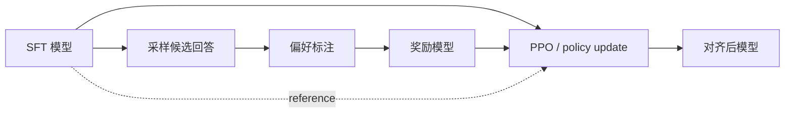

# 偏好与策略优化

!!! abstract

    这一章讨论后训练中的偏好与策略优化链路，包括 preference learning、reward modeling、DPO、RLHF 与 RL。核心问题是如何把“哪一个回答更符合目标行为”这一类序列级监督转化为可优化信号，并据此决定是先显式学习奖励模型，再做策略优化，还是直接在偏好数据上优化策略。

## 这一章关注什么

这一章围绕同一类监督信号展开：对同一输入的多个候选回答进行比较，从中得到 pairwise preference。这个信号是 reward modeling、DPO、RLHF 与后续 RL 策略优化的共同起点。

可以把主要路线概括为三条。

- pairwise preference 是共同的信号来源，用来表达候选回答之间的相对优劣。
- explicit reward modeling 是一条中间建模路线，先把偏好比较转成可打分的标量奖励。
- direct preference optimization 与基于 RL 的策略优化，是两条主要下游路线；前者直接用偏好数据更新策略，后者把奖励模型作为优化接口继续做策略改进。

### 章内结构

这一章改为单页收口，原先分散在奖励建模、DPO、RLHF 与强化学习子页中的核心内容，现统一并入本页。阅读时可以按以下顺序理解：

- 先看偏好信号与奖励建模，理解 pairwise preference 如何转成可优化的标量目标。
- 再看 DPO，理解离线偏好数据如何直接更新策略。
- 再看 RLHF 与强化学习优化，理解在线采样、KL 约束与策略更新的作用。

| 路线 | 核心信号 | 是否显式奖励模型 | 是否需要在线采样 | 在本页对应部分 |
| :--- | :--- | :--- | :--- | :--- |
| 偏好数据与奖励建模 | pairwise preference，进一步拟合为 scalar reward | 是 | 否 | 奖励模型 |
| 直接偏好优化 | pairwise preference | 否 | 否 | DPO |
| 基于奖励的策略优化 | scalar reward，通常来自 reward model | 是 | 是 | RLHF 与强化学习优化 |

### 阅读顺序

- 偏好信号与数据结构
- 奖励模型
- DPO
- RLHF
- 强化学习优化

## 为什么 SFT 之后还需要 preference learning

SFT 的训练信号通常来自单个参考输出。给定输入 $x$ 和目标回答 $y$，模型只会被鼓励提高 $P_\theta(y\mid x)$。这种目标有三个直接限制。

- 当一个问题存在多个都可接受的回答时，SFT 只观察到其中一种写法，难以表示不同候选之间的相对质量。
- 当优化目标涉及“更有帮助”“更安全”“更简洁”“更符合产品风格”时，这类属性通常不是逐 token 唯一确定的监督标签。
- 当错误主要表现为冗长、回避、误拒答、语气不当、步骤顺序不合理时，token 级似然未必能稳定区分这些序列级缺陷。

因此，SFT 往往解决的是“模型会不会按任务格式回答”，而 preference learning 进一步解决“多个可回答方案里模型更应该偏向哪一种”。它补充的是排序信息，而不是替代基础的指令学习。

从训练链路看，SFT 常把模型带到一个能产生可比较候选的状态。只有当候选之间已经具有一定可读性时，人工或模型标注的偏好信号才有意义。若模型仍停留在明显失配的分布上，偏好比较会被低质量噪声主导，训练信号也难以稳定。

## 偏好信号的基本形式

偏好学习的输入通常不是“绝对正确答案”，而是“在两个或多个候选中，哪一个更优”。最常见的形式是 pairwise preference。

给定同一个 prompt $x$，模型或数据系统提供两个候选回答 $y^+$ 和 $y^-$，其中标注者认为 $y^+$ 优于 $y^-$。训练目标不要求系统知道 $y^+$ 的绝对质量分数，只要求它知道二者之间的顺序。

这种监督比单一参考答案更适合表达如下信息：

- 两个回答都大体正确，但一个更完整或更稳健。
- 两个回答都可执行，但一个更符合安全边界。
- 两个回答内容接近，但一个冗长、重复或格式不稳定。
- 两个回答都包含局部错误，但一个整体危害更低。

在实现上，pairwise 数据也可以扩展到 listwise、ranking、best-of-n，或先转换为隐含的标量目标再训练；但大多数后训练方法最终仍可归约到“优选候选相对劣选候选的优势应被放大”。

## Pairwise preference 与 scalar reward

pairwise preference 和 scalar reward 都试图表达序列级质量，但信息形态不同。

pairwise preference 只描述相对顺序。对同一输入，它告诉训练系统 $y^+$ 优于 $y^-$，但不直接说明两者相差多少，也不保证不同 prompt 之间的可比性。其优点是标注负担较低、一致性通常更好，因为人类更容易做比较而不是打绝对分。

scalar reward 为每个候选分配一个实数分数 $r(x,y)$。这样做的收益，是后续优化更直接，尤其适合 RLHF 中作为奖励函数驱动策略更新。代价是分数尺度本身不稳定：不同标注者、不同任务类型、不同时间批次之间，分数口径可能漂移。很多 reward model 实际上并不直接从绝对打分学起，而是先从 pairwise preference 中学习一个隐含标量，使得优选回答具有更高 reward。

下表概括两类信号的主要差异。

| 维度 | Pairwise preference | Scalar reward |
| :--- | :--- | :--- |
| 监督形式 | 给定两个候选，标明谁更好 | 给定单个候选，预测一个实数分数 |
| 标注难度 | 较低，人类更容易比较 | 较高，分数口径更难统一 |
| 跨样本可比性 | 弱，主要在同 prompt 内成立 | 强，但依赖标度稳定性 |
| 典型用途 | 奖励建模原始监督、DPO 类直接优化 | RLHF 中作为奖励函数 |
| 主要风险 | 只给顺序，不给强度 | reward scale 漂移与 hacking |

工程上常见的做法是：收集 pairwise preference，先训练 reward model 生成 scalar reward，再用于 PPO 一类 RL 优化；或者直接用 pairwise 数据训练 DPO/IPO/ORPO 这类不显式构造在线奖励的目标。

## 偏好数据结构

偏好数据最小单元通常包含四部分：输入、优选回答、劣选回答、偏好来源。抽象写法可记为

$$
(x, y^+, y^-, m),
$$

其中 $x$ 为 prompt 或多轮上下文，$y^+$ 为 chosen response，$y^-$ 为 rejected response，$m$ 为 metadata，例如标注来源、任务类别、安全标签、采样温度、候选生成模型与时间戳。

在真实系统中，偏好数据往往还需要补充以下字段：

- 对话历史与 system policy，用于固定比较条件。
- 候选生成方式，例如同一模型不同采样，或不同模型对打。
- 标注维度，例如 helpfulness、harmlessness、honesty、format compliance。
- tie / skip / uncertain 标记，用于处理难以判断的样本。
- 长度、语言、领域、风险等级等切分标签，便于配比与诊断。

偏好数据的质量不只取决于标注正确率，还取决于比较是否公平。若 chosen 和 rejected 的采样温度、上下文模板、工具权限、检索结果不一致，模型学到的就不一定是目标行为差异，而可能是数据管线偏差。

## 奖励模型

奖励模型路线的核心，是显式训练一个打分模型 $r_\phi(x,y)$，使其在同一 prompt 下给优选候选更高分。对 pairwise 数据，常见目标是 Bradley-Terry 风格的对比损失：

$$
\mathcal{L}_{\mathrm{RM}} = - \log \sigma\left(r_\phi(x,y^+) - r_\phi(x,y^-)\right).
$$

该目标不要求 reward 等于真实效用值，只要求优选候选的分数差在统计上更大。训练完成后，reward model 可作为独立模块，为任意候选回答打分，并进一步用于 RLHF。

从建模形式看，奖励模型学习的是一个条件打分函数：给定输入 $x$ 与候选回答 $y$，输出一个标量分数

$$
r_\phi(x, y).
$$

这个分数表达的是相对偏好顺序。对于多数后训练场景，关键问题是“哪个回答更优”，而不是“这个回答的绝对分数是多少”。因此，奖励模型更接近排序器，而不是通用真值函数。

在最常见的 pairwise 设置中，训练样本写作：

$$
(x, y^+, y^-),
$$

其中 $y^+$ 表示更受偏好的回答，$y^-$ 表示较差回答。一个常见概率模型是 Bradley-Terry 风格偏好概率：

$$
P_\phi(y^+ \succ y^- \mid x)
=
\frac{\exp(r_\phi(x, y^+))}{\exp(r_\phi(x, y^+)) + \exp(r_\phi(x, y^-))}.
$$

等价写法是：

$$
P_\phi(y^+ \succ y^- \mid x)
=
\sigma\big(r_\phi(x, y^+) - r_\phi(x, y^-)\big).
$$

这个形式直接表达了“更优回答应当获得更高分差”。它也说明了奖励模型的一个重要性质：只要保持相对差值不变，整体平移分数不会改变偏好概率。

奖励模型进入训练闭环时，常见步骤如下：

1. 用 [SFT](sft.md) 模型生成多个候选回答。
2. 对候选做人工或 AI 偏好比较。
3. 用偏好对训练奖励模型。
4. 将奖励模型作为 RLHF 或 reranking 的评分器。

| 步骤 | 输入 | 输出 | 主要风险 |
| --- | --- | --- | --- |
| 候选生成 | prompt + policy | multiple responses | 候选过于同质，信息量不足 |
| 偏好标注 | candidate pairs | chosen / rejected | 标注噪声与口径漂移 |
| RM 训练 | preference pairs | reward model | 长度偏置、风格过拟合 |
| 下游使用 | RM + policy | aligned policy / rerank | reward hacking |

这一条路线的优点包括：

- 奖励函数被显式建模，可单独评估、蒸馏、冻结和复用。
- 可以支持在线采样和策略优化，适合长链路探索。
- 有利于把多个偏好维度做加权、约束或分解。

局限也很明确：

- reward model 本身可能过拟合标注偏差。
- 策略模型会主动寻找 reward model 的漏洞，形成 reward hacking。
- 训练与部署链路更长，系统复杂度更高。
- 在线 RL 稳定性、吞吐和成本压力都更大。

奖励模型的核心偏置主要集中在三个方向。

### 长度偏置

奖励模型很容易把冗长、礼貌、结构规整的回答当成高质量信号。原因在于这些表面特征在很多标注数据中与“好回答”高度相关。

- 回答越长，奖励分数越高
- 模型学会堆叠免责声明与安全措辞
- 事实密度下降，但主观评分维持较高水平

### 风格偏置

奖励模型会吸收标注风格。若数据主要来自单一团队、单一产品语气或单一教师模型，最终打分器会更偏爱该风格，并把风格差异误认为质量差异。

### 分布外失真

当 policy 更新后，输出分布会逐渐偏离奖励模型训练分布。此时奖励模型面对的新回答形态、异常轨迹与长工具链交互，可能缺乏稳定排序能力。分布外失真通常表现为：

- 高分回答实际质量下降
- rerank 与人工偏好相关性变差
- 某些边界任务出现系统性误判

## DPO

直接偏好优化路线不单独训练一个可部署的 reward model，而是直接利用 preference 对策略模型施加约束。DPO 是这一类方法的代表。

其核心思想是：若一个策略相对于参考策略 $\pi_{\mathrm{ref}}$ 更偏向 chosen、同时抑制 rejected，那么它就隐式地优化了与奖励一致的目标。典型形式可写为

$$
\mathcal{L}_{\mathrm{DPO}} = - \log \sigma \left( \beta \left[ \log \frac{\pi_\theta(y^+\mid x)}{\pi_{\mathrm{ref}}(y^+\mid x)} - \log \frac{\pi_\theta(y^-\mid x)}{\pi_{\mathrm{ref}}(y^-\mid x)} \right] \right).
$$

这里不再显式训练 $r_\phi$，而是通过策略与参考策略的对数概率差，直接把偏好顺序映射到优化目标中。这样做的收益是训练链路短、实现简单、稳定性通常优于在线 PPO。代价是探索能力较弱，且优化高度依赖静态偏好数据的覆盖质量。

对同一输入 $x$，若 $y^+$ 优于 $y^-$，则希望 policy 对 $y^+$ 的相对概率高于 $y^-$. 同时，新的 policy 仍需保持与 reference model 的合理距离，以维持语言质量与分布稳定性。这个目标也可以写成两个相对差值：

$$
\Delta_\theta
=
\log \pi_\theta(y^+ \mid x) - \log \pi_\theta(y^- \mid x),
$$

$$
\Delta_{ref}
=
\log \pi_{ref}(y^+ \mid x) - \log \pi_{ref}(y^- \mid x).
$$

DPO 关注的是新策略相对于参考策略，把 chosen/rejected 区分得更明显。reference model 常常来自 [SFT](sft.md) 阶段的冻结副本，它提供一个稳定锚点，使偏好优化集中在“相对提升”上，而不是无约束放大 chosen 的概率。

DPO 与显式奖励建模之间存在直接联系。若把最优 policy 写成 reference policy 与 reward 的指数加权形式，则有：

$$
\pi^*(y \mid x) \propto \pi_{ref}(y \mid x) \exp\left(\frac{1}{\beta} r(x, y)\right).
$$

这意味着 reward difference 可以由 policy 与 reference 的对数概率差近似表示。直观上，DPO 把“奖励高的回答更容易被选择”改写成“chosen 相对于 rejected 的对数概率差更大”。因此，DPO 可以看成隐式奖励建模：奖励并未作为独立模型显式出现，但其作用已被吸收到目标函数中。

这一路线适合以下场景：

- 已有较高质量的 pairwise 偏好数据。
- 希望减少在线 RL 的工程复杂度。
- 主要目标是对现有策略做分布内对齐，而不是大规模在线探索。

常见训练流程更短：

1. 准备 reference model。
2. 收集 preference pair。
3. 计算 chosen 与 rejected 的 sequence logprob。
4. 按 DPO loss 更新 policy。

| 步骤 | 关键对象 | 主要风险 |
| --- | --- | --- |
| 参考模型冻结 | SFT policy | 锚点过弱或与目标错位 |
| pair 数据准备 | chosen / rejected | 偏好噪声与长度偏置 |
| logprob 计算 | sequence-level probability | 长回答累积效应 |
| DPO 优化 | $\beta$, batch, lr | 过拟合与风格收缩 |

DPO 的主要收益包括：

- 不需要单独训练奖励模型
- 不需要完整在线 RL 基础设施
- 更容易复用现有监督训练管线
- 训练稳定性通常高于 PPO 类在线优化

DPO 的主要代价包括：

- 缺少独立可部署的 reward scorer
- 偏好数据噪声会直接作用于 policy
- 对 reference model 选择更敏感
- 可诊断性弱于显式 RM + RL 方案

DPO 家族已经出现多种变体，常见动机包括提高稳定性、简化约束或更好处理噪声。

| 方法 | 主要改动 | 关注点 |
| --- | --- | --- |
| DPO | 基础 pairwise 目标 | 简化 RLHF 链路 |
| IPO | 调整偏好目标形式 | 改善优化行为 |
| ORPO | 简化参考约束或目标构造 | 降低训练复杂度 |
| SimPO | 进一步简化比较结构 | 强化轻量实现 |

## RLHF

RLHF 关注的是回答质量的相对排序与行为边界塑形。对于很多开放任务，单条示范答案无法完整表达“更有帮助”“更安全”“更符合产品风格”这类目标，偏好数据则能够提供更直接的比较信号。

从系统角度看，RLHF 试图完成以下工作：

- 把主观偏好转成可学习的中间评分器
- 把中间评分器转成策略更新信号
- 在提升目标行为的同时保持基础语言质量稳定

经典 RLHF 通常包含四步：

1. 通过 [SFT](sft.md) 建立基础对话与任务接口。
2. 采样多个候选回答并收集偏好比较。
3. 训练奖励模型。
4. 用强化学习方法更新 policy。

| 阶段 | 输入 | 输出 | 作用 |
| --- | --- | --- | --- |
| SFT | instruction data | base assistant policy | 建立可交互分布 |
| Preference collection | prompt + multi-sample | chosen / rejected | 提供相对质量信号 |
| Reward model | preference pairs | score model | 近似人类偏好 |
| RL optimization | policy + reward | aligned policy | 提升目标行为概率 |

奖励模型在 RLHF 中并不直接生成答案，而是作为策略优化的外部评价器。它的重要性主要体现在：

- 它把人工偏好变成可重复调用的训练信号
- 它决定后续策略会朝哪个方向优化
- 它的偏差会在 RL 中被放大

KL 约束是 RLHF 里非常重要的一层保护。一个常见写法是：

$$
r'(x, y) = r_\phi(x, y) - \beta \, \mathrm{KL}(\pi_\theta(\cdot|x)\,\|\,\pi_{ref}(\cdot|x)).
$$

这个修正后的奖励表达了两件事：

- 第一项鼓励模型朝高奖励回答移动
- 第二项限制模型偏离 reference model 太快

reference model 常来自 SFT 阶段的冻结副本。它并不提供额外知识，而是提供一个稳定的比较基线。reference model 的价值主要包括：

- 维持原有语言质量与风格稳定性
- 减少策略分布突变
- 与 KL 约束共同抑制 reward over-optimization

RLHF 的典型问题主要包括：

### 成本

RLHF 需要候选采样、偏好标注、RM 训练与在线策略优化，因此整体成本明显高于单纯 SFT 或 DPO。

### 稳定性

训练稳定性受多种因素共同影响：

- reward model 噪声
- rollout 分布变化
- KL 系数设置
- batch 规模与 advantage 估计误差

### Reward Hacking

策略会主动寻找奖励模型漏洞。若评分器过度依赖长度、模板或礼貌表达，模型就会强化这些表面模式，最终拉低真实任务质量。

### 分布偏移

随着 policy 更新，输出分布会偏离 RM 训练分布，奖励模型在新区域上的排序可靠性通常下降。这个问题解释了为什么 RLHF 往往需要持续评测与数据回流。

## 强化学习优化

后训练中的强化学习目标可以写成：

$$
\max_\theta \; \mathbb{E}_{\tau \sim \pi_\theta}[r(\tau)].
$$

这里希望当前 policy 采样出的输出，平均得到更高奖励。对语言模型而言，policy 是条件分布

$$
\pi_\theta(y_t \mid x, y_{<t}),
$$

一次完整生成可以表示为 trajectory：

$$
\tau = (x, y_1, y_2, \dots, y_T).
$$

强化学习进入后训练，主要是因为存在一类目标难以逐 token 写成标准监督标签，却可以在完整输出生成之后给出相对明确的反馈。例如：

- 回答是否符合人类偏好
- 多步推理的最终答案是否正确
- 工具调用链条是否完成任务
- 生成是否满足安全或格式约束
- 长答案的整体帮助性是否优于参考答案

但单独优化期望奖励通常不够安全。奖励模型可能不完备，采样分布会随 policy 更新快速漂移，模型也可能为追高 reward 而偏离原本可读、稳定的语言分布。因此，工程上通常加入 trust region 或参考模型约束，使 policy 改动保持在可控范围内。

### PPO

PPO 在后训练中的主要作用，是用较稳定、相对可实现的方式限制每次 policy 更新的幅度。常见 clipped objective 为：

$$
r_t(\theta) = \frac{\pi_\theta(a_t \mid s_t)}{\pi_{\theta_{old}}(a_t \mid s_t)}
$$

$$
L^{\text{CLIP}}(\theta) = \mathbb{E}\left[\min\left(r_t(\theta)A_t,\; \operatorname{clip}(r_t(\theta), 1-\epsilon, 1+\epsilon)A_t\right)\right].
$$

这里的含义是：当新 policy 相对旧 policy 的变化超出阈值 $\epsilon$ 时，目标函数会截断收益，避免模型因为少量高 advantage 样本而发生过大的步长更新。

### KL 约束

在后训练里，通常不会允许优化后的 policy 任意偏离初始 SFT 模型。常见做法是在优化目标中加入相对参考模型 $\pi_{ref}$ 的 KL penalty：

$$
\max_\theta \; \mathbb{E}_{\tau \sim \pi_\theta}[r(\tau)] - \beta \, D_{KL}(\pi_\theta \| \pi_{ref}).
$$

KL penalty 的主要作用包括：

- 防止模型迅速偏离 SFT 分布，降低语言质量退化风险
- 抑制 reward hacking，使模型难以通过极端概率重分配钻奖励漏洞
- 提供一种可调节的保守更新机制

### On-policy 成本

RLHF 和一般 PPO 训练成本高，根本原因之一是 on-policy。训练所用样本必须来自当前或接近当前的 policy。模型一旦更新，旧样本的分布相关性就会下降，不能像离线监督数据那样长期重复使用。

这会带来几类直接成本：

- 每轮更新都要重新采样，生成 token 本身就昂贵
- 若 reward 来自 reward model 或 verifier，还要对新样本重新打分
- 大量样本只服务于有限轮次更新，数据复用率低于离线 SFT
- 分布持续漂移，训练监控和超参调优更困难

### GRPO

GRPO 在近年的 reasoning 场景中受到关注，核心直觉是：对同一个 prompt 一次采样多个候选答案，在组内做相对比较，用相对优势代替对每个样本都依赖单独、精确的 value 估计。

它的直观好处包括：

- 同一 prompt 下的候选答案共享上下文，更容易做相对排序
- 当 reward 主要关心“哪一个更好”而不是“绝对分值多大”时，组内归一化更自然
- 可以减轻 value model 估计不准带来的方差和复杂度

它改善的是估计方式，不是从根本上消除 on-policy 采样成本。

## 工程取舍

不同团队选择奖励模型路线还是直接偏好优化路线，通常由数据形态、训练预算、迭代速度和风险承受能力共同决定。

| 维度 | 奖励模型 + RLHF | 直接偏好优化（如 DPO） |
| :--- | :--- | :--- |
| 训练链路 | 更长，模块更多 | 更短，实现更直接 |
| 在线探索 | 强，可以基于新采样继续改进 | 弱，主要依赖离线偏好数据 |
| 稳定性 | 较敏感，需要控制 PPO、KL 与奖励尺度 | 通常更稳定 |
| 成本 | 高，需要额外奖励模型与 RL 采样 | 相对低 |
| 可解释性 | 可单独检查 reward 行为 | 主要观察策略结果 |
| 主要风险 | reward hacking、模式坍缩、训练不稳 | 数据覆盖不足、过拟合静态偏好 |

常见混合方式包括：

- 先做 SFT，再做 DPO，作为低成本基线。
- 用 reward model 评估候选质量，但策略更新仍采用离线方法。
- 用 DPO 快速迭代版本，用 RLHF 处理高价值但复杂的行为目标。
- 在通用偏好上做 DPO，在高风险领域单独训练安全 reward。

方法选择通常取决于两点：

- 要优化的行为是否需要在线探索
- 团队是否能承担更复杂的训练闭环

## 失败模式

preference learning 的常见问题不只发生在优化阶段，数据采样、标注协议、候选分布和评估口径都可能产生系统性偏差。

### 偏好数据偏差

如果标注者偏好某种固定文风、长度或措辞，模型会把这些表面特征当成高 reward 信号。结果可能是回答更长、更圆滑，却未必更正确。

### Reward hacking

在 RLHF 中，策略模型会主动搜索 reward model 的脆弱区域。若 reward model 过度依赖浅层特征，策略可能学会生成“看起来高分”的回答，而不是“真实更好”的回答。

### 分布外失真

偏好数据通常覆盖有限任务类型。模型在训练分布内胜率上升，并不保证在新领域、新语言或新工具协议下仍保持同样偏好排序。

### 长度偏置

很多标注流程天然偏向较长回答，因为较长文本更容易显得全面。若不控制长度因素，模型会逐步学到冗长输出，从而抬高推理成本并降低交互效率。

### 安全与帮助性冲突

若不同偏好维度未被显式分离，模型可能在“更积极回答”和“更稳健拒答”之间来回摆动。结果是在某些边界样本上出现误拒答或误放行。

### 参考策略漂移

在 DPO 类方法中，reference policy 定义了“允许偏离基线的幅度”。若参考策略过弱，优化容易过度漂移；若参考策略过强，偏好信号又难以真正生效。

这些失败模式说明，preference learning 的关键不只在损失函数，还在于数据协议、候选生成和评估体系是否一致。

## 与 SFT、RLHF、DPO 的关系

SFT、preference learning、RLHF、DPO 位于同一后训练链路的不同层级。

- SFT 提供基础监督起点，输入通常是单个参考答案。
- preference learning 关注如何利用偏好信号优化候选排序。
- RLHF 是显式奖励建模再做策略优化的实现路线。
- DPO 是直接基于偏好数据更新策略的实现路线。

| 概念 | 是否需要参考答案 | 是否需要偏好对 | 是否显式 reward model | 是否使用 RL |
| :--- | :--- | :--- | :--- | :--- |
| SFT | 是 | 否 | 否 | 否 |
| Reward Modeling | 否 | 是 | 是 | 否 |
| RLHF | 起点常来自 SFT | 是 | 是 | 是 |
| DPO | 起点常来自 SFT | 是 | 否 | 否 |

## 评估与诊断

偏好学习后的模型不能只看训练损失。更有意义的评估通常包括：

- 偏好胜率，即模型回答在人工或 judge 评估中相对基线的 win rate。
- 安全集和拒答集上的行为边界，检查误拒答与误放行。
- 长度、语气、格式合规率，识别是否出现风格性偏置。
- 不同任务桶、语言桶、领域桶下的分层表现，检查是否只在局部样本有效。
- 与 reference / SFT 模型的 KL 或行为漂移指标，判断更新幅度是否过大。

在工程上，若离线胜率上升但线上体验下降，常见原因包括奖励错位、分布外失真和候选采样方式变化。因此，评估必须覆盖训练分布内外两个层面。

## 要点

- SFT 解决基础任务跟随，preference learning 解决多个可行回答之间的排序问题。
- pairwise preference 更容易标注，scalar reward 更便于后续 RL 优化。
- 偏好数据的核心结构是 prompt、chosen、rejected 与 metadata，一致的比较条件比样本数量更重要。
- 奖励模型路线适合显式奖励建模与在线探索，但系统复杂度和 reward hacking 风险更高。
- 直接偏好优化路线训练链路更短，稳定性通常更好，但更依赖静态偏好数据覆盖。
- RLHF 与 DPO 都属于 preference learning；它们通常建立在 SFT 之后。
- 训练成败往往由数据协议、候选分布、评估口径与安全权衡共同决定，而不只由损失函数决定。
