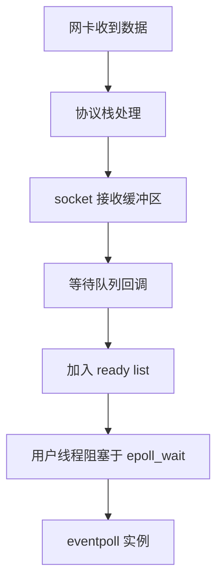

# I/O 模型

!!! abstract "摘要"

    本文从一般操作系统 I/O 路径出发，整理阻塞 I/O、非阻塞 I/O、I/O 复用、信号驱动 I/O、异步 I/O 与 `io_uring` 的位置关系。重点不是罗列接口名称，而是说明一次 I/O 为什么会拆成等待与搬运两个阶段，以及不同模型分别把成本放在何处。

## 问题背景

理解 I/O 模型时，关键不在于背出接口名称，而在于看清楚线程究竟在等待什么、什么时候会睡眠、什么时候必须亲自参与数据搬运。一次典型的读操作并不是单个瞬间完成的动作，而是包含了等待数据到达、确认事件状态、复制数据、继续处理这一整条链路。

如果把一次读取抽象成：

$$
\text{device} \rightarrow \text{kernel buffer} \rightarrow \text{user buffer}
$$

那么线程面对的第一个问题是数据何时进入内核缓冲区，第二个问题是数据由谁搬运到用户态。I/O 模型的差异，本质上就是围绕这两个问题展开。

## 两阶段视角

对应用线程而言，一次输入操作通常可以拆成两个阶段：

1. 等待数据就绪，即等待网卡、磁盘或其他设备把数据送到内核缓冲区。
2. 执行数据搬运，即把已经就绪的数据复制到用户态缓冲区，或把结果写回内核发送路径。

因此，同步与异步讨论的是完成责任是否仍由调用线程承担，阻塞与非阻塞讨论的是线程在等待阶段是否挂起。这两个维度互相独立，不能简单对应。

很多混淆都来自把这两个维度混在一起。例如 `epoll` 往往被称为“异步”，但它解决的主要是多个 FD 的等待问题；就绪之后真正的 `read` 与 `write` 仍然通常由用户线程同步发起。相反，真正的异步 I/O 更强调提交请求后，等待与搬运都由内核继续推进，用户态只在完成时得到通知。

## 从阻塞调用到事件驱动

最直接的模型是同步阻塞 I/O。线程调用 `read` 或 `write` 后，如果条件尚未满足，就会立即睡眠，直到数据准备完成并且复制结束后才返回。控制流最简单，但当等待对象数量不断上升时，问题就会从 I/O 本身转移为：

$$
\text{线程数量} \times \text{阻塞等待时间}
$$

同步非阻塞 I/O 试图解决“线程被单个等待对象卡住”的问题。设置 `O_NONBLOCK` 后，如果数据尚未到达，系统调用会立刻返回 `EAGAIN` 或 `EWOULDBLOCK`。线程不再睡眠，但代价只是从睡眠换成了轮询。如果应用对每个 FD 反复尝试读取，那么无效系统调用的数量会随 FD 数量线性增长：

$$
O(N)
$$

因此，非阻塞 I/O 解决了“单次调用被卡住”的问题，却没有解决“大量等待对象如何统一管理”的问题。

I/O 复用正是在这个位置出现。它把“等待哪个 FD 就绪”交给内核统一处理，应用线程只在拿到就绪集合后，再对真正活跃的 FD 执行 `read` 或 `write`。所以 I/O 复用仍然属于同步 I/O，但它把逐对象轮询改成了一次等待多个 FD 的聚合式等待。

## `select`、`poll` 与 `epoll`

`select` 与 `poll` 的思路相似，都是把一批 FD 交给内核等待，然后在返回后由用户态检查哪些 FD 已经就绪。它们的问题也相似：监听集合需要在系统调用中反复传入，内核和用户态都要做线性扫描，因此核心成本仍然与监控规模线性相关。

`select` 使用位图表达监听集合，接口历史较早，存在 `FD_SETSIZE` 这类上限；`poll` 改用 `pollfd` 数组表达事件集合，避免了位图大小限制，但没有改变线性扫描这一事实。它们的共同特征是：

- 监听集合由用户态反复提交给内核。
- 内核每次等待后都要重新报告集合状态。
- 返回后仍需按序扫描以找到活跃 FD。

`epoll` 的改进并不只是“更快的 `poll`”，而是模型发生了变化。它把监听集合持久化在内核里，使“注册 FD”与“等待事件”分离。应用通过 `epoll_ctl` 把 FD 放入内核维护的结构，之后 `epoll_wait` 只关注已经发生的就绪事件。

从实现上看，`epoll` 依赖两类结构：

- 红黑树维护注册过的监听项，负责增删改查。
- 就绪链表维护已经发生事件的节点，负责返回活跃集合。

这使等待阶段不再需要每轮把全部 FD 重新传给内核，返回阶段也不必重新扫描整个监听集合。它减少的不是业务处理时间，而是等待管理本身的成本。

### `select`

`select` 的接口历史最久，它通过三个位图集合分别表达可读、可写与异常事件，并用 `nfds` 指定扫描上界。其核心调用形式如下。

??? note "`select` 接口"

    ```c
    int select(
        int nfds,
        fd_set *readfds,
        fd_set *writefds,
        fd_set *exceptfds,
        struct timeval *timeout
    );
    ```

它的问题并不只是“最多只能看 $1024$ 个 FD”。更本质的限制有三点：

- 每次调用都要把整个位图从用户态复制到内核。
- 内核返回后，用户态仍要按位扫描整个区间。
- `nfds` 决定了扫描上界，最大 FD 一旦很大，即使实际活跃 FD 很少，扫描成本也会被拉高。

因此它的等待管理开销更接近：

$$
O(\text{max fd})
$$

这也是为什么 `select` 更适合规模较小、可移植性要求高、而不是追求极端并发的场景。

### `poll`

`poll` 把 `select` 的位图改成 `pollfd` 数组，摆脱了 `FD_SETSIZE` 这种固定上限。它的核心接口如下。

??? note "`poll` 接口"

    ```c
    struct pollfd {
        int   fd;
        short events;
        short revents;
    };

    int poll(struct pollfd *fds, nfds_t nfds, int timeout);
    ```

`poll` 的改进主要在表达方式，而不是等待算法本身。监听集合从“最大 FD 范围扫描”变成“数组元素扫描”，因此复杂度更接近：

$$
O(\text{number of watched fds})
$$

但内核与用户态依然需要围绕整组 `pollfd` 做线性处理，所以在 FD 数量继续增长时，瓶颈仍然会出现。它比 `select` 更实用，但没有从根本上改变“每轮都重新带着整张表等待一次”的模式。

## `epoll` 的典型适用场景

`epoll` 在 Linux 中最典型的应用场景是 socket、pipe、eventfd 等事件型 FD。以网络 socket 为例，数据到达后，协议栈会把数据放入 socket 接收缓冲区，并在相应等待队列上触发回调，把该 FD 挂到 `epoll` 的就绪链表中。应用线程阻塞在 `epoll_wait` 上时，等待的是“是否有活跃 FD 出现”，而不是“某个具体 FD 是否有数据”。

在事件密集而活跃对象很多的系统里，这意味着应用可以把等待逻辑集中到少量线程中，再由事件循环驱动后续处理。真正改变的是执行模型：

$$
\text{一对象一等待} \rightarrow \text{少量线程统一等待大量活跃对象}
$$

这也是 [进程与线程](ProcessAndThread.md) 一文中讨论执行实体数量控制时，必须回到 I/O 模型来理解的原因。

### `epoll` 的三个接口

`epoll` 把“创建实例”“注册监听项”“等待就绪事件”拆成了三个动作，语义边界比 `select`/`poll` 更清晰。

??? note "`epoll` 接口"

    ```c
    int epoll_create1(int flags);

    int epoll_ctl(int epfd, int op, int fd, struct epoll_event *event);

    int epoll_wait(int epfd, struct epoll_event *events, int maxevents, int timeout);
    ```

- `epoll_create1` 创建一个 `eventpoll` 实例。
- `epoll_ctl` 负责对某个 FD 做 `ADD`、`MOD`、`DEL`。
- `epoll_wait` 只负责从就绪队列中取回已经活跃的事件。

这三个接口的拆分非常关键，因为它意味着监听集合不再是“每次等待顺带传入”，而是内核长期持有的状态。

### `epoll` 的事件流

站在网络路径上看，`epoll` 的处理链路可以概括为：

$$
\text{NIC interrupt} \rightarrow \text{protocol stack} \rightarrow \text{socket wait queue} \rightarrow \text{epoll callback} \rightarrow \text{ready list}
$$

它不是主动轮询每个 FD 的状态，而是在 socket 状态变化时，通过回调把对应节点加入就绪链表。因此 `epoll_wait` 的核心工作并不是检查全量 FD，而是消费已经准备好的事件。

如果只看抽象过程，可以用下面这张图概括：



因此 `epoll` 的收益来自“事件到来时增量更新”，而不是“等待时重新全表扫描”。

## LT、ET 与读取规范

`epoll` 只解决事件分发，不替应用决定读取策略。边缘触发（ET）和水平触发（LT）的区别，体现在事件是否在“状态持续成立”期间重复通知。

LT 更接近默认直觉。只要缓冲区里仍有未读数据，FD 就保持可读，下一次 `epoll_wait` 仍可能返回该事件。它更稳健，也更适合先保证正确性。

ET 强调“状态变化时通知一次”。如果应用没有在本轮把缓冲区读空，那么后续即使仍有数据残留，也可能不会再次收到通知。因此 ET 模式几乎总是要求：

- FD 设置为非阻塞。
- 每次被唤醒后持续读取，直到返回 `EAGAIN`。
- 写路径同样处理“尽量写完，否则等待下一次可写事件”。

很多关于 `epoll` 的错误并不来自接口本身，而是读取规范没有和触发模式配套。

## 信号驱动、传统 AIO 与 `io_uring`

信号驱动 I/O 试图通过信号通知应用“事件已经到达”。它确实减少了主动轮询，但信号语义本身不适合承载复杂的大规模事件管理：事件表达能力有限，状态组织也不如事件循环自然，所以在现代通用程序里并不主流。

传统 Linux AIO 更偏向块设备与存储场景，在通用文件与 socket 编程中长期没有形成统一而自然的用户态编程模型。这也是为什么“理论上存在异步 I/O”并不等于“工程上已经替代 `epoll`”。

`io_uring` 的价值在于，它不再只提供“等待哪个 FD 就绪”的接口，而是通过提交队列与完成队列把请求提交和结果回收都结构化。对部分操作而言，它可以把等待、提交、完成通知以及某些数据搬运过程都统一纳入同一框架：

$$
\text{submit} \rightarrow \text{kernel continues work} \rightarrow \text{completion queue}
$$

因此 `io_uring` 的位置并不是简单替代 `epoll`，而是把同步等待模型推进到更强的异步提交模型。但它也带来更复杂的生命周期管理、缓冲区注册、队列深度控制以及内核版本依赖，因此“是否比 `epoll` 更好”必须结合业务路径判断。

### `io_uring` 的队列模型

`io_uring` 的核心不在某一个单独系统调用，而在两组共享队列：

- SQ，Submission Queue，用于用户态提交请求描述。
- CQ，Completion Queue，用于内核回收完成事件。

用户态先把操作描述写入 SQE，再通知内核消费；内核在执行完成后把结果写入 CQE，由用户态统一收取。因此它的交互方式更接近“批量提交任务，再批量领取结果”，而不是“每个事件都先等就绪，再调用一次读写”。

如果抽象成流程，可以写成：

$$
\text{prepare SQE} \rightarrow \text{submit} \rightarrow \text{kernel executes} \rightarrow \text{consume CQE}
$$

这种模型的几个直接收益是：

- 多个请求可以批量提交，减少频繁系统调用。
- 某些操作可以绕过“先等可读，再调用 `read`”这一分裂流程。
- 用户态可以把等待与完成回收组织成更稳定的批处理路径。

### `io_uring` 的代价

`io_uring` 的复杂度也明显高于 `epoll`。应用不仅要管理文件描述符和事件回调，还要管理：

- SQ/CQ 的生命周期与深度。
- 已提交但尚未完成请求的上下文。
- 缓冲区注册、固定文件表等可选优化。
- 取消、超时、短读写与部分完成语义。

因此它虽然能把模型推进到更强的异步化，但也把应用从“事件驱动读写”推向了“请求驱动状态机”。如果业务本身并不能从这种异步深度中稳定获益，那么额外复杂度未必值得承担。

## 对比与选型

从等待与完成责任两个维度看，几类常见模型可以简化对比如下：

| 模型 | 等待阶段 | 数据搬运 | 应用侧组织方式 | 典型接口 |
| :--- | :--- | :--- | :--- | :--- |
| 同步阻塞 I/O | 内核等待 | 调用线程同步参与 | 一次调用处理一个对象 | `read` / `write` |
| 同步非阻塞 I/O | 应用反复轮询 | 调用线程同步参与 | 主动轮询 FD | `O_NONBLOCK` |
| I/O 复用 | 内核统一等待多 FD | 调用线程同步参与 | 事件循环 | `select` / `poll` / `epoll` |
| 传统异步 I/O | 内核等待 | 内核推进完成 | 完成通知回调 | AIO |
| `io_uring` | 提交后由内核继续推进 | 依操作类型而定 | 请求队列 + 完成队列 | `io_uring_enter` 等 |

如果只看 Linux 上的主流工程现实，可以进一步压缩成一句判断：

- `select`、`poll` 更适合历史兼容、小规模或便携性优先场景。
- `epoll` 是大规模事件型 FD 等待的成熟默认方案。
- `io_uring` 适合在环境可控、收益明确时进一步追求更深的异步化与批量化。

## 选型边界

如果线程数不大、等待对象数量有限，并且业务逻辑本身远重于 I/O 等待，那么同步阻塞 I/O 仍可能是合理方案。简单模型并不天然错误，错误的是在并发规模已经改变后仍然沿用原来的等待方式。

当 FD 数量大、活跃对象比例低、等待远多于计算时，I/O 复用通常是更稳妥的基础设施。`epoll` 之所以长期是 Linux 上的默认答案之一，不是因为它最先进，而是因为它在复杂度、可预测性和成熟度之间取得了平衡。

`io_uring` 更适合在以下前提下进入候选范围：

- 内核版本和部署环境可控。
- 团队愿意处理更复杂的异步资源管理。
- 业务路径能够从批量提交、减少系统调用或更深的异步化中稳定获益。

## 关系索引

I/O 模型回答的是“线程如何等待外部事件”以及“谁负责推进 I/O 完成”。继续向下看相关主题：

- 如果关注数据在内核与用户态之间如何搬运，可阅读 [零拷贝](ZeroCopy.md)。
- 如果关注等待方式如何影响执行实体组织，可阅读 [进程与线程](ProcessAndThread.md)。
- 如果关注多个执行流如何协调共享状态，可阅读 [锁与同步](Synchronization.md)。
